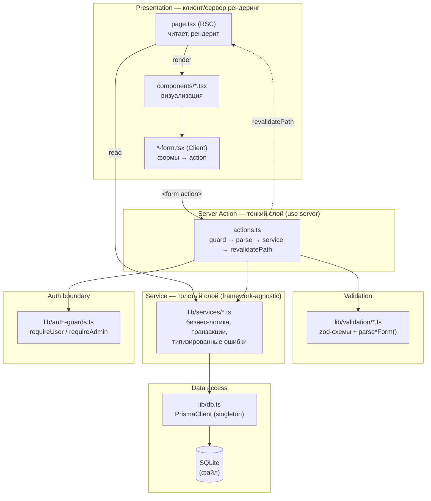
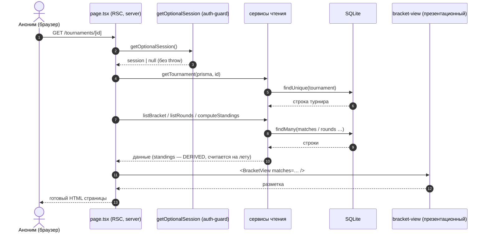

# 03 — Архитектура приложения

Документ описывает архитектуру веб-приложения «Padel Tournaments»: общий стиль, технологический
стек, разбиение на слои и их ответственность, потоки данных при чтении и записи, физическую
структуру каталогов, сквозные технические решения и сознательно отвергнутые анти-паттерны.
Цель главы — обосновать, *почему* система устроена именно так, а не только перечислить компоненты.

Смежные документы: [модель данных](04-model-dannyh.md) (сущности, связи, ограничения),
[аутентификация и безопасность](10-autentifikatsiya-i-bezopasnost.md) (Better Auth, роли, guards,
модель угроз), [серверные действия и валидация](11-servernye-deystviya-i-validatsiya.md)
(write-API, zod-схемы, модель ошибок).

---

## 1. Обзор и принципы

Приложение спроектировано как **единое full-stack-приложение на Next.js (App Router)** — без
выделенного бэкенда, без отдельного REST/GraphQL-сервиса, без клиентского state-management-слоя.
Один процесс Node.js одновременно отвечает за серверный рендеринг страниц (чтение) и за обработку
мутаций (запись), общаясь с локальной базой SQLite через Prisma. Это архитектура **«сервер-центричного
монолита»**, в которой граница «клиент ↔ сервер» проходит внутри одного фреймворка и одного
репозитория.

Ключевые архитектурные принципы, которыми руководствовалось проектирование:

- **Один язык, один репозиторий, одна сборка.** Вся система — TypeScript: и серверная логика, и
  компоненты, и схемы валидации, и определение модели данных (Prisma-схема генерирует типы,
  которыми пользуется весь код). Это устраняет рассинхронизацию контрактов между фронтендом и
  бэкендом, типичную для разделённых стеков, и ускоряет разработку силами одного человека.

- **Чтение и запись — принципиально разные пути.** Чтение выполняют React Server Components (RSC),
  напрямую вызывая сервисный слой; запись выполняют Server Actions. У этих путей разные требования
  (рендеринг против целостности и авторизации), поэтому они разведены архитектурно (см. §3, §5).

- **Бизнес-логика отделена от транспорта.** Доменные правила (генерация сетки, продвижение
  победителя, подсчёт результата, рейтинги, регистрация) живут в framework-agnostic сервисном слое
  `lib/services`, а не в обработчиках запросов. Сервисы тестируются изолированно, без поднятия
  Next.js (см. одноимённые `*.test.ts` рядом с каждым сервисом).

- **Простота важнее обобщённости.** Это дипломная работа: один клуб-администратор, отсутствие
  реальной нагрузки, нет требований к горизонтальному масштабированию. Поэтому осознанно выбраны
  самые прямые решения: файловая SQLite вместо СУБД-сервера, `revalidatePath` вместо WebSocket,
  персистентное дерево матчей вместо вычисления на лету. Преждевременная оптимизация (пулы
  соединений, кеши, очереди) исключена из scope как избыточная сложность.

- **Безопасность — на границе, а не в обёртке.** Авторизация выполняется внутри каждого Server
  Action и в защищённых Server Components (Node runtime, подписанная cookie-сессия), а не в
  middleware. Это сознательный отказ от известного edge/node-футгана (см. §8).

---

## 2. Технологический стек

Стек выверен по `package.json` и зафиксирован в [FACTS] как источник правды. По каждой строке —
краткое обоснование выбора (развёрнутые альтернативы рассмотрены в `research/STACK.md`).

| Слой | Технология | Версия | Роль и обоснование |
|------|------------|--------|--------------------|
| Фреймворк | **Next.js (App Router)** | 16.2.7 | Full-stack в одном процессе: RSC для чтения + Server Actions для записи. Снимает необходимость в отдельном API-слое и клиентском fetch-коде; серверный рендер удобен для статичной по природе турнирной сетки. App Router (а не Pages) — ради первоклассных Server Components, Server Actions и layout-ов. |
| UI | **React** | 19.2.4 | Поставляется вместе с Next 16; разделение на Server/Client Components. Интерактивны только листовые компоненты (формы, кнопка выхода) — остальное рендерится на сервере. |
| Язык | **TypeScript** | ^5 | Сквозная типобезопасность от Prisma-моделей до компонентов. Контракт между слоями проверяется компилятором, а не соглашениями. |
| ORM | **Prisma + @prisma/client** | ^6.19.3 | Типобезопасный доступ к БД, миграции, генерация типов из схемы. Версия **6.x** выбрана сознательно вместо 7.x: v7 делает driver-адаптеры обязательными и добавляет `prisma.config.ts` и генерируемый output — лишняя сложность без выгоды на этом масштабе. |
| БД | **SQLite** (файл) | — | Нулевая настройка, один файл, идеально для офлайн-демо без нагрузки. SQLite не имеет нативных enum-типов → «перечисления» хранятся как `String` и валидируются zod-union/TS-union (см. §7). |
| Валидация | **Zod** | ^4.4.3 | Единый источник правды для парсинга `FormData` и бизнес-правил формы. Одна схема обслуживает и клиентскую пред-валидацию, и серверную границу — они не могут разойтись. |
| Auth | **Better Auth** | ^1.6.14 | email+password, плагин `admin()` для ролей, Prisma-адаптер, исполнение в Node runtime. Живая поддерживаемая библиотека (в отличие от deprecated Lucia); не требует edge/node-разделения, в отличие от Auth.js. Email-верификация выключена — офлайн-демо без SMTP. |
| Стили | **Tailwind CSS + @tailwindcss/postcss** | ^4 | CSS-first-конфигурация без JS-файла конфига, авто-обнаружение контента. Тёмная тема, адаптив. Без UI-библиотеки компонентов — ~10 простых форм не оправдывают её. |
| Прочее | **tsx** (dev) | ^4 | Запуск TypeScript-скриптов seed и тестов без отдельной сборки. |

Менеджер пакетов — **npm** (скрипты в `package.json`). Выбор обусловлен переносимостью на машину
проверяющего без дополнительных требований.

---

## 3. Стиль архитектуры

Система реализует паттерн **«RSC для чтения, Server Actions для записи»** — это ключевое
архитектурное решение, определяющее всё остальное.

**Чтение через Server Components.** Страницы (`app/**/page.tsx`) — это `async`-функции, исполняемые
на сервере. Они вызывают сервисный слой напрямую (`await getTournament(prisma, id)`), получают
данные и возвращают готовый HTML. Нет клиентского `fetch`, нет endpoint-а, нет состояния загрузки,
нет дублирования типов между сервером и клиентом. Браузер получает уже отрендеренную страницу.

**Запись через Server Actions.** Мутации — это функции с директивой `"use server"`
(`app/**/actions.ts`), вызываемые прямо из `<form action={...}>`. Не нужен REST-маршрут, не нужна
обвязка `fetch`, не нужна ручная сериализация. Action выполняет авторизацию, валидирует ввод,
делегирует сервису и вызывает `revalidatePath`, после чего соответствующий RSC перерисовывается с
новыми данными.

**Почему НЕ отдельный REST/API-слой.** Выделенный API (Express/Fastify/Route Handlers поверх
домена) был бы оправдан, если бы существовал второй потребитель данных — мобильное приложение,
внешняя интеграция, SPA на отдельном домене. Здесь единственный потребитель — сам же сервер,
рендерящий HTML. Введение REST-слоя в этой ситуации означало бы:

- дублирование контракта (типы запросов/ответов на обеих сторонах сети),
- ручную сериализацию/десериализацию и обработку HTTP-статусов,
- лишний сетевой хоп и состояние загрузки на клиенте,
- разнос авторизации по двум местам.

Server Components и Server Actions дают тот же результат (чтение и мутация данных) **без сетевой
границы внутри приложения** и без потери типобезопасности: функция-сервис вызывается как обычная
функция, её типы выводятся компилятором сквозь весь стек. Единственный настоящий route-handler в
проекте — `app/api/auth/[...all]/route.ts` — существует не как доменный API, а потому что Better
Auth по своей природе требует HTTP-эндпоинт для собственных операций (sign-in/up/out, смена email).

---

## 4. Слои и ответственность

Архитектура строго слоится. Каждый слой обращается только к слою ниже; обратных зависимостей и
«перепрыгивания» через слой нет.



**Слой 1 — Presentation (`app/**/page.tsx`, `components/*.tsx`, `*-form.tsx`).**
Страницы — это Server Components: читают данные через сервис и рендерят разметку. Презентационные
компоненты (`bracket-view`, `round-robin-view`, `rotation-view`, `tournament-status-badge`)
получают уже подготовленные данные пропсами и не содержат логики, кроме форматирования. Client
Components — только интерактивные «листья» (формы регистрации/счёта, кнопка выхода) с директивой
`"use client"`. Защита страниц встроена в сами RSC (вызов guard вверху компонента), а не вынесена в
middleware.

**Слой 2 — Server Action (`app/**/actions.ts`).**
Тонкая граница записи. Канонический паттерн каждого action:

```
1. requireUser() / requireAdmin()      — авторизация (ПЕРВАЯ строка, граница безопасности)
2. parse*Form(formData)                — парсинг и валидация ввода (zod)
3. await <service>(prisma, ...)         — делегирование бизнес-логики
4. revalidatePath(`/tournaments/${id}`) — инвалидация кеша → перерисовка RSC
   return { ok: true } | { ok: false, error/fieldErrors }
```

Action **не содержит** доменной логики и **не делает** redirect — он возвращает структуру
`{ ok, ... }`, чтобы страница осталась на месте и показала результат после ревалидации. Идентичность
пользователя (`user.id`, роль) всегда берётся из подписанной сессии, **никогда** из тела формы;
`tournamentId`/`matchId` привязываются к action через `.bind(...)` из серверного компонента, а не
читаются из тела (защита от подмены цели мутации).

**Слой 3 — Service (`lib/services/*.ts`).**
«Толстый» слой — здесь живёт вся бизнес-логика: генерация сетки (`bracket.generateBracket`),
продвижение победителя (`bracket.advance`), расписания форматов (`round-robin`, `americano`,
`mexicano`), подсчёт результата (`result.recordResult`, `round-result.recordRoundResult`), рейтинги
(`standings.computeStandings`), регистрация (`registration.registerPair/registerSingle`), переходы
статусов (`tournament-status`). Свойства слоя:

- **Принимает `prisma` параметром.** Сервис не импортирует синглтон сам — клиент передаётся извне.
  Это держит action тонким и делает сервис тестируемым с in-memory/мок-клиентом.
- **Транзакции для целостности.** Многошаговые мутации (регистрация с проверкой вместимости,
  генерация всей сетки, запись результата с продвижением) обёрнуты в `prisma.$transaction`. На
  любом reject — полный откат: не остаётся ни полусгенерированной сетки, ни осиротевших `SetScore`,
  ни наполовину продвинутого родителя.
- **Типизированные ошибки с `code`-дискриминантом.** Каждый сервис бросает свой класс ошибки
  (`RegistrationError`, `ResultError`, `RoundResultError`, `BracketError`, `FormatError`,
  `AdminError`) с полем `code`. Action сопоставляет ошибку по типу/коду и отдаёт наружу только
  безопасное RU-сообщение; сырой текст Prisma наружу не уходит (см. §7).

**Слой 4 — Auth boundary (`lib/auth-guards.ts`).**
Не слой данных, а сквозная граница: `getOptionalSession` (без бросков, для nav и публичных страниц),
`requireUser` (бросает при анониме/бане), `requireAdmin` (бросает при не-админе). Все чтения сессии
проходят через этот модуль — единый источник правды об идентичности. Исполняется в Node runtime
(`next/headers` делает модуль server-only по построению).

**Слой 5 — Data access (`lib/db.ts` → SQLite).**
`lib/db.ts` экспортирует единственный синглтон `PrismaClient` (см. §7). Prisma транслирует
типобезопасные вызовы в SQL к файловой SQLite-базе.

**Правило слоёв одной фразой:** *толстый сервис — тонкий action — авторизация на границе.* Логика
концентрируется в сервисах; action только охраняет, парсит и делегирует; авторизация выполняется в
первой строке action и вверху защищённого RSC.

---

## 5. Потоки данных

Два принципиально разных пути — запись и чтение — показаны диаграммами последовательности.

### 5.1. Запись: администратор вводит счёт матча

Администратор сохраняет результат матча playoff. Поток проходит сверху вниз через все слои, после
коммита `revalidatePath` инвалидирует кеш и RSC перерисовывается уже с новым победителем в следующем
раунде.

```mermaid
sequenceDiagram
    autonumber
    actor Admin as Админ (браузер)
    participant Form as score-form (Client)
    participant Action as recordResultAction (Server Action)
    participant Guard as requireAdmin (auth-guard)
    participant Parse as parseRecordResultForm (zod)
    participant Svc as recordResult (service)
    participant Tx as prisma.$transaction
    participant DB as SQLite
    participant Page as page.tsx (RSC)

    Admin->>Form: ввод геймов по сетам, submit
    Form->>Action: <form action> + FormData
    Action->>Guard: requireAdmin()
    Guard-->>Action: admin user (или throw "Forbidden")
    Action->>Parse: parse(formData)
    Parse-->>Action: { ok, sets[] } / { ok:false }
    Action->>Svc: recordResult(prisma, matchId, sets)
    Svc->>Tx: open transaction
    Tx->>DB: load Match (+ слоты)
    Tx->>DB: delete+recreate SetScore[]
    Tx->>DB: update Match (setsWon, winnerId)
    Tx->>DB: update parent slot (advance) ИЛИ finish tournament
    Tx-->>Svc: commit (или rollback на ResultError)
    Svc-->>Action: summary / throw ResultError("draw"…)
    Action->>Page: revalidatePath(`/tournaments/${id}`)
    Action-->>Form: { ok:true } / { ok:false, error: RU-текст }
    Page-->>Admin: перерисованный RSC (новый победитель в сетке)
```



Существенные детали потока: авторизация — **первая** операция (до парсинга и до БД); валидация —
до сервиса; вся мутация (замена `SetScore`, кэш счёта, продвижение победителя, возможный финиш
турнира) атомарна в одной транзакции; ничья в playoff приводит к `ResultError("draw")` и **полному
откату** без продвижения; наружу уходит либо `{ ok:true }`, либо безопасное RU-сообщение.

### 5.2. Чтение: аноним смотрит турнирную сетку

Анонимный пользователь открывает страницу турнира. Авторизация не требуется (сессия читается
опционально), путь короткий: RSC → read-сервис → Prisma → HTML.



Существенные детали: на чтении нет мутаций и нет жёсткой авторизации — сессия лишь определяет, какие
блоки показать (формы видны по роли/статусу, `readOnly = !isAdmin || status==="finished"`); рейтинги
(`standings`) не материализуются в БД, а пересчитываются при каждом рендере из строк результатов;
страница `/tournaments/[id]` — **единый RSC-хаб**, который сам ветвится по формату
(`playoff`/`round_robin`/`americano`/`mexicano`) и режиму участия (`pairs`/`singles`).

---

## 6. Структура каталогов

```
src/
├── app/                              # App Router: маршруты, страницы, серверные действия
│   ├── (auth)/                       # route-group: страницы аутентификации (вход/регистрация)
│   │   ├── login/                    #   page.tsx (RSC) + login-form.tsx (Client)
│   │   └── register/                 #   page.tsx + register-form.tsx
│   ├── (app)/                        # route-group: приватная зона (игрок+/admin)
│   │   ├── dashboard/                #   кабинет игрока
│   │   ├── profile/                  #   личный кабинет: page + profile-form + actions.ts
│   │   └── admin/                    #   админ-зона
│   │       ├── page.tsx              #     админ-панель
│   │       ├── actions.ts            #     служебные действия (adminPing)
│   │       └── tournaments/
│   │           ├── actions.ts        #     createTournamentAction
│   │           └── new/              #     форма создания турнира (page + create-tournament-form)
│   ├── (public)/                     # route-group: публичные страницы (доступны анониму)
│   │   └── tournaments/
│   │       ├── page.tsx              #     список турниров
│   │       └── [id]/                 #     ЕДИНЫЙ хаб турнира (детальная страница)
│   │           ├── page.tsx          #       RSC: ветвление по формату/режиму/роли
│   │           ├── actions.ts        #       participate / start / remove / finish / recordResult
│   │           └── *-form.tsx        #       Client-формы (participate, score, round-score, …)
│   ├── api/auth/[...all]/route.ts    # единственный route-handler — Better Auth
│   ├── layout.tsx                    # корневой layout: тема «Court» + шрифты, шапка <Nav/>
│   ├── page.tsx                      # главная: ближайшие турниры по дате (?past=1 — прошедшие)
│   └── globals.css                   # Tailwind 4 @theme (тема «Court», токены) + слой _base
│
├── components/                       # презентационные компоненты (визуализация, без логики)
│   ├── bracket-view.tsx              #   дерево playoff (колонки раундов)
│   ├── round-robin-view.tsx          #   таблица + матчи кругового
│   ├── rotation-view.tsx             #   раунды/корты + рейтинг (американо/мексикано)
│   ├── tournament-status-badge.tsx   #   бейдж статуса
│   ├── nav.tsx                       #   шапка (Server Component, читает опц. сессию)
│   └── logout-button.tsx             #   интерактивный «листок» (Client)
│
└── lib/                              # внефреймворковый код: домен, валидация, инфраструктура
    ├── db.ts                         #   PrismaClient singleton (hot-reload-safe)
    ├── auth.ts                       #   конфигурация Better Auth
    ├── auth-guards.ts                #   getOptionalSession / requireUser / requireAdmin
    ├── auth-client.ts                #   клиентский хелпер Better Auth
    ├── services/                     #   ТОЛСТЫЙ доменный слой (+ *.test.ts рядом)
    │   ├── tournament.ts             #     createTournament / listTournaments / getTournament
    │   ├── bracket.ts                #     генерация сетки playoff + продвижение
    │   ├── round-robin.ts            #     круговой метод
    │   ├── americano.ts              #     американо (ротация пар)
    │   ├── mexicano.ts               #     мексикано (раунды по рейтингу)
    │   ├── format-engine.ts          #     диспетчер генерации/записи по формату
    │   ├── result.ts                 #     playoff scoring (free-form)
    │   ├── round-result.ts           #     round-based scoring
    │   ├── standings.ts              #     рейтинги (DERIVED — пересчёт каждый раз)
    │   ├── registration.ts           #     регистрация пар/одиночек
    │   ├── rounds.ts                 #     чтение раундов/игроков
    │   ├── tournament-status.ts      #     машина статусов турнира
    │   ├── admin.ts                  #     удаление регистраций, ручной финиш
    │   └── profile.ts                #     чтение/обновление профиля
    └── validation/                   #   zod-схемы + parse*Form() (+ *.test.ts)
        ├── auth.ts                   #     схемы + RU-лейблы (уровни, форматы…)
        ├── tournament.ts             #     схема создания турнира
        ├── registration.ts           #     схема регистрации пары/одиночки
        ├── result.ts                 #     схема ввода результата playoff
        ├── round-result.ts           #     схема ввода результата round-based
        └── profile.ts                #     схема обновления профиля
```

**Стили (тема «Court», v3.0).** Глобальные токены темы (`@theme`) и компонентный слой `_base` живут
в `globals.css`; экранно-специфичные стили вынесены в co-located CSS рядом с соответствующими
страницами/компонентами (`(auth)/auth.css`, `dashboard.css`, `profile.css`, `new/create-tournament.css`,
`tournaments/tournaments.css`, `[id]/tournament.css`, `components/bracket.css`, `components/formats.css`).
Это чисто презентационный слой — на доменную логику, серверные действия и потоки данных он не влияет.

**Route-groups и их смысл.** Скобочные папки `(auth)`, `(app)`, `(public)` — это **route-groups
Next.js**: они организуют маршруты по аудитории, **не влияя на URL** (сегмент в скобках не попадает
в путь). Их назначение здесь:

- `(public)` — страницы, доступные анониму (список турниров, детальная страница-хаб). Чтение без
  авторизации; формы внутри показываются по роли/статусу.
- `(auth)` — вход и регистрация: страницы для неаутентифицированного посетителя.
- `(app)` — приватная зона: кабинет, профиль, админ-панель. Здесь страницы охраняются guard-ами
  внутри RSC.

Группировка даёт чистое разделение по смыслу доступа и позволяет (при желании) навешивать общий
layout на группу, не загромождая URL-структуру служебными сегментами.

**`lib/services` против `lib/validation`.** Разделены сознательно: `validation` отвечает за то,
*корректен ли ввод по форме* (типы, обязательность, диапазоны — синтаксис), и переиспользуется
клиентом и сервером; `services` отвечает за то, *допустима ли операция по правилам предметной
области* (вместимость, статус, уровень, дубликаты, исход матча — семантика) и работает с БД.
Каждый файл сервиса и схемы сопровождается соседним `*.test.ts` — юнит-тесты домена без Next.js.

---

## 7. Сквозные технические решения

**Перечисления как `String` + zod-union (SQLite без enum).** SQLite не имеет нативного enum-типа.
Все «перечисления» предметной области — `role`, `status`, `format`, `participantMode`, `scoringMode`,
`courtSide`, `skillLevel`, `nextSlot`, `teamSlot` — хранятся в БД как `String`, а допустимость
значений обеспечивается на уровне приложения: zod-union при парсинге ввода и TS-union в типах
сервисов. Это даёт ту же гарантию корректности, что и enum, без зависимости от поддержки enum
конкретной СУБД, и оставляет путь миграции на Postgres (где enum есть) открытым без переписывания
домена. Подробнее в [модели данных](04-model-dannyh.md).

**Singleton PrismaClient (hot-reload).** `lib/db.ts` хранит единственный экземпляр `PrismaClient` в
`globalThis`. В dev-режиме Next.js перезагружает модули при каждом изменении, и без синглтона на
каждой перезагрузке создавался бы новый клиент и новое соединение с SQLite-файлом → предупреждения о
блокировке файла и исчерпании соединений. Синглтон создаётся один раз и переиспользуется; в
production переменная в `globalThis` не сохраняется (там горячей перезагрузки нет). Это стандартный
паттерн для Prisma + Next.js.

**`revalidatePath` вместо WebSocket.** После любой мутации action вызывает
`revalidatePath('/tournaments/[id]')`, что инвалидирует серверный кеш страницы; при следующем (или
немедленном, инициированном формой) запросе RSC перерисовывается с актуальными данными. Это даёт
эффект «живого» обновления сетки **без** инфраструктуры реального времени (WebSocket/SSE, брокер,
подписки). Для одного администратора, который сам же и вводит результаты, push-обновления избыточны;
pull-через-ревалидацию проще, надёжнее и полностью в рамках возможностей Next.js.

**Типизированные ошибки с `code`-дискриминантом.** Сервисный слой никогда не возвращает «голую»
ошибку наружу. Каждый сервис определяет класс-ошибку с дискриминантным полем `code` (например,
`ResultError` с `code ∈ {invalid_set, slots_unfilled, no_winner, empty, draw}`,
`RegistrationError` с `code ∈ {self_partner, already_registered, tournament_full, not_open,
partner_not_found, level_mismatch, wrong_mode}`). Сообщение в ошибке — уже готовый безопасный
русский текст для пользователя. Action ловит ошибку, проверяет её тип (`e instanceof ResultError`) и
отдаёт `e.message`; **любая нетипизированная ошибка** (в т.ч. сырой текст Prisma) маппится в
обобщённое RU-сообщение вида «Не удалось …, попробуйте ещё раз». Так наружу никогда не утекают
детали реализации или схемы БД, а UI получает осмысленную обратную связь. Полная таблица кодов и
сообщений — в [серверных действиях и валидации](11-servernye-deystviya-i-validatsiya.md).

---

## 8. Анти-паттерны (чего избегали)

Ряд распространённых решений был рассмотрен и **сознательно отвергнут**. Их фиксация — часть
обоснования архитектуры.

**Авторизация в middleware.** Соблазнительно охранять `/admin` и `/dashboard` в `middleware.ts` и
считать мутации защищёнными. Это **неверно** и опасно: Next.js middleware исполняется в Edge runtime,
где недоступны Node-`crypto` и нативные модули (классический edge/node-футган для проверки сессии);
кроме того, middleware обходим (CVE-2025-29927) и не даёт гарантий для прямого вызова Server Action.
**Решение:** авторизация выполняется `requireUser()/requireAdmin()` внутри **каждого** Server Action
(первая строка) и вверху защищённых RSC, в Node runtime, по подписанной cookie-сессии. Скрытие
кнопок в UI — лишь косметика; настоящая граница — в action и сервисе. Детали — в
[безопасности](10-autentifikatsiya-i-bezopasnost.md).

**Доменная логика в action или компоненте.** Писать генерацию сетки или продвижение победителя прямо
в `actions.ts`/`page.tsx` означало бы смешать транспорт и авторизацию с правилами предметной области,
сделать логику нетестируемой и непереиспользуемой. **Решение:** вся доменная логика — в
`lib/services/*` (чистые async-функции, принимающие `prisma`); action остаётся тонким
(guard → parse → service → revalidate), а сервис покрыт юнит-тестами без Next.js.

**Вычисление сетки на каждый чит (read) вместо персиста матчей.** Альтернатива — хранить только пары
и результаты, а «кто с кем играет» в каждом раунде вычислять при каждом рендере. Это переусложняет
чтение, легко даёт off-by-one в продвижении и затрудняет показ частично заполненных поздних раундов.
**Решение:** при старте генерируются **все** `size − 1` матчей дерева, связанные указателями
`nextMatchId`/`nextSlot`; чтение сетки — один `findMany`, продвижение победителя — один `update` в
родительский слот. Подробности модели — в [модели данных](04-model-dannyh.md), алгоритмы — в
[форматах и алгоритмах](05-formaty-i-algoritmy.md).

**Prisma `enum` на SQLite.** Объявить `enum Role { … }` в схеме — провайдер SQLite это не
поддерживает. **Решение:** `String`-поля с документированным union и валидацией zod/TS (см. §7).

---

## 9. Нефункциональные аспекты

**Масштабирование — вне scope.** Система рассчитана на одну организацию с единственным
администратором и на демонстрационную, а не реальную нагрузку. Поэтому горизонтальное
масштабирование, кеширование данных, пулы соединений, очереди и тонкая настройка СУБД сознательно
**не вводятся** — это была бы преждевременная оптимизация, прямо исключённая из задач дипломной
работы. Если бы в будущем понадобилась реальная многопользовательская нагрузка, минимальный путь
эволюции — замена провайдера Prisma с `sqlite` на `postgresql` (изменение `provider` + `url`),
после чего enum-поля могли бы стать нативными, а соединения — пулиться; **сервисный слой при этом не
меняется**, поскольку он работает с переданным `PrismaClient` и не привязан к конкретной СУБД.

**SQLite single-writer.** SQLite сериализует записи (единственная блокировка записи), и при всплеске
конкурентных записей возможен `SQLITE_BUSY`. Для данной системы это **нерелевантно**: пишет
фактически один администратор (создание турниров, ввод результатов), регистрации игроков редки и
короткотранзакционны, а целостность многошаговых операций уже обеспечена `prisma.$transaction`.
Никаких WAL-настроек или пулинга не добавляется — это было бы решением несуществующей здесь проблемы.

**Целостность данных.** Достигается двумя механизмами: транзакциями сервисного слоя (атомарность
многошаговых мутаций с полным откатом) и ограничениями уровня БД как backstop (`@@unique` на парах,
матчах, раундах, регистрациях — защита от гонок и двойных операций, см.
[модель данных](04-model-dannyh.md)).

**Безопасность как нефункциональное требование** вынесена целиком в
[аутентификацию и безопасность](10-autentifikatsiya-i-bezopasnost.md): подписанная сессия, роли
через плагин `admin()`, guard-ы на границе, единственный seed-аккаунт администратора, безопасные
RU-сообщения вместо сырого текста ошибок.

---

*Источник фактов: `.planning/quick/.../FACTS.md`; архитектурные паттерны выверены по
`src/lib/db.ts`, `src/lib/auth*.ts`, `src/lib/services/*`, `src/app/**`.*
