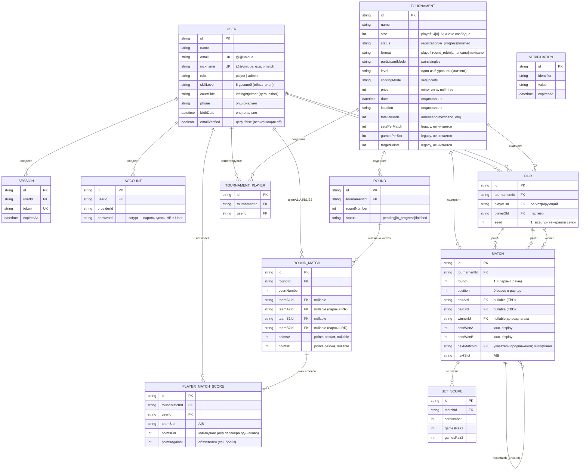

# 04 — Модель данных

Документ описывает проектирование базы данных приложения «Padel Tournaments»:
сущности, их атрибуты, связи, ограничения целостности и принятые проектные решения.
Источник истины — `prisma/schema.prisma`. СУБД — **SQLite**, доступ — через **Prisma ORM**.

См. также: [архитектура](03-arhitektura.md), [форматы и алгоритмы](05-formaty-i-algoritmy.md),
[подсчёт и standings](06-podschyot-i-standings.md), [безопасность](10-autentifikatsiya-i-bezopasnost.md).

## 1. Обзор

Модель состоит из **12 сущностей**, разбитых на три группы:

| Группа | Сущности | Происхождение |
|--------|----------|---------------|
| Аутентификация | `User`, `Session`, `Account`, `Verification` | Генерируются Better Auth; в `User` дописаны доменные поля |
| Домен playoff / парные турниры | `Tournament`, `Pair`, `Match`, `SetScore` | Олимпийская сетка для пар (база v1.0) |
| Домен round-based форматов | `TournamentPlayer`, `Round`, `RoundMatch`, `PlayerMatchScore` | Круговой / американо / мексикано (v2.0) |

Ключевая идея проектирования — **аддитивность**: модели round-based форматов добавлены так,
чтобы не ломать существующее дерево playoff (`Match`/`SetScore`). `Tournament` — общий «корень»
для всех форматов; конкретный набор связанных таблиц определяется полями `format` и `participantMode`.

## 2. ER-диаграмма

## 3. Сущности аутентификации

Эти четыре таблицы спроектированы и сгенерированы Better Auth (`npx @better-auth/cli generate`).
Доменные поля дописаны только в `User`. Подробнее — [аутентификация и безопасность](10-autentifikatsiya-i-bezopasnost.md).

### 3.1. User (`user`)

Учётная запись игрока или администратора.

| Поле | Тип | Ограничения | Назначение |
|------|-----|-------------|------------|
| `id` | String | PK | Идентификатор (генерируется Better Auth) |
| `name` | String | — | Отображаемое имя |
| `email` | String | `@@unique` | Логин |
| `emailVerified` | Boolean | деф. `false` | Верификация выключена (офлайн-демо) |
| `image` | String? | — | Аватар (не используется) |
| `role` | String | деф. `"player"` | `"player"` \| `"admin"` (плагин `admin()`) |
| `banned`, `banReason`, `banExpires` | Boolean?/String?/DateTime? | — | Поля плагина `admin()` (не используются) |
| `courtSide` | String | деф. `"either"` | `"left"`\|`"right"`\|`"either"`; **не** собирается при регистрации |
| `nickname` | String | **`@@unique`** | Обязательный уникальный человекочитаемый идентификатор (регистрозависимый exact-match) |
| `phone` | String? | — | Телефон, только для отображения |
| `skillLevel` | String | NOT NULL | Один из 5 уровней: `beginner`\|`progressing`\|`intermediate`\|`advanced`\|`pro` |
| `birthDate` | DateTime? | — | Дата рождения (опц.; собирается как ISO-строка — A1-fallback) |
| `createdAt`, `updatedAt` | DateTime | — | Метки времени |

**Проектное решение:** у `User` намеренно НЕТ колонки пароля — пароль (scrypt) хранится в `Account.password`.
`@@unique([nickname])` — источник истины уникальности ника на уровне БД; это единственное (кроме email)
уникальное поле, проверяемое при создании, поэтому ошибку создания трактуем как «ник занят».

### 3.2. Session / Account / Verification

| Сущность | Назначение | Ключевые поля |
|----------|------------|---------------|
| `Session` | Активные сессии (куки) | `token` (`@@unique`), `expiresAt`, `userId` (FK, onDelete Cascade), `@@index([userId])` |
| `Account` | Учётные данные/провайдеры; **здесь scrypt-пароль** | `providerId`, `accountId`, `password?`, `userId` (FK, Cascade), `@@index([userId])` |
| `Verification` | Токены верификации (не задействованы — верификация off) | `identifier`, `value`, `expiresAt`, `@@index([identifier])` |

## 4. Сущности домена playoff / парных турниров

### 4.1. Tournament (`tournament`)

Корневая сущность турнира — общая для всех четырёх форматов.

| Поле | Тип | Ограничения | Назначение |
|------|-----|-------------|------------|
| `id` | String | PK (`cuid`) | Идентификатор |
| `name` | String | — | Название |
| `size` | Int | app-валидация | Вместимость. Для `playoff` — строго 4/8/16; для остальных — свободно (soft-cap 24) |
| `status` | String | деф. `"registration"` | `"registration"`\|`"in_progress"`\|`"finished"` (см. [машины состояний](08-mashiny-sostoyaniy.md)) |
| `format` | String | деф. `"playoff"` | `"playoff"`\|`"round_robin"`\|`"americano"`\|`"mexicano"` |
| `participantMode` | String | деф. `"pairs"` | `"pairs"`\|`"singles"` |
| `level` | String | деф. `"intermediate"` | Один из 5 уровней — строгий матчинг при регистрации |
| `scoringMode` | String | деф. `"sets"` | `"sets"`\|`"points"` (ортогонален формату) |
| `price` | Int? | — | Цена в минорных единицах; `null` = бесплатно/не задано |
| `date` | DateTime? | — | Дата проведения |
| `location` | String? | — | Место |
| `totalRounds` | Int? | — | Число раундов для американо/мексикано |
| `setsPerMatch` | Int | деф. 3 | **Legacy** — после free-form не читается (см. [подсчёт](06-podschyot-i-standings.md)) |
| `gamesPerSet` | Int | деф. 6 | **Legacy** — не читается |
| `targetPoints` | Int? | — | **Legacy** — не читается (target снят) |
| `createdAt` | DateTime | — | Метка создания |

**Связи:** `pairs[]`, `matches[]` (playoff/парные), `tournamentPlayers[]`, `rounds[]` (round-based).
Какие из них наполняются — зависит от `format`/`participantMode`.

**Проектное решение (legacy-поля):** `setsPerMatch`/`gamesPerSet`/`targetPoints` оставлены в схеме с
дефолтами после перехода на free-form подсчёт, чтобы **не делать миграцию**; они больше не читаются и
убраны из формы создания. Это сознательный компромисс «диплом > чистота схемы».

### 4.2. Pair (`pair`)

Зарегистрированная пара в турнире (для `playoff`/`round_robin` в режиме `pairs`).

| Поле | Тип | Ограничения | Назначение |
|------|-----|-------------|------------|
| `id` | String | PK (`cuid`) | Идентификатор |
| `tournamentId` | String | FK → Tournament, onDelete **Cascade** | Турнир |
| `player1Id` | String | FK → User (`PairPlayer1`) | Регистрирующий игрок (идентичность сессии) |
| `player2Id` | String | FK → User (`PairPlayer2`) | Выбранный партнёр |
| `seed` | Int? | — | Посев 1..size; заполняется при генерации сетки |
| `createdAt` | DateTime | — | Метка |

**Ограничения:** `@@unique([tournamentId, player1Id])` и `@@unique([tournamentId, player2Id])` —
защита от повторной вставки одной пары в один слот. Кросс-слотовый дубликат (игрок как player1 здесь и
player2 там) ловится транзакционным `findFirst` в `registration.ts`. FK на `Tournament` — Cascade;
FK на `User` — **не** Cascade (удаление пользователя не должно молча стирать историю).

### 4.3. Match (`match`)

Узел предгенерированного дерева single-elimination. Все `size − 1` матчей создаются сразу при генерации
сетки и связываются указателями `nextMatchId`/`nextSlot`.

| Поле | Тип | Ограничения | Назначение |
|------|-----|-------------|------------|
| `id` | String | PK (`cuid`) | Идентификатор |
| `tournamentId` | String | FK → Tournament, Cascade | Турнир |
| `round` | Int | — | Номер раунда (1 = первый, максимум = финал) |
| `position` | Int | — | 0-based индекс в раунде (порядок раскладки) |
| `pairAId` | String? | FK → Pair (`MatchPairA`) | Слот A (null = TBD) |
| `pairBId` | String? | FK → Pair (`MatchPairB`) | Слот B (null = TBD) |
| `winnerId` | String? | FK → Pair (`MatchWinner`) | Победитель (заполняется при результате) |
| `setsWonA` / `setsWonB` | Int? | — | Кэш счёта сетов (только для отображения) |
| `nextMatchId` | String? | FK → Match (`Bracket`, self-relation) | Куда продвигается победитель; `null` = финал |
| `nextSlot` | String? | — | `"A"`\|`"B"` — слот в родительском матче |
| `setScores` | SetScore[] | — | Структурный счёт по сетам |

**Ограничения:** `@@unique([tournamentId, round, position])` — структурный инвариант и backstop против
двойного «Старта» (конкурентная повторная генерация падает на вставке). `@@index([tournamentId, round])`.
**Источник истины продвижения** — `winnerId` + указатель `nextMatch`/`nextSlot`; `setsWonA/B` — производное
для отображения. Подробнее — [форматы](05-formaty-i-algoritmy.md).

### 4.4. SetScore (`set_score`)

Одна строка на сет внутри матча playoff.

| Поле | Тип | Ограничения | Назначение |
|------|-----|-------------|------------|
| `id` | String | PK | Идентификатор |
| `matchId` | String | FK → Match, onDelete **Cascade** | Матч |
| `setNumber` | Int | — | Номер сета (1..N, free-form) |
| `gamesPair1` / `gamesPair2` | Int | — | Геймы пары A / пары B в этом сете |

**Ограничения:** `@@unique([matchId, setNumber])` — нет дублей номеров сетов. На каждую (пере)запись
результата все строки матча **delete + recreate** (свободная правка не оставляет устаревших сетов).

## 5. Сущности домена round-based форматов

### 5.1. TournamentPlayer (`tournament_player`)

Одиночная регистрация игрока (для `round_robin`/`americano`/`mexicano` в режиме `singles`).

| Поле | Тип | Ограничения | Назначение |
|------|-----|-------------|------------|
| `id` | String | PK | Идентификатор |
| `tournamentId` | String | FK → Tournament, Cascade | Турнир |
| `userId` | String | FK → User (**не** Cascade) | Игрок |

**Ограничения:** `@@unique([tournamentId, userId])`, `@@index([tournamentId])`. Вместимость измеряется
счётом `TournamentPlayer` относительно `size` (а НЕ счётом `Pair`).

### 5.2. Round (`round`)

Контейнер раунда для round-based форматов.

| Поле | Тип | Ограничения | Назначение |
|------|-----|-------------|------------|
| `id` | String | PK | Идентификатор |
| `tournamentId` | String | FK → Tournament, Cascade | Турнир |
| `roundNumber` | Int | — | Номер раунда |
| `status` | String | деф. `"pending"` | `"pending"`\|`"in_progress"`\|`"finished"` |
| `matches` | RoundMatch[] | — | Матчи на кортах |

**Ограничения:** `@@unique([tournamentId, roundNumber])`. `round_robin`/`americano` могут
предгенерировать все раунды; `mexicano` материализует раунды по одному (каждый зависит от текущего рейтинга).

### 5.3. RoundMatch (`round_match`)

Матч на корте внутри раунда. Две **динамические** команды через 4 nullable FK на `User`.

| Поле | Тип | Ограничения | Назначение |
|------|-----|-------------|------------|
| `id` | String | PK | Идентификатор |
| `roundId` | String | FK → Round, Cascade | Раунд |
| `courtNumber` | Int | — | Номер корта |
| `teamA1Id` / `teamA2Id` | String? | FK → User (`RMTeamA1`/`RMTeamA2`) | Команда A: singles → только A1; парный RR → A1+A2 |
| `teamB1Id` / `teamB2Id` | String? | FK → User (`RMTeamB1`/`RMTeamB2`) | Команда B: аналогично |
| `pointsA` / `pointsB` | Int? | — | Результат в points-режиме (null до записи) |
| `playerScores` | PlayerMatchScore[] | — | Индивидуальные очки |

**Проектное решение:** переиспользование 4 слотов вместо отдельной модели «пара в раунде» —
singles заполняет только `teamA1`/`teamB1`; парный круговой кладёт пару в `A1+A2` vs `B1+B2`.
FK на `User` — **не** Cascade.

### 5.4. PlayerMatchScore (`player_match_score`)

Индивидуальные очки игрока в корт-матче — основа рейтинга американо/мексикано.

| Поле | Тип | Ограничения | Назначение |
|------|-----|-------------|------------|
| `id` | String | PK | Идентификатор |
| `roundMatchId` | String | FK → RoundMatch, Cascade | Корт-матч |
| `userId` | String | FK → User (**не** Cascade) | Игрок |
| `teamSlot` | String | — | `"A"`\|`"B"` |
| `pointsFor` | Int | — | Командные очки (оба партнёра получают **одинаковое** значение) |
| `pointsAgainst` | Int | NOT NULL | Очки соперника (обязательны: тай-брейк + детерминизм мексикано) |

**Ограничения:** `@@unique([roundMatchId, userId])`, `@@index([userId])`.

## 6. Сводка связей

| Связь | Кардинальность | Тип | onDelete |
|-------|----------------|-----|----------|
| User → Session / Account | 1 — N | владение | Cascade |
| User → Pair (player1 / player2) | 1 — N (×2 именованные) | роль в паре | — (защита истории) |
| User → TournamentPlayer / RoundMatch(×4) / PlayerMatchScore | 1 — N | участие | — |
| Tournament → Pair / Match / TournamentPlayer / Round | 1 — N | состав | Cascade |
| Pair → Match (A / B / winner) | 1 — N (×3 именованные) | участие/победа | — |
| Match → SetScore | 1 — N | детализация счёта | Cascade |
| Match → Match (`Bracket`) | 1 — N (self) | продвижение | — |
| Round → RoundMatch | 1 — N | состав раунда | Cascade |
| RoundMatch → PlayerMatchScore | 1 — N | очки | Cascade |

**Дисциплина каскадов:** удаление турнира каскадно чистит его пары/матчи/раунды и их детей; удаление
пользователя **никогда** не каскадит в доменную историю (FK на `User` всюду без Cascade).

## 7. Проектные решения и обоснования

1. **Перечисления как String + zod/TS-union.** SQLite (через Prisma 6) не имеет нативного enum-типа,
   а Prisma-enum добавил бы сложности. Все «перечисления» (`status`, `format`, `participantMode`,
   `scoringMode`, `role`, `courtSide`, `skillLevel`, `teamSlot`, `nextSlot`) — это `String`,
   валидируемые на уровне приложения (zod-union в `src/lib/validation`, TS-union в коде). См. [архитектура](03-arhitektura.md).

2. **Предгенерированное дерево playoff с указателем `nextMatch`.** Вся сетка (`size − 1` матчей)
   создаётся при «Старте»; продвижение победителя — простое обновление слота родителя. Альтернатива
   (вычислять сетку на каждый чит) отвергнута как анти-паттерн.

3. **Аддитивность round-based поверх playoff.** Новые модели (`TournamentPlayer`/`Round`/`RoundMatch`/
   `PlayerMatchScore`) не трогают `Match`/`SetScore`. Один `Tournament` обслуживает оба мира; ветвление —
   по `format`/`participantMode`.

4. **Рейтинги (standings) — производные, не хранятся.** Турнирная таблица американо/мексикано/кругового
   вычисляется на каждый запрос из `PlayerMatchScore`/`RoundMatch` (см. [подсчёт](06-podschyot-i-standings.md)),
   поэтому отдельной таблицы рейтинга в схеме нет — нет риска рассинхронизации.

5. **Идентичность пары в парном круговом** восстанавливается по `(tournamentId, player1Id)` из слотов
   `RoundMatch`, без отдельной таблицы связи пары и корт-матча.

6. **Свободная правка результата** реализована через delete+recreate дочерних строк (`SetScore`,
   `PlayerMatchScore`), что упрощает логику ценой перезаписи — допустимо для диплома.

## 8. О нормализации

Схема близка к **3НФ**: атрибуты зависят от ключа сущности, повторяющиеся группы вынесены в дочерние
таблицы (`SetScore`, `PlayerMatchScore`, `RoundMatch`). Сознательные отступления — кэш-поля
`Match.setsWonA/setsWonB` (производны от `SetScore`, хранятся для дешёвого отображения) и
дублирование командного `pointsFor` у обоих партнёров (упрощает агрегацию рейтинга по игроку).
Эти денормализации локальны, контролируемы (перезаписываются вместе с результатом) и оправданы
простотой чтения — приоритет дипломной работы.
