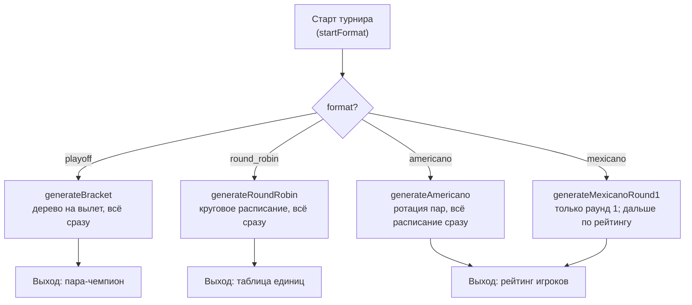
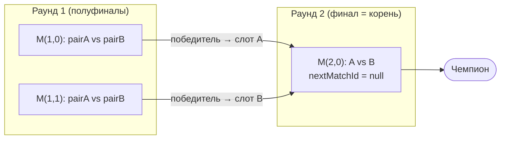
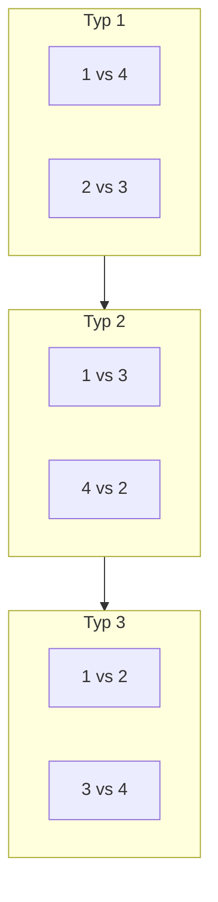
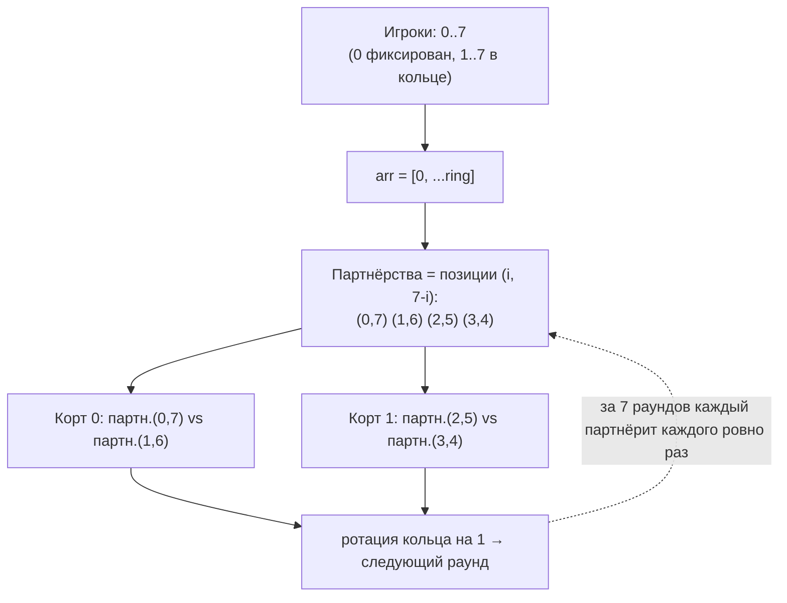
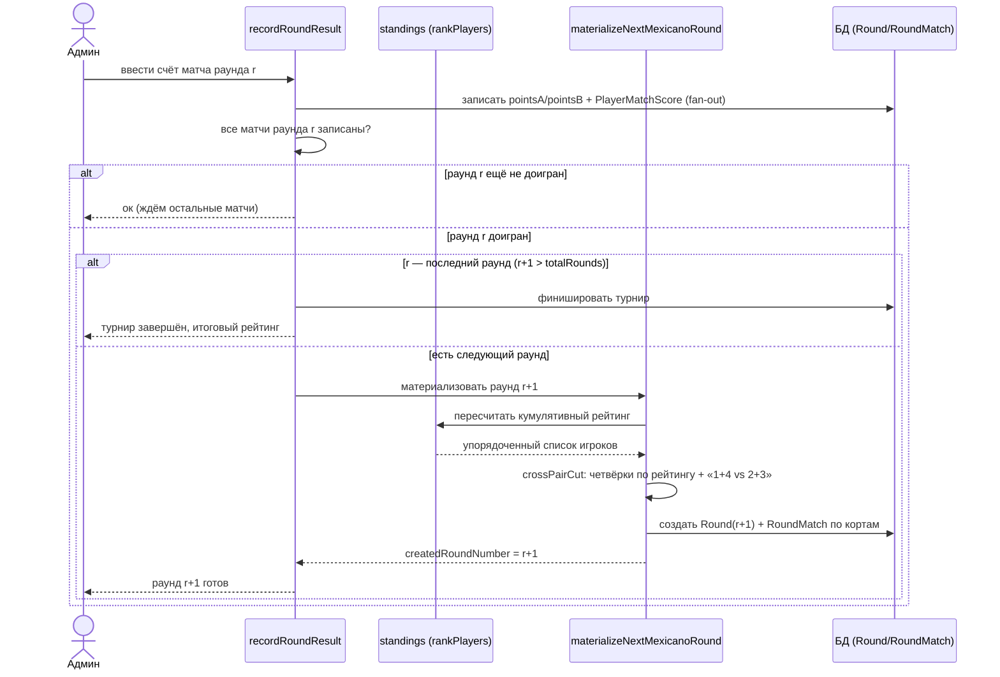
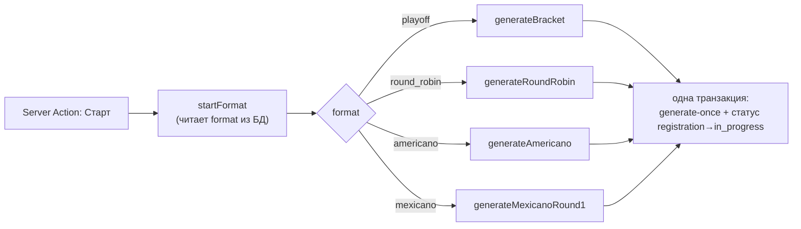

# 05 — Форматы турниров и алгоритмы

Этот документ описывает четыре формата турниров, поддерживаемых системой «Padel Tournaments», и алгоритмы, которые формируют из списка участников конкретные матчи: посев и дерево на вылет, круговое расписание, ротацию пар и динамическую перенарезку по рейтингу. Цель главы — зафиксировать, *что* и *как* спроектировано: приводятся идеи, инварианты, псевдокод и диаграммы, но не тела функций.

Подсчёт очков, определение победителя матча и построение итоговых таблиц вынесены в отдельный документ — [подсчёт и standings](06-podschyot-i-standings.md); здесь они упоминаются лишь там, где влияют на ход алгоритма. Сущности базы данных (`Tournament`, `Pair`, `Match`, `SetScore`, `TournamentPlayer`, `Round`, `RoundMatch`, `PlayerMatchScore`) подробно описаны в [модели данных](04-model-dannyh.md). Жизненные циклы турнира, раунда и матча, а также правила переходов статусов — в [машинах состояний](08-mashiny-sostoyaniy.md).

Все четыре генератора живут в слое сервисов (`src/lib/services/`), принимают `PrismaClient` параметром и оборачивают запись в одну транзакцию: на любом отказе ничего не сохраняется. Генерация запускается ровно один раз — повторный «Старт» отбивается типизированной ошибкой (`BracketError` / `FormatError`) и страхуется уникальным ограничением в БД.

---

## 1. Обзор четырёх форматов

Система реализует два принципиально разных класса соревнований. **Playoff** и **round-robin** — *соревновательные* форматы: единица соревнования (пара или игрок) фиксирована, расписание строится целиком при старте и не зависит от результатов. **Американо** и **мексикано** — *социально-соревновательные* форматы: регистрация одиночная, партнёр меняется от раунда к раунду, очки индивидуальные, а на выходе — рейтинг игроков, а не пара-чемпион.

Главное архитектурное следствие этого водораздела: playoff и round-robin материализуют все матчи «всё сразу» (stateless-генерация по списку участников), американо — тоже всё сразу (расписание ротации детерминировано и не зависит от счёта), а **мексикано** материализует раунды по одному, потому что состав пар следующего раунда вычисляется по текущему рейтингу и недоступен, пока предыдущий раунд не доигран.

| Формат | Регистрация | Размер | Как формируются матчи | Выход | Ротация |
|--------|-------------|--------|-----------------------|-------|---------|
| `playoff` | парная | строго 4 / 8 / 16 (степень двойки, без bye) | дерево на вылет, посев `Fisher–Yates`, всё дерево сразу | пара-чемпион (корень дерева) | нет |
| `round_robin` | парная **или** одиночная | свободное N (soft-cap 24), любое ≥ 2 | каждый с каждым, круговой метод, всё расписание сразу | топ итоговой таблицы единиц | нет |
| `americano` | только одиночная | свободное N ≥ 4 (soft-cap 24) | круговой метод **на игроках**, всё расписание сразу | рейтинг игроков | да (партнёр меняется каждый раунд по фиксированной схеме) |
| `mexicano` | только одиночная | свободное N ≥ 8 (soft-cap 24) | раунд 1 — случайная нарезка; раунды 2..R — нарезка по текущему рейтингу, по одному | рейтинг игроков | да (партнёр меняется каждый раунд **по рейтингу**) |

Размер хранится в `Tournament.size` и для playoff обязан принадлежать множеству {4, 8, 16} — это исключает bye-логику (см. §2). Для остальных форматов `size` задаёт лишь вместимость регистрации (capacity-close), а минимально допустимое число участников проверяется уже на старте внутри соответствующего генератора (round-robin ≥ 2, американо ≥ 4, мексикано ≥ 8).

Режим подсчёта (`scoringMode` ∈ {`sets`, `points`}) **ортогонален** формату: он определяет, как вводится и интерпретируется счёт матча, но не влияет на то, как формируются сами матчи. Поэтому в данном документе он почти не фигурирует — детали в [подсчёте и standings](06-podschyot-i-standings.md).

Диспетчеризация старта по `format` сосредоточена в одной функции `startFormat` (см. §6): она выбирает нужный генератор и больше ничего не делает.



---

## 2. Playoff — олимпийская система (single-elimination)

### Идея

Playoff — классическая сетка на вылет: пары разбиваются на матчи первого раунда, победитель каждого проходит в следующий раунд, проигравший выбывает. Дерево сворачивается к единственному финалу, победитель которого — чемпион турнира. Единица — `Pair`, партнёр фиксирован на весь турнир.

### Почему ровно степень двойки

Размер ограничен множеством {4, 8, 16} — степенями двойки. Это сознательное упрощение: при размере, равном степени двойки, каждый раунд имеет чётное число участников, и **bye** (автоматический проход без игры из-за нечётного числа) никогда не нужен. Отказ от bye-логики убирает целый класс краевых случаев (кому отдать «пустой» проход, как это влияет на посев и продвижение) — для дипломной работы это оправданная экономия сложности. Размер проверяется и при создании турнира (zod-валидация формы), и повторно внутри генератора по таблице раундов.

### Структура дерева в данных

Каждый матч — узел модели `Match` с координатами `(round, position)`: `round` нумеруется с 1 (первый раунд), `position` — с 0 слева направо внутри раунда. Связь «куда идёт победитель» хранится прямо в узле через пару полей `nextMatchId` + `nextSlot` (self-relation «Bracket»): победитель попадает в матч `nextMatchId` на слот `nextSlot` ∈ {`A`, `B`}. У финала `nextMatchId` и `nextSlot` равны `null` — это и есть признак корня дерева. Число матчей в сетке из `size` пар всегда равно `size − 1` (функция `matchCount(size)`), а раскладка по раундам берётся из фиксированной таблицы `ROUNDS` (например, для 8 пар — `[4, 2, 1]`), а **не** вычисляется через `log2`, чтобы исключить ошибки округления на степенях двойки.

### Алгоритм `generateBracket`

Генерация выполняется в одной транзакции и идемпотентна по отношению к повторному запуску. Ключевая идея — **создать все `size − 1` матчей заранее**, ещё до того как известны победители: «пустые» узлы будущих раундов существуют с самого начала, что упрощает продвижение (некуда «не дойти»). Псевдокод:

```
generateBracket(tournamentId):
  в транзакции:
    (1) перечитать турнир; требовать status == "registration"      // иначе BracketError("not_open")
    (2) size = tournament.size
        rounds = ROUNDS[size]                                       // нет записи → BracketError("bad_size")
        требовать count(Pair) == size                               // иначе BracketError("wrong_count")
    (3) требовать count(Match) == 0                                 // иначе BracketError("already_generated")
    (4) pairs = все пары турнира
        shuffled = Fisher–Yates(pairs)                              // случайная жеребьёвка
        для i от 0 до size-1: pair[shuffled[i]].seed = i + 1        // посев 1..size
    (5) создавать матчи ОТ ФИНАЛА К ПЕРВОМУ раунду (round = finalRound..1):
          для каждой position в раунде:
            если round < finalRound:
              parent = advance(round, position)                    // см. ниже
              nextMatchId = id уже созданного родителя
              nextSlot    = parent.slot
            иначе: nextMatchId = null, nextSlot = null              // финал = корень
            если round == 1:                                       // только первый раунд получает пары
              pairAId = shuffled[position*2]
              pairBId = shuffled[position*2 + 1]
            создать Match(round, position, pairAId?, pairBId?, nextMatchId?, nextSlot?)
    (6) перевести турнир registration → in_progress (через статус-машину)
    верни { matchesCreated: size - 1 }
```

Два проектных нюанса:

- **Посев `Fisher–Yates`.** Жеребьёвка должна быть случайной, поэтому пары перемешиваются на копии массива стандартным `Fisher–Yates` (единственное место в playoff-движке, где используется `Math.random`), и в перемешанном порядке им присваивается `seed` 1..`size`. Пары первого раунда берутся как соседние элементы перемешанного массива: матч на позиции `position` получает `shuffled[2·position]` и `shuffled[2·position+1]`.
- **Порядок создания — от финала к первому раунду.** Матчи создаются в порядке убывания номера раунда. Благодаря этому к моменту создания дочернего матча его родитель уже существует в БД и имеет известный `id`, который можно записать в `nextMatchId` ребёнка. Матчи раундов выше первого создаются с пустыми слотами (`pairAId`/`pairBId` = `null`) — они заполнятся по мере продвижения победителей.

Куда идёт победитель, вычисляет чистая функция `advance(round, position)` — единственное место «слотовой арифметики», протестированное изолированно:

```
advance(round, position) =
  { round:    round + 1,
    position: floor(position / 2),
    slot:     (position чётная) ? "A" : "B" }
```

То есть родитель находится в следующем раунде на позиции `floor(position/2)`; чётные позиции питают слот `A` родителя, нечётные — слот `B`.

### Продвижение `advance` (запись результата)

Само продвижение победителя в дереве — часть записи результата матча (сервис `result.ts`, описан в [подсчёте и standings](06-podschyot-i-standings.md)). Логика поверх `advance` такова: когда у матча определён победитель, берётся его `nextMatchId`/`nextSlot`; если они не `null`, победившая пара записывается в родительский матч на соответствующий слот (`A` или `B`). Если же `nextMatchId == null`, значит это финал — турнир автоматически финишируется (победитель финала становится чемпионом). Поскольку playoff не допускает ничьих, попытка записать ничейный счёт отбивается ошибкой `ResultError("draw", …)` без продвижения и без финиша.

### Дерево на 4 пары

Раунды — это колонки слева направо; стрелки показывают, в какой матч и на какой слот уходит победитель.



Здесь `advance(1, 0) = (round 2, position 0, slot A)` и `advance(1, 1) = (round 2, position 0, slot B)`: оба полуфинала ведут в один финал, но в разные слоты.

---

## 3. Round-robin — круговая система

### Идея

Каждая единица играет с каждой другой ровно один раз (single round-robin); победитель определяется не деревом, а накопленной итоговой таблицей. Единица соревнования — **пара** (парный round-robin, регистрация по нику партнёра как в playoff) **или** **игрок** (одиночный round-robin, матчи 1×1). Партнёр в парном режиме не ротирует. Размер свободный (не обязан быть степенью двойки); рекомендуемый мягкий предел — 24 единицы, так как число матчей растёт квадратично (`N·(N−1)/2`).

### Круговой метод (circle / polygon method)

Расписание строит чистая функция `circleMethodSchedule<T>` — классический круговой метод: одна позиция массива фиксируется навсегда, а остальные элементы вращаются по кольцу; на каждом обороте пары составляются как «первый с последним, второй с предпоследним» и т. д. Инвариант: за `N−1` туров каждая единица встретит каждую другую ровно один раз, итого `N·(N−1)/2` матчей.

```
circleMethodSchedule(units):                       // вход уже перемешан вызывающим (детерминизм)
  arr = копия units
  если len(arr) нечётно: arr.push(BYE=null)         // дополняем фиктивной единицей
  n = len(arr); rounds = n - 1; half = n / 2
  для r от 0 до rounds-1:
    matches = []
    для i от 0 до half-1:
      home = arr[i]; away = arr[n-1-i]
      если home == BYE или away == BYE: continue     // сторона с BYE отдыхает, матч НЕ создаётся
      matches.push({ courtNumber: len(matches), unitA: home, unitB: away })
    выдать раунд r+1 с matches
    // ротация: arr[0] на месте, хвост [1..n-1] вращается на 1 (последний → в начало)
    arr = [ arr[0], последний(хвост), ...хвост без последнего ]
```

Три краевых случая, явно учтённых в реализации (и отмеченных в [ресёрче форматов](../.planning/research/FORMATS.md) как типовые ошибки):

- **Фиксируется только `arr[0]`.** Вращать *весь* массив, включая первый элемент, — ошибка: появляются дубли и пропуски встреч. Поэтому `arr[0]` не двигается никогда, ротируется лишь хвост.
- **Нечётное N → добавляется BYE.** Если единиц нечётное число, в массив добавляется фиктивная единица-сентинел (`null`). Тогда туров становится `N` (для исходного нечётного `N`), и каждая реальная единица ровно один раз «играет с BYE», то есть отдыхает.
- **BYE не порождает матч.** Сторона, выпавшая на BYE, просто пропускает тур — матч не создаётся, чтобы не засорять таблицу. Нумерация кортов (`courtNumber`) при этом переиндексируется по фактически созданным матчам, без «дыр».

Сам `circleMethodSchedule` не перемешивает вход — жеребьёвку (`Fisher–Yates`) делает вызывающий `generateRoundRobin` ровно один раз перед построением расписания. Это держит расписание детерминированным относительно зафиксированного порядка и сосредотачивает недетерминизм в одной точке.

### Парный и одиночный режимы (слоты `RoundMatch`)

Round-robin использует общую round-based модель данных: контейнер тура — `Round`, матч на корте — `RoundMatch` с четырьмя nullable-FK на `User`: `teamA1`, `teamA2`, `teamB1`, `teamB2`. Эти же четыре слота переиспользуются обоими режимами:

- **Парный режим:** заполняются все четыре слота — пара A это (`teamA1`, `teamA2`) = (`player1`, `player2`), пара B — (`teamB1`, `teamB2`).
- **Одиночный режим (1×1):** заполняются только `teamA1` и `teamB1`, а `teamA2`/`teamB2` остаются `null`.

Какой источник участников читать, генератор решает по `participantMode` турнира: `pairs` → таблица `Pair`, `singles` → таблица `TournamentPlayer` (тот же источник, что и регистрация). Внутри расписание оперирует размеченным (discriminated) типом `Unit` (`{kind:"pair", …}` или `{kind:"user", …}`), и уже при сохранении в `RoundMatch` выбирается нужная раскладка слотов.

Итоговая таблица для round-robin — это standings вида `units` (ключ сортировки: победы в матчах → разница очков → набранные очки → стабильный фолбэк по id); подробности в [подсчёте и standings](06-podschyot-i-standings.md). Финиш турнира наступает автоматически, когда все матчи всех туров сыграны.

### Расписание на 4 участника (3 тура)

Для четырёх единиц `circleMethodSchedule` даёт ровно `3` тура и `6` матчей (каждый с каждым). Зафиксировав вход как `[1, 2, 3, 4]` (элемент `1` неподвижен):



После каждого тура хвост `[2, 3, 4]` поворачивается на одну позицию (`4` уходит в начало хвоста), а `1` остаётся на месте. Легко проверить, что все шесть пар {1-2, 1-3, 1-4, 2-3, 2-4, 3-4} встречаются ровно один раз.

---

## 4. Американо

### Идея и канон

Американо — социально-соревновательный формат с **одиночной** регистрацией, в котором **партнёр меняется каждый раунд**. Каноническая цель: за `N−1` раундов каждый игрок ровно один раз сыграет в паре с каждым другим. Очки индивидуальные (см. [подсчёт и standings](06-podschyot-i-standings.md)), итог — рейтинг игроков, а не пара-чемпион. Расписание целиком генерируется при старте и не зависит от результатов.

### Алгоритм `americanoSchedule` — круговой метод на игроках

Ключевая идея: применить тот же круговой метод, но **к игрокам, а не к парам**. Тогда «пары позиций» кругового метода становятся партнёрствами, и гарантия «каждый встретит каждого» превращается в гарантию **«каждый сыграл в паре с каждым ровно раз»** (partner-once). Эта гарантия проверена для N = 4 / 8 / 12 / 16 — ноль повторных партнёрств.

```
americanoSchedule(players):                          // вход уже перемешан вызывающим
  padded = копия players
  если len нечётно: padded.push(BYE=null)
  n = len(padded); rounds = n - 1; half = n / 2
  fixed = padded[0]; ring = padded[1..n-1]            // arr[0] фиксирован, кольцо вращается
  для r от 0 до rounds-1:
    arr = [fixed, ...ring]
    // ПАРТНЁРСТВА: пары позиций (i, n-1-i)
    partnerships = []
    для i от 0 до half-1:
      a = arr[i]; b = arr[n-1-i]
      если a == BYE или b == BYE: continue            // партнёрство с BYE отдыхает
      partnerships.push([a, b])
    // КОРТЫ: корт k = партнёрство(2k) vs партнёрство(2k+1)
    courts = []
    для k = 0, пока 2k+1 < len(partnerships):
      courts.push({ courtNumber: len(courts), teamA: partnerships[2k], teamB: partnerships[2k+1] })
    выдать раунд r+1 с courts
    // ротация кольца на 1 (последний элемент кольца → в начало)
    ring = [ последний(ring), ...ring без последнего ]
```

Существенные проектные моменты:

- **Партнёр-once — определяющая гарантия; уникальность соперников — нет.** Корт `k` сводит партнёрство `2k` против партнёрства `2k+1` — то есть назначение *соперников* вторично. Для `N`, не кратных 4, и для больших `N` полный микс соперников недостижим в принципе; это нормальное свойство кругового метода, а не дефект. Движок сознательно гарантирует только «партнёр ровно раз».
- **Sit-outs (кто отдыхает).** Число игроков, сидящих в каждом раунде, определяется остатком `N` по модулю 4:
  - `N ≡ 0 (mod 4)` → отдыхают **0** (идеальный случай, все на кортах);
  - `N` нечётное → отдыхает **1** игрок (добавляется один BYE);
  - `N ≡ 2 (mod 4)` → отдыхают **2** игрока: число валидных партнёрств оказывается нечётным, и последнее непарное партнёрство (двое) в этом раунде остаётся без корта.

  Сидящие раунды не штрафуются в рейтинге — у игрока просто меньше вкладов в сумму очков (детали в [подсчёте и standings](06-podschyot-i-standings.md)).

Регистрация американо всегда одиночная: генератор читает `TournamentPlayer`, никогда `Pair`. Минимум — 4 игрока (один корт). Перемешивание игроков делается один раз перед построением расписания; `americanoSchedule` сам по себе детерминирован. В `RoundMatch` партнёрство A кладётся в слоты (`teamA1`, `teamA2`), партнёрство B — в (`teamB1`, `teamB2`).

### Ротация и распределение по кортам для N = 8

При восьми игроках получается `7` раундов, по `2` корта в каждом (4 партнёрства → 2 корта), отдыхающих нет (`8 ≡ 0 mod 4`). Диаграмма показывает построение одного раунда: как из зафиксированного `0` и вращающегося кольца возникают партнёрства, а из них — корты.



---

## 5. Мексикано

### Отличие от американо

Мексикано наследует от американо всё «социальное»: одиночная регистрация, индивидуальные очки, итог-рейтинг, четыре игрока на корте. Единственное, но определяющее отличие — **пары и соперники следующего раунда формируются динамически по текущему рейтингу**, а не по фиксированной круговой схеме. Формат самобалансирующийся: к концу турнира сильные сходятся с сильными, и матчи становятся ровнее. Повтор партнёров и соперников допускается — уникальность не является целью. Это и есть причина, по которой мексикано не может сгенерировать всё расписание сразу: состав раунда `r+1` зависит от результатов раунда `r`.

### Раунд 1 — случайный базовый (`round1Cut`)

Первый раунд — отправная точка без рейтинга: игроки перемешиваются и нарезаются по порядку на четвёрки. Внутри четвёрки **кросс-разведение не применяется**: для четвёрки `[q0, q1, q2, q3]` команда A = (`q0`, `q1`), команда B = (`q2`, `q3`), корт = индекс четвёрки.

```
round1Cut(ids):
  для каждой последовательной четвёрки g = ids[4g .. 4g+3]:
    teamA = (ids[4g],   ids[4g+1])
    teamB = (ids[4g+2], ids[4g+3])
    courtNumber = g
```

Нарезку на четвёрки выполняет общая чистая функция `quadCut(ids)`: она режет упорядоченный список на последовательные группы по 4 (`группа g = ids[4g..4g+3]`); остаток короче четырёх **не** образует корт — эти игроки отдыхают (мексикано по дизайну рассчитан на число игроков, кратное 4, но остаток отбрасывается корректно). Только раунд 1 генерируется при старте (функция `generateMexicanoRound1`, минимум 8 игроков, нужно ≥ 2 кортов, чтобы рейтинговая нарезка имела смысл).

### Раунды 2..R — нарезка по рейтингу (`crossPairCut`)

Каждый последующий раунд строится из **кумулятивного рейтинга** игроков. Список упорядочивается по убыванию очков и режется тем же `quadCut` на последовательные четвёрки: группа 0 — это места 1–4 (корт 1, «сильные против сильных»), группа 1 — места 5–8 (корт 2) и так далее. Внутри каждой четвёрки (с локальными местами `s0 < s1 < s2 < s3` по рейтингу) применяется **кросс-разведение по схеме D1 «1+4 vs 2+3»**:

```
crossPairQuad([s0, s1, s2, s3]):                  // s0..s3 — по убыванию рейтинга
  teamA = (s0, s3)      // 1-й + 4-й
  teamB = (s1, s2)      // 2-й + 3-й
  → суммы рангов 1+4 = 2+3 = 5: команды по силе РАВНЫ

crossPairCut(rankedIds):
  для каждой четвёрки из quadCut(rankedIds): применить crossPairQuad
```

Выбор «1+4 vs 2+3» (а не альтернативного «1+3 vs 2+4») зафиксирован как **проектное решение D1**: эта раскладка даёт равные по сумме рангов команды (5 = 5) и чуть шире представлена в источниках. Решение сделано явно и закреплено в коде, поскольку источники по мексикано расходятся именно в этом пункте (подробно — в [ресёрче форматов](../.planning/research/FORMATS.md), решение D1). Это **classic Mexicano**, который пересортировывает всю таблицу и заново режет на четвёрки; его не следует путать с King-of-the-Court / «Super Mexicano», где победитель переходит на корт выше — это отдельный формат, в системе не реализованный.

### Материализация следующего раунда (`materializeNextMexicanoRound`)

Следующий раунд не существует в БД, пока не доигран текущий. Его создаёт функция `materializeNextMexicanoRound`, которая вызывается **изнутри** транзакции записи результата раунда (`recordRoundResult`, см. [подсчёт и standings](06-podschyot-i-standings.md)) и сама транзакцию не открывает. Алгоритм:

```
materializeNextMexicanoRound(tournamentId, completedRoundNumber):
  nextRoundNumber = completedRoundNumber + 1
  (1) GATE "round_incomplete": найти завершённый раунд; посчитать его RoundMatch,
      у которых pointsA == null ИЛИ pointsB == null.
      если есть незаписанные → вернуть null (раунд не доигран — материализации нет)
  (2) MATERIALIZE-ONCE: если раунд nextRoundNumber уже существует → вернуть null
  (3) пересчитать кумулятивный рейтинг: агрегировать PlayerMatchScore по всем раундам
      (sumFor, sumAgainst, wins, played), затем rankPlayers(...) → упорядоченный список userId
  (4) courts = crossPairCut(ranked)                  // нарезка по рейтингу + «1+4 vs 2+3»
  (5) создать Round(nextRoundNumber) + по одному RoundMatch на корт
      (P2002 страхует материализацию-once при гонке → вернуть null)
  вернуть { createdRoundNumber: nextRoundNumber }
```

Два контракта важны для корректности:

- **Gate «round_incomplete».** Раунд `r+1` материализуется только тогда, когда у *всех* матчей раунда `r` уже есть результат (оба `pointsA` и `pointsB` заполнены). Пока хоть один матч не введён, функция возвращает `null` и ничего не создаёт — рейтинг ещё не финализирован, нарезать нельзя.
- **Финиш на последнем раунде, а не материализация.** `materializeNextMexicanoRound` сознательно *не* решает, что турнир закончился. Сравнение `completedRoundNumber + 1` с `totalRounds` и финиш турнира на последнем раунде принадлежат вызывающему `recordRoundResult`. То есть на завершении последнего раунда следующий раунд **не** материализуется — вместо этого турнир финишируется. Это разделение ответственности держит функцию материализации простой и переиспользуемой.

Детерминизм нарезки критичен: при равенстве очков порядок игроков должен быть воспроизводимым, иначе четвёрки получались бы случайно. Это обеспечивает стабильный финальный тай-брейк в `rankPlayers` (ключ сортировки игроков: сумма очков → разница → число побед → `userId` по возрастанию). Именно ради детерминизма поле `pointsAgainst` в `PlayerMatchScore` обязательно — оно нужно и как тай-брейк, и как вход для нарезки (см. [модель данных](04-model-dannyh.md)).

### Поток одного цикла мексикано

Диаграмма показывает цикл «запись результата раунда → пересчёт рейтинга → нарезка следующего раунда» и точку ветвления на последнем раунде.



---

## 6. Диспетчеризация — `format-engine`

Чтобы вызывающий код (Server Action «Старт») не ветвился по форматам, выбор генератора инкапсулирован в один диспетчер `startFormat(prisma, tournamentId)` в `format-engine.ts`. Он перечитывает `format` **из БД** (заявленный клиентом формат не используется — это защита от подмены формы: фальсифицированная форма не может перенаправить генератор) и маршрутизирует:

| `tournament.format` | Генератор |
|---------------------|-----------|
| `playoff` | `generateBracket` |
| `round_robin` | `generateRoundRobin` |
| `americano` | `generateAmericano` |
| `mexicano` | `generateMexicanoRound1` |

`startFormat` владеет только маршрутизацией — он не переописывает логику генераторов. Неизвестный формат приводит к обычной ошибке (защитная ветка; на практике недостижима благодаря валидации `format` при создании турнира). Симметрично устроен `recordFormatResult`: он по тому же `format` выбирает парсер и рекордер результата — playoff идёт через `parseRecordResultForm` → `recordResult`, а round-based форматы — через `parseRoundResultForm` → `recordRoundResult` (счёт-логика описана в [подсчёте и standings](06-podschyot-i-standings.md)).



---

## 7. Сводка проектных решений

Ниже — обоснование ключевых решений именно этого слоя (почему алгоритмы спроектированы так, а не иначе).

- **Аддитивность к playoff.** Playoff-стек (`Match` / `Pair` / `SetScore`) существовал первым и жёстко завязан на дерево на вылет (`pairAId`/`pairBId`/`winnerId` — FK на `Pair`, плюс `nextMatchId`/`nextSlot`). Вместо того чтобы навешивать на `Match` взаимоисключающие поля для round-based форматов (что сломало бы продвижение и уникальные ограничения), для круговых и ротационных форматов заведены отдельные модели (`Round`, `RoundMatch`, `PlayerMatchScore`, `TournamentPlayer`). Новые форматы добавлены *поверх* playoff, не трогая его поведение — playoff-путь остался байт-в-байт прежним.

- **Переиспользование слотов `RoundMatch`.** Четыре nullable-FK на `User` (`teamA1`/`teamA2`/`teamB1`/`teamB2`) обслуживают все три round-based формата сразу: парный round-robin занимает все четыре слота, одиночный 1×1 — только `teamA1`/`teamB1`, а американо/мексикано кладут в них динамические партнёрства. Это избавляет от трёх разных таблиц матчей и делает один компонент визуализации (`rotation-view` / `round-robin-view`) применимым к нескольким форматам.

- **Чистые функции расписания, тестируемые без БД.** Вся «опасная» арифметика — `advance` (слоты дерева), `circleMethodSchedule`, `americanoSchedule`, `quadCut` / `crossPairQuad` / `round1Cut` / `crossPairCut` — вынесена в Prisma-free функции. Off-by-one ошибки кругового метода и слотовой арифметики решены один раз и покрыты модульными тестами без необходимости поднимать базу.

- **Детерминизм и стабильные тай-брейки.** Недетерминизм (жеребьёвка `Fisher–Yates`) сосредоточен в одной точке каждого генератора — сами функции расписания детерминированы относительно зафиксированного входа. Для мексикано детерминизм критичен вдвойне: нарезка на четвёрки опирается на порядок рейтинга, поэтому при равенстве очков порядок доопределяется стабильным финальным тай-брейком по `userId` (в `rankPlayers`), что делает перенарезку воспроизводимой. Ради этого `pointsAgainst` хранится обязательно.

- **Generate-once и транзакционность.** Каждый генератор перечитывает источник правды (статус, формат, число участников, наличие уже созданных матчей/раундов) *внутри* транзакции, так что вызывающий код не может обойти проверки. Повторный «Старт» отбивается логически (`already_generated`) и страхуется на уровне БД уникальными ограничениями (`@@unique([tournamentId, round, position])` для `Match`, `@@unique([tournamentId, roundNumber])` для `Round`) — даже при гонке двух параллельных стартов второй упадёт на P2002 и откатится целиком.

- **Размер, зависящий от формата.** Жёсткое требование «степень двойки» оправдано только для playoff (исключение bye). Для остальных форматов `size` — лишь вместимость регистрации, а реальный нижний порог (≥ 2 / ≥ 4 / ≥ 8) проверяется на старте. Это сохраняет playoff простым и при этом не навязывает искусственных ограничений круговым и ротационным форматам.

Подробности по подсчёту очков, определению победителя матча и построению итоговых таблиц — в [подсчёте и standings](06-podschyot-i-standings.md). Структуры данных, на которые опираются алгоритмы, — в [модели данных](04-model-dannyh.md). Жизненные циклы и условия переходов (включая format-зависимое условие финиша для round-based) — в [машинах состояний](08-mashiny-sostoyaniy.md).
