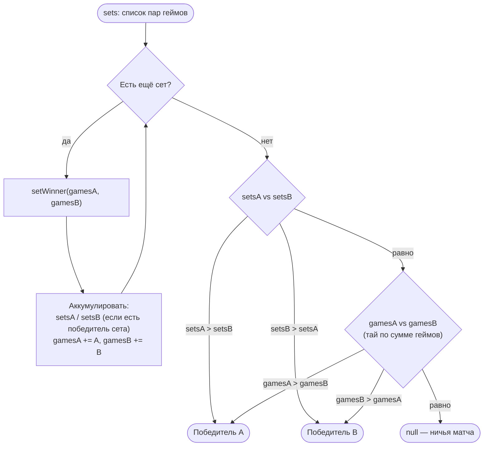
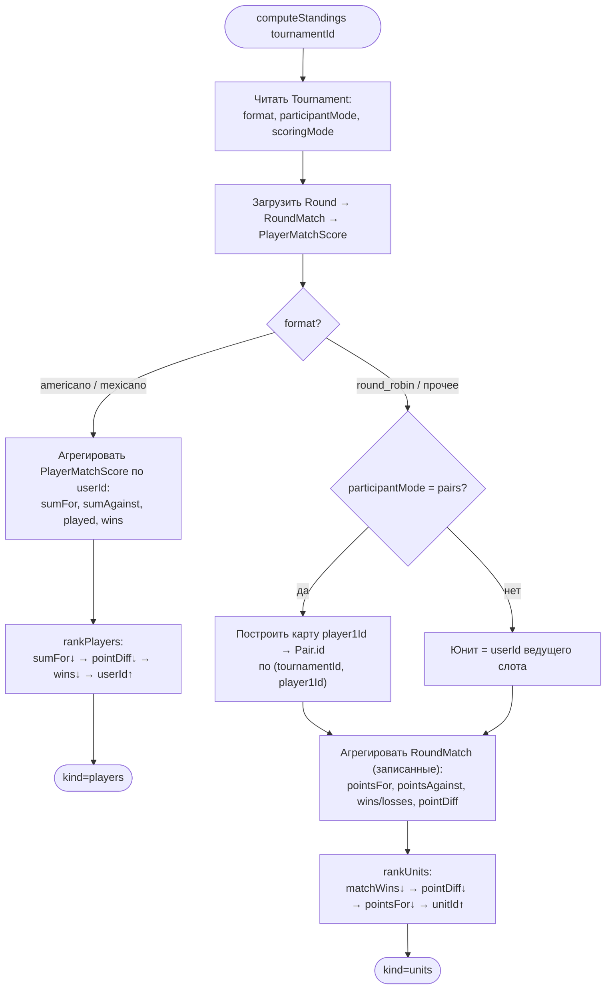

# 06 — Подсчёт результатов и рейтинги (standings)

Этот документ описывает, как система «Padel Tournaments» вычисляет исход отдельного матча
и как из исходов матчей выводятся итоговые рейтинги (standings). Здесь же обосновано ключевое
проектное решение — переход к **free-form** подсчёту — и инвариант запрета ничьей в playoff.

Подсчёт спроектирован как **чистое ядро правил** (Prisma-free функции `setWinner`,
`matchWinnerFromSets`, `tallySetsWon`, `scorePointsMode`, `scoreSetsMode`), поверх которого
лежит **транзакционная персистентность** (`recordResult`, `recordRoundResult`) и **производный
расчёт рейтингов** (`computeStandings`). Разделение позволяет тестировать математику исхода
изолированно, а запись и продвижение — отдельно.

Связанные документы: устройство форматов и алгоритмы генерации — в
[форматах и алгоритмах](05-formaty-i-algoritmy.md); модели и поля БД, на которые опирается
подсчёт (`SetScore`, `RoundMatch`, `PlayerMatchScore`, `Match`) — в
[модели данных](04-model-dannyh.md).

---

## 1. Два режима подсчёта (`scoringMode`), ортогональных формату

Режим подсчёта задаётся полем `Tournament.scoringMode` и **полностью ортогонален** формату
турнира. Любой из четырёх форматов (`playoff`, `round_robin`, `americano`, `mexicano`) может
играться как в режиме `sets`, так и в режиме `points`. Формат отвечает за то, *кто с кем*
играет и *как турнир продвигается*; режим подсчёта отвечает только за то, *как из введённого
счёта получить исход одного матча* и *где этот счёт хранится*.

| Аспект | `sets` (теннисный стиль) | `points` (очки за матч) |
|--------|--------------------------|--------------------------|
| Что вводит администратор | По строке на сет: пары геймов `set{n}_a` / `set{n}_b` (n = 1, 2, …) | Два целых числа очков команды A и команды B |
| Сколько значений | Любое число сетов (динамический скан, без верхнего предела) | Ровно два числа |
| Победитель сета | Больше геймов выигрывает сет; равенство → сет ничейный (не засчитан никому) | — (понятия «сет» нет) |
| Победитель матча | Больше выигранных сетов; при равенстве сетов — тай по сумме геймов | Больше очков; при равенстве — ничья |
| Хранение (playoff) | `SetScore` — по одной строке на сет (`gamesPair1`, `gamesPair2`); кэш `Match.setsWonA/B` | (для playoff используется тот же `SetScore`-путь только в режиме `sets`; в режиме `points` playoff в данной системе тоже идёт через `recordResult`, где счёт интерпретируется как сеты) |
| Хранение (round-based) | Сводка «выигранных сетов» сворачивается в два целых и пишется в `RoundMatch.pointsA/pointsB`; пер-сетных строк нет | Очки пишутся напрямую в `RoundMatch.pointsA/pointsB` |
| Индивидуальный вклад (round-based) | `PlayerMatchScore.pointsFor/pointsAgainst` = число выигранных сетов команды / соперника | `PlayerMatchScore.pointsFor/pointsAgainst` = очки команды / соперника |

Ключевое проектное следствие: **per-set гранулярность хранится только для playoff** (модель
`SetScore`). В round-based форматах результат режима `sets` намеренно «схлопывается» до двух
чисел выигранных сетов и записывается в те же поля `pointsA/pointsB`, что и в режиме `points`.
Это сделано сознательно (см. раздел 7 — ограничение тай-брейка): отдельной пер-сетной таблицы
для round-based нет, чтобы не вводить дополнительную миграцию и модель ради метрики, которая в
рейтинге всё равно сворачивается до счёта.

Диспетчер режима в round-based записи (`recordRoundResult`) читает `scoringMode` из БД и
выбирает соответствующую чистую функцию — `scorePointsMode` или `scoreSetsMode`. Заявленный
вызывающей стороной режим или счёт **не используется**: источник правды — поле в `Tournament`.

---

## 2. Free-form подсчёт — ключевое проектное решение

### 2.1. Что было (v2.0) и что стало

В версии до free-form подсчёт опирался на жёсткие теннисные правила, конфигурируемые на турнире:

| Параметр | Было (v2.0) | Стало (free-form) |
|----------|-------------|-------------------|
| Число сетов | Фиксировано полем `setsPerMatch` (например, «лучший из 3») | Любое число сетов; форма динамически шлёт `set1_*`, `set2_*`, … без верхнего предела |
| Счёт сета | Валидность по теннису: win-by-2, тай-брейк 7:6, ограничение `gamesPerSet` | Любая пара неотрицательных целых (4:5, 6:6, 10:3) — валидируется только «целое ≥ 0» |
| Режим очков | До целевого значения `targetPoints` (например, до 32) | Любые два неотрицательных целых, без целевого значения |
| Ничья | Не возникала по построению (правила гарантировали победителя) | Допустима во всех форматах, **кроме** playoff |

### 2.2. Поля БД остались, но не читаются

Поля `Tournament.setsPerMatch`, `Tournament.gamesPerSet`, `Tournament.targetPoints` **остались
в схеме** (с дефолтными значениями) ради совместимости с уже существующими миграциями и
seed-данными, но **в коде подсчёта не читаются**: ни `recordResult`, ни `recordRoundResult`,
ни чистые функции исхода к ним не обращаются. Из формы создания турнира соответствующие поля
ввода также убраны. Это явный «мёртвый» legacy на уровне данных при живой логике, которая их
игнорирует, — компромисс между «не делать миграцию-удаление колонок» и «не усложнять логику
неиспользуемой конфигурацией».

### 2.3. Обоснование решения

- **Соответствие реальной судейской практике.** В клубных турнирах по паделу формат счёта
  гибок (короткие форматы, тай-брейк вместо третьего сета, игра «до N очков по времени»). Жёсткая
  валидация «win-by-2 / ровно 3 сета» отвергала бы легитимные реальные счета и заставляла бы
  администратора «подгонять» их под правило.
- **Простота и предсказуемость.** Свобода ввода превращает подсчёт в две короткие, очевидные
  и легко тестируемые функции (исход сета по геймам, исход матча по сетам). Нет
  спецслучаев тай-брейка, нет ветвления по `setsPerMatch` — меньше кода, меньше ошибок. Это
  соответствует приоритету проекта (дипломная работа: простое работающее решение без
  преждевременной сложности).
- **Свободная правка.** Администратор может переписать результат любым корректным счётом без
  «борьбы» с валидатором (см. раздел 6 — persistence через delete+recreate).
- **Единственная цена** — недоступность пер-геймовых тай-брейкеров в round-based рейтинге
  (раздел 7/8). Это осознанная, задокументированная деградация, приемлемая для масштаба
  дипломной работы.

---

## 3. Вычисление победителя — режим `sets`

Вся математика режима `sets` сосредоточена в трёх чистых функциях файла
`src/lib/services/result.ts`. Они не обращаются к БД и не зависят от формата — поэтому
переиспользуются и в playoff (`recordResult`), и в round-based (`scoreSetsMode` импортирует их).

### 3.1. `setWinner(gamesA, gamesB)` — исход одного сета

Правило: **больше геймов выигрывает сет**.

```text
функция setWinner(gamesA, gamesB):
    если gamesA или gamesB не целое, либо < 0:
        бросить ResultError("invalid_set")        // единственная отвергаемая ситуация
    если gamesA > gamesB: вернуть "A"
    если gamesB > gamesA: вернуть "B"
    вернуть null                                   // равенство геймов → ничья сета
```

Отвергается **только** нечисловой / отрицательный / дробный вход. Любая пара неотрицательных
целых принимается, включая 6:6 (это даёт ничейный сет — `null`), 10:3, 0:0 и т.п. Никакого
win-by-2, тай-брейка 7:6 или ограничения сверху нет.

### 3.2. `tallySetsWon(sets)` — подсчёт выигранных сетов

Проходит по всем сетам, для каждого вызывает `setWinner` и считает, сколько сетов выиграла
сторона A и сколько B. **Ничейные сеты (`null`) не засчитываются никому** — они увеличивают
сумму геймов, но не счётчик выигранных сетов. Возвращает `{ setsWonA, setsWonB }`.

### 3.3. `matchWinnerFromSets(sets)` — исход матча по сетам

Правило с двухуровневым тай-брейком:

1. **Больше выигранных сетов** → победитель.
2. При равенстве выигранных сетов — **тай по суммарным геймам** во всех сетах.
3. Если и сеты, и сумма геймов равны → `null` (ничья матча).

```text
функция matchWinnerFromSets(sets):
    setsA, setsB, gamesA, gamesB = 0, 0, 0, 0
    для каждого сета s:
        w = setWinner(s.gamesPair1, s.gamesPair2)
        если w == "A": setsA += 1
        иначе если w == "B": setsB += 1
        gamesA += s.gamesPair1
        gamesB += s.gamesPair2
    если setsA > setsB: вернуть "A"          // 1-й уровень: выигранные сеты
    если setsB > setsA: вернуть "B"
    если gamesA > gamesB: вернуть "A"         // 2-й уровень: сумма геймов
    если gamesB > gamesA: вернуть "B"
    вернуть null                              // полная ничья матча
```

Тай по сумме геймов — это разумный спортивный разрыв при равенстве сетов (например, сторона,
выигравшая «больше игр в проигранных сетах», получает преимущество). Он же исключает лишние
ничьи там, где победитель объективно определим.

### 3.4. Динамический ввод сетов (без верхнего предела)

Форма результата не знает заранее число сетов. Парсеры
(`parseRecordResultForm` для playoff и `parseRoundResultForm` для round-based, оба в
`src/lib/validation/`) **сканируют поля динамически**: читают `set1_a/set1_b`, `set2_a/set2_b`,
… по возрастанию `n`, пока **обе** клетки строки физически отсутствуют в `FormData` — тогда
скан прекращается. Правила обработки строки:

- обе клетки пусты → строка пропускается (это «хвостовой»/неиспользованный сет);
- одна клетка заполнена, другая пуста → ошибка «Заполните оба счёта в сете n»;
- обе заполнены → парсинг в целое ≥ 0 (`z.coerce.number().int().min(0)`), добавление в список;
- список пуст после скана → ошибка «Введите счёт хотя бы одного сета».

Парсер **только формирует и приводит** вход к целым; валидность исхода (победитель/ничья) —
ответственность серверного ядра (`setWinner` / `matchWinnerFromSets`). Так форма и сервер не
могут «разойтись» в правилах: правило живёт в одном месте.

### 3.5. Flowchart: определение победителя матча по сетам



---

## 4. Вычисление победителя — режим `points`

Режим `points` для round-based реализован чистой функцией `scorePointsMode(pointsA, pointsB)`
в `src/lib/services/round-result.ts`:

```text
функция scorePointsMode(pointsA, pointsB):
    если pointsA или pointsB не целое, либо < 0:
        бросить RoundResultError("invalid_points")
    если pointsA == pointsB: winner = null        // ничья (целевого значения больше нет)
    иначе winner = (pointsA > pointsB) ? "A" : "B"
    вернуть { pointsA, pointsB, winner }
```

Правило тривиально: **больше очков — победитель; равенство — ничья**. Понятие `targetPoints`
(«игра до N очков») **убрано**: счёт не сверяется ни с каким целевым значением, любые два
неотрицательных целых принимаются как есть. Допустимость самой ничьи решается уже не здесь, а
форматными правилами записи (раздел 5): для round-based `winner = null` — легитимный исход.

---

## 5. Ничья и playoff-инвариант

Free-form подсчёт допускает ничью на уровне *чистой функции исхода* во всех режимах
(`setWinner` → `null` для сета, `matchWinnerFromSets` → `null` для матча, `scorePointsMode`
→ `null` при равенстве очков). Что происходит с этой ничьёй дальше — зависит от того, кто
записывает результат.

### 5.1. Round-based: ничья допустима

В форматах `round_robin`, `americano`, `mexicano` матч не обязан иметь победителя — итог
определяется накопленным рейтингом по всем матчам. Поэтому `recordRoundResult` сохраняет ничью
как обычный исход: `winner = null` записывается, очки/выигранные сеты обеих сторон фиксируются в
`RoundMatch.pointsA/pointsB` и в `PlayerMatchScore`. Турнир продолжается штатно. (Комментарий в
`computeStandings` отмечает, что ничьи в `round_robin` отвергаются на уровне записи плана 05, но
в текущем агрегаторе на этот случай всё равно стоит защита — ничья не даёт победы ни одной
стороне, увеличивая лишь `played` и очки.)

### 5.2. Playoff: ничья запрещена (типизированная ошибка)

В олимпийской сетке (`playoff`) каждый матч **обязан** дать решающего победителя: победитель
продвигается в родительский слот дерева (`nextMatchId`/`nextSlot`), а ничья оставила бы дерево
в недостроенном, противоречивом состоянии — некого продвигать. Поэтому `recordResult`, получив
от `matchWinnerFromSets` значение `null`, **бросает типизированную ошибку и НЕ делает ничего
дальше**:

```text
winnerSide = matchWinnerFromSets(sets)
если winnerSide == null:
    бросить ResultError("draw",
        "Ничья недопустима в playoff — введите решающий счёт")
    // → транзакция откатывается; SetScore не переписывается,
    //   winnerId/setsWon не обновляются, продвижения и финиша НЕ происходит
```

Свойства инварианта:

- ошибка типизирована (`code = "draw"`), поэтому Server Action отображает дружелюбное русское
  сообщение по коду, без сопоставления строк и без утечки внутреннего текста;
- бросок происходит **до** любых записей в БД, внутри `prisma.$transaction`, поэтому весь
  эффект отменяется атомарно — нет осиротевших `SetScore`, нет «полупродвинутого» родителя;
- инвариант касается только playoff: ровно потому, что продвижение по дереву требует
  однозначного исхода. Для всех остальных форматов исход агрегируется, а не «продвигается»,
  поэтому ничья там безопасна.

---

## 6. Персистентность результата

Запись результата спроектирована как **полная замена** прежнего результата матча (idempotent
re-record) внутри одной транзакции. Это прямое следствие free-form-решения «свободная правка»:
администратор может переписать счёт сколько угодно раз, и каждая запись приводит данные к
консистентному состоянию с нуля.

### 6.1. Playoff — `SetScore` delete + recreate

`recordResult` (в `src/lib/services/result.ts`) на каждую (пере)запись:

1. загружает матч (источник правды по слотам пар и указателю продвижения);
2. отвергает запись, если хотя бы один слот соперника пуст (`pairAId`/`pairBId` = null) —
   нельзя вводить счёт до того, как соперники определены;
3. отвергает пустой ввод (нужен хотя бы один сет);
4. считает `tallySetsWon` и выводит победителя `matchWinnerFromSets` (ничья → ошибка, см. 5.2);
5. **удаляет все `SetScore` матча и создаёт их заново** (`setNumber` = 1..n) — отсюда
   «свободная правка»: старый набор сетов не мёрджится, а полностью заменяется новым;
6. кэширует `setsWonA/setsWonB` и `winnerId` в `Match`;
7. продвигает победителя в заранее существующий родительский слот (UPDATE по
   `nextMatchId`/`nextSlot`); на финале (родителя нет) — финиширует турнир через машину
   статусов, трактуя уже-`finished` как no-op.

`winnerId` выводится только на сервере и по построению принадлежит `{pairAId, pairBId}` —
он **никогда** не принимается от вызывающей стороны.

### 6.2. Round-based — `PlayerMatchScore` fan-out

`recordRoundResult` (в `src/lib/services/round-result.ts`) на каждую (пере)запись:

1. загружает `RoundMatch` + раунд + формат/режим турнира из БД (заявленный формат/счёт не
   доверяется); матч playoff здесь отвергается (`not_round_based`);
2. для mexicano: отвергает правку, если следующий раунд уже сформирован
   (`stale_pairings`) — иначе исправленный счёт раунда *r* не пересоберёт уже материализованный
   раунд *r+1*, что молча рассогласовало бы сетки (подробнее о материализации mexicano — в
   [форматах и алгоритмах](05-formaty-i-algoritmy.md));
3. выводит `{ pointsA, pointsB, winner }` по режиму (`scorePointsMode` / `scoreSetsMode`);
4. пишет командный счёт в `RoundMatch.pointsA/pointsB`;
5. **fan-out в `PlayerMatchScore`**: `deleteMany` по матчу, затем `create` по одной строке на
   каждый ненулевой FK игрока. **Оба партнёра команды получают ОДИНАКОВЫЙ командный
   `pointsFor`** (= счёт своей команды), а `pointsAgainst` (= счёт соперника) **обязателен** —
   он нужен и для тай-брейка по разнице, и для детерминизма пересчёта рейтинга в mexicano;
6. ворота финиша/материализации по формату: `round_robin`/`americano` авто-финишируют, когда
   записаны все матчи всех раундов; mexicano либо материализует следующий раунд из накопленного
   рейтинга, либо (на последнем раунде) финиширует.

Паттерн `deleteMany → create` делает повторную запись идемпотентной: нет «двойных» строк
игрока, состояние после правки полностью определяется последним вводом.

---

## 7. Standings (рейтинги/таблицы) — производные, не материализуются

Рейтинги **нигде не хранятся**. Функция `computeStandings` (в `src/lib/services/standings.ts`)
**пересчитывает их с нуля на каждый вызов** из `RoundMatch` и `PlayerMatchScore`. Обоснование:

- **нет дрейфа** — рейтинг не может рассинхронизироваться с фактическими результатами, потому
  что он *есть* функция от результатов;
- **это же — источник для cut в mexicano**: материализация следующего раунда mexicano читает
  ровно `computeStandings`, поэтому пересчёт по требованию гарантирует, что «турнирная таблица
  на экране» и «таблица, по которой режутся пары» — одно и то же;
- цена пересчёта на масштабе дипломной работы пренебрежимо мала; материализация была бы
  преждевременной оптимизацией.

`computeStandings` возвращает **union по дискриминанту `kind`** — `"players"` или `"units"` —
в зависимости от формата.

### 7.1. `kind = "players"` (americano / mexicano) — рейтинг игроков

Источник — `PlayerMatchScore`. Агрегируется по `userId`: суммируются `pointsFor` (→ `sumFor`) и
`pointsAgainst` (→ `sumAgainst`), считается число сыгранных матчей (`played`) и побед
(`wins`, где `pointsFor > pointsAgainst`). Только записанные матчи несут `playerScores`, поэтому
несыгранные матчи естественно ничего не добавляют. Сортировка — `rankPlayers`.

**Цепочка сортировки (тай-брейк):**

```text
sumFor   ↓ (по убыванию)        — суммарные личные очки
pointDiff ↓                     — разница (sumFor − sumAgainst)
wins     ↓                      — число побед
userId   ↑ (по возрастанию)     — СТАБИЛЬНЫЙ детерминированный фолбэк
```

Финальный ключ `userId asc` — **критичен**: он гарантирует полностью детерминированный порядок
при полном равенстве остальных метрик. Именно на этот детерминизм опирается нарезка следующего
раунда mexicano (cut по рейтингу): без стабильного фолбэка одинаковые по очкам игроки могли бы
сортироваться непредсказуемо, и состав следующего раунда стал бы невоспроизводимым.

### 7.2. `kind = "units"` (round_robin) — таблица «юнитов»

Источник — `RoundMatch` (поля `pointsA/pointsB`). «Юнит» — это **пара** (`participantMode =
"pairs"`) или **игрок** (`"singles"`). По каждому записанному матчу (`pointsA`/`pointsB` оба
не-null) сторонам начисляются `played`, `pointsFor`, `pointsAgainst`, а также `wins`/`losses`
по знаку разности очков. Затем считается `pointDiff` и применяется `rankUnits`.

**Цепочка сортировки (тай-брейк):**

```text
matchWins ↓                     — число выигранных матчей
pointDiff ↓                     — разница очков
pointsFor ↓                     — набранные очки
unitId    ↑                     — стабильный детерминированный фолбэк
```

**Восстановление идентичности пары (pairs-RR).** `RoundMatch` хранит только четыре FK на
`User` (`teamA1/A2/B1/B2`), но не ссылку на `Pair`. Чтобы построить таблицу по парам, ведущий
игрок слота (`teamA1Id` / `teamB1Id`) сопоставляется с `Pair.id` по ключу
**(`tournamentId`, `player1Id`)**: предварительно строится карта `player1Id → Pair.id`
(`Pair` уникален по `@@unique([tournamentId, player1Id])`). Слоты, которые не удалось
сопоставить (BYE/несвязанный), пропускаются.

**Вклад режима `sets` в рейтинг.** В режиме `sets` для round-based в `pointsA/pointsB` лежит
**число выигранных сетов** (результат свёрнут `scoreSetsMode`). То есть вклад юнита/игрока в
рейтинг — это выигранные сеты, а не геймы: пер-геймовая и H2H-метрики на уровне рейтинга
**недоступны** в принятом no-migration дизайне (нет пер-сетной таблицы для round-based) — см.
раздел 8.

### 7.3. Поля рейтинговой записи

| Поле | `PlayerStanding` (kind=players) | `UnitStanding` (kind=units) | Смысл |
|------|:---:|:---:|-------|
| `userId` / `unitId` | `userId` | `unitId` (Pair.id или userId) | Идентификатор субъекта рейтинга |
| `kind` (внутр.) | — | `"pair"` \| `"user"` | Тип юнита |
| `rank` | ✓ | ✓ | 1-based место после сортировки |
| `played` | ✓ | ✓ | Сыграно матчей |
| `wins` | ✓ | ✓ | Победы |
| `losses` | — | ✓ | Поражения (для units) |
| `pointsFor` | ✓ (= `sumFor`) | ✓ | Набрано (очки или выигранные сеты) |
| `pointsAgainst` | ✓ (= `sumAgainst`) | ✓ | Пропущено |
| `pointDiff` | ✓ | ✓ | `pointsFor − pointsAgainst` |

Обе сортировки (`rankPlayers`, `rankUnits`) **не мутируют вход** (сортируют копию массива) и
проставляют `rank` уже после сортировки.

### 7.4. Flowchart: выбор ветви и сортировка в `computeStandings`



---

## 8. Тай-брейкеры: порядок и ограничения дизайна

Сводка цепочек тай-брейка по каждому `kind`. Все цепочки завершаются **стабильным
идентификаторным ключом по возрастанию** — это намеренный детерминизм, без которого нарезка
mexicano была бы невоспроизводимой, а таблицы — нестабильными между пересчётами.

**`kind = "players"` (americano / mexicano):**

1. `sumFor` ↓ — суммарные личные очки;
2. `pointDiff` ↓ — разница `sumFor − sumAgainst`;
3. `wins` ↓ — число побед;
4. `userId` ↑ — стабильный детерминированный фолбэк (load-bearing для cut mexicano).

**`kind = "units"` (round_robin):**

1. `matchWins` ↓ — выигранные матчи;
2. `pointDiff` ↓ — разница очков;
3. `pointsFor` ↓ — набранные очки;
4. `unitId` ↑ — стабильный детерминированный фолбэк.

**Ограничения дизайна (осознанная деградация):**

- **Нет пер-геймовых тай-брейкеров в round-based.** В режиме `sets` round-based-результат
  сворачивается до числа выигранных сетов (хранится в `pointsA/pointsB`); сами геймы по сетам
  для round-based не сохраняются (пер-сетная таблица `SetScore` существует только для playoff).
  Поэтому тай-брейк «по разнице геймов» в круговом/ротационном рейтинге **недоступен** — это
  прямая цена no-migration дизайна и free-form свёртки.
- **Нет head-to-head (личных встреч) тай-брейка.** Рейтинг строится из агрегатов, личная
  встреча между конкретными юнитами как отдельный критерий не вычисляется.
- **Playoff не имеет рейтинга** в смысле этого документа: исход playoff — это само дерево
  (победитель финала), а не таблица; ничья там запрещена инвариантом раздела 5. Подробности
  продвижения по сетке — в [форматах и алгоритмах](05-formaty-i-algoritmy.md).

Эти ограничения приемлемы для масштаба дипломной работы: они упрощают модель данных и логику,
не влияя на корректность определения мест в типичных непатовых турнирах, а полностью патовые
ситуации детерминированно (хоть и условно) разрешаются стабильным идентификаторным ключом.
