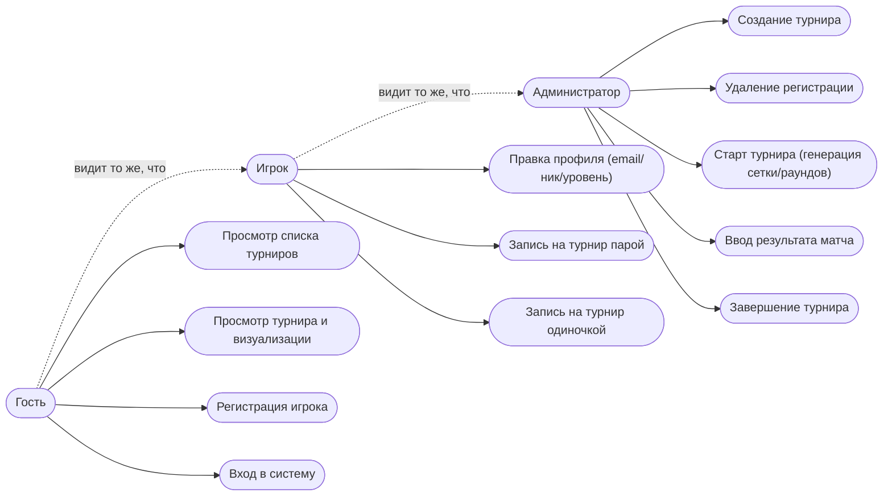
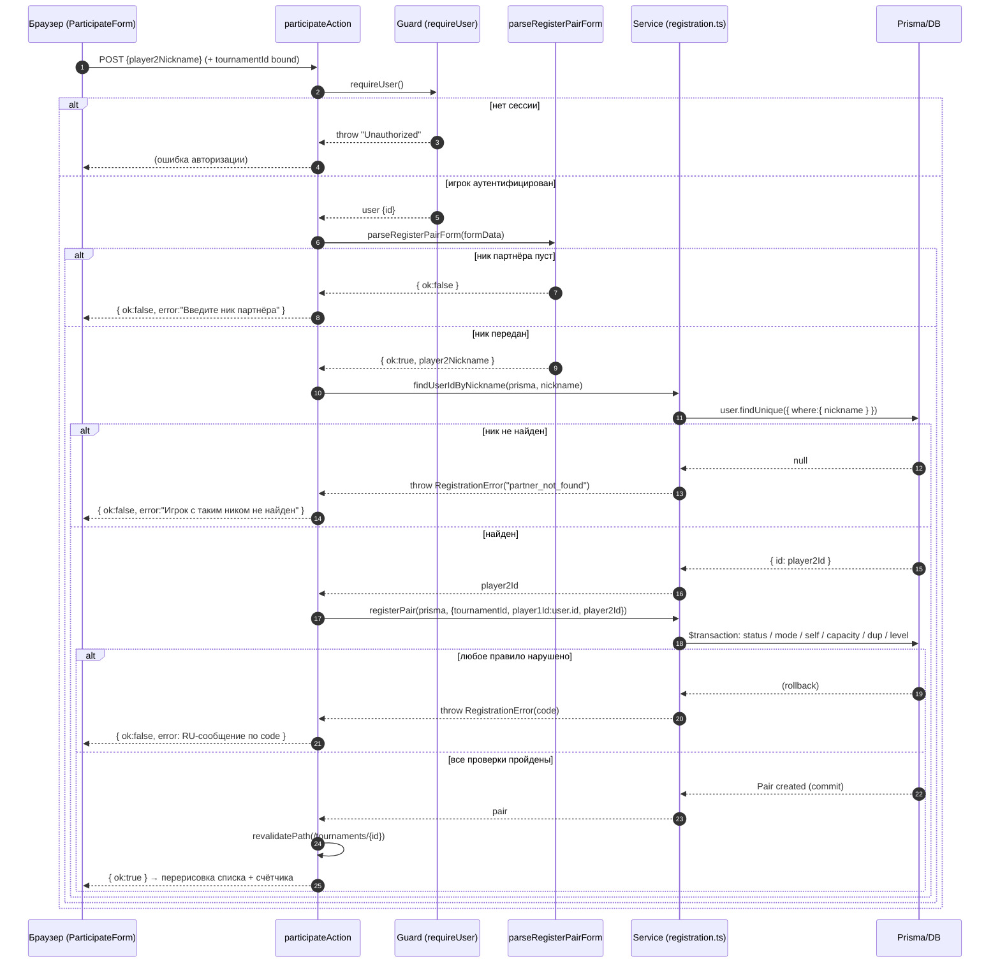
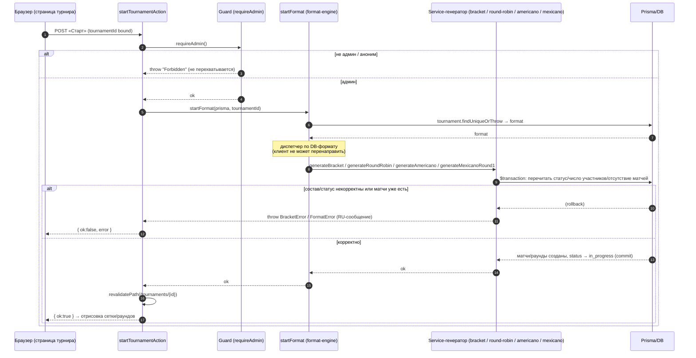
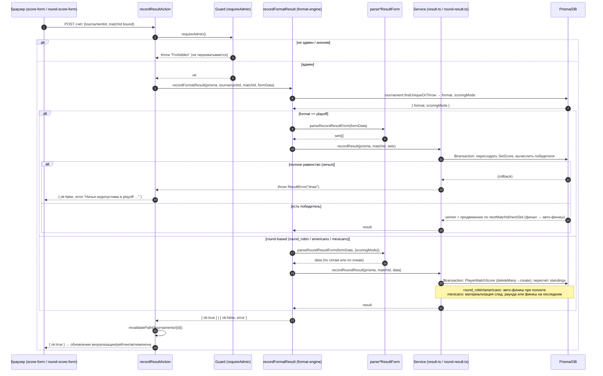

# 07 — Сценарии использования

Глава описывает поведение системы «Padel Tournaments» с точки зрения её пользователей:
кто и что может сделать, как протекает каждое ключевое действие в основном потоке и какие
альтернативы и ошибки предусмотрены. Сценарии выверены по серверным действиям
(`src/app/**/actions.ts`) и сервисам бизнес-логики (`src/lib/services/*.ts`), а не по
предполагаемому поведению UI.

Сценарии намеренно отражают архитектурную границу: каждое серверное действие — это публичный
HTTP-эндпоинт, поэтому **первой строкой** любого действия идёт проверка прав
(`requireUser`/`requireAdmin`), а все бизнес-правила (статус турнира, вместимость, совпадение
уровня, режим участия) перепроверяются **в сервисном слое внутри транзакции** — UI-ограничения
(скрытая кнопка, `disabled`-форма) считаются косметикой и не являются защитой. Подробности
проверок и модели ошибок — в [серверных действиях и валидации](11-servernye-deystviya-i-validatsiya.md),
переходы статусов — в [машинах состояний](08-mashiny-sostoyaniy.md), алгоритмы генерации и
подсчёта — в [форматах и алгоритмах](05-formaty-i-algoritmy.md).

---

## 1. Акторы

Система рассчитана на одну организацию-клуб с единственным администратором, поэтому
ролевая модель минимальна: три актора с чёткими границами прав.

| Актор | Идентификация | Что может делать |
|-------|---------------|------------------|
| **Гость** (аноним) | Нет сессии (`getOptionalSession` → `null`) | Просматривать список турниров (ближайшие/прошедшие по дате через `?past=1`, с серверными фильтрами по статусу/формату/уровню/виду/поиску), детальную страницу турнира и его визуализацию (сетка / таблица кругового / ротация и рейтинги). Регистрироваться как игрок, входить. |
| **Игрок** (`role = "player"`) | Подписанная cookie-сессия Better Auth, роль `player` | Всё, что доступно гостю, плюс: редактировать собственный профиль (включая смену email и ника), записываться на турнир парой (по нику партнёра) или одиночкой — пока турнир в статусе `registration` и его режим/уровень совпадают. |
| **Администратор** (`role = "admin"`) | Подписанная cookie-сессия Better Auth, роль `admin`; единственный seed-аккаунт | Всё, что доступно игроку, плюс управление турнирами: создание турнира, удаление чужих регистраций (до старта), запуск турнира (генерация сетки/раундов по формату), ввод и правка результатов матчей, ручное завершение турнира. |

Замечания о границах:

- **Право «свой профиль».** Действие правки профиля пишет по `user.id` из сессии-guard'а —
  игрок физически не может отредактировать чужой профиль, даже подделав форму: идентификатор
  владельца не берётся из тела запроса.
- **Право администратора — реальное, а не «по кнопке».** Скрытие админ-ссылок в навигации и
  условный рендер форм по роли/статусу — лишь UX; прямой POST мимо UI отбивается проверкой
  `requireAdmin()` до любой работы с БД.
- **Права на запись пары.** `player1Id` (регистрирующий) — всегда `user.id` из сессии, не из
  формы; от клиента принимается только ник партнёра, который сервер сам резолвит в `player2Id`.

---

## 2. Диаграмма вариантов использования

Овалы — варианты использования; стрелка от актора к овалу означает «инициирует». Стрелки
наследования прав (Игрок видит всё, что Гость; Администратор — всё, что Игрок) показаны
пунктиром между акторами.

Просмотровые варианты (`Просмотр списка`, `Просмотр турнира`) реализованы как Server Components,
доступны всем без авторизации и поэтому в сценариях ниже отдельно не расписываются — это чтение
без побочных эффектов. Подробная карта страниц — в
[пользовательском интерфейсе](09-polzovatelskiy-interfeys.md).

---

## 3. Текстовые сценарии

Формат каждого сценария: **Актор**, **Предусловие**, **Основной поток**,
**Альтернативы / ошибки**, **Постусловие**. Сообщения об ошибках приводятся так, как они
возвращаются пользователю (русскоязычные, по `code`-дискриминанту типизированных ошибок; сырой
текст Prisma наружу не уходит).

### 3.1. Регистрация игрока

- **Актор:** Гость.
- **Предусловие:** пользователь не аутентифицирован; email и ник свободны.
- **Основной поток:**
  1. Гость открывает `/register`, заполняет email, пароль, обязательные доменные поля (ник,
     уровень `skillLevel`) и при желании необязательные (телефон, дата рождения).
  2. Форма отправляется в обработчик Better Auth (`/api/auth/[...all]`): создаётся `User`
     (роль по умолчанию `player`, `courtSide` = `"either"`) и `Account` со scrypt-хешем пароля.
     Колонки пароля у `User` нет — учётные данные хранятся в `Account.password`.
  3. Создаётся сессия, в браузер ставится подписанная cookie.
- **Альтернативы / ошибки:**
  - Email уже занят → ошибка регистрации, аккаунт не создаётся.
  - Ник уже занят (`@@unique([nickname])`, регистрозависимое точное сравнение) → ошибка, аккаунт
    не создаётся.
  - Невалидные поля (пустой ник, неизвестный уровень, короткий пароль) → ошибки полей формы.
- **Постусловие:** создан игрок с ролью `player`, активна сессия. Email-верификация отключена
  (офлайн-демо), подтверждение почты не требуется.

### 3.2. Вход в систему

- **Актор:** Гость (зарегистрированный).
- **Предусловие:** существует `User`/`Account` с заданными email и паролем.
- **Основной поток:**
  1. Гость открывает `/login`, вводит email и пароль.
  2. Обработчик Better Auth сверяет пароль (scrypt) с `Account.password`.
  3. При совпадении создаётся сессия, ставится подписанная cookie; пользователь получает права
     своей роли (`player` или единственный `admin`).
- **Альтернативы / ошибки:**
  - Неверный email или пароль → обобщённая ошибка входа (без раскрытия, какое именно поле
    неверно — анти-энумерация).
- **Постусловие:** активна сессия; доступны действия соответствующей роли.

### 3.3. Создание турнира (с format-зависимой валидацией размера)

- **Актор:** Администратор.
- **Предусловие:** активна сессия с ролью `admin`.
- **Основной поток:**
  1. Администратор открывает `/admin/tournaments/new`, заполняет форму: название, формат
     (`playoff` / `round_robin` / `americano` / `mexicano`), режим участия
     (`pairs` / `singles`), уровень `level`, размер `size`, режим подсчёта `scoringMode`
     (`sets` / `points`), при желании — цену, дату, место, число раундов `totalRounds`.
  2. `createTournamentAction` первой строкой выполняет `requireAdmin()` (граница безопасности).
  3. `parseTournamentForm` валидирует поля. Размер проверяется **с учётом формата**: для
     `playoff` допустимы только степени двойки 4/8/16 (исключает bye-логику); для
     `round_robin` — свободное число участников (мягкий потолок 24); для `americano`/`mexicano`
     режим участия неявно одиночный (система сама ротирует пары).
  4. `createTournament` создаёт `Tournament`, **жёстко выставляя `status = "registration"`** —
     статус никогда не берётся из формы. Legacy-поля `setsPerMatch`/`gamesPerSet`/`targetPoints`
     не задаются (free-form scoring) и сохраняют дефолты схемы.
  5. Кэш списка турниров инвалидируется (`revalidatePath("/tournaments")`), затем — redirect на
     детальную страницу созданного турнира.
- **Альтернативы / ошибки:**
  - Размер не соответствует формату (например, 5 или 7 для `playoff`) → ошибка поля `size`,
    турнир не создаётся.
  - Невалидные/пустые обязательные поля → ошибки соответствующих полей.
  - Прямой POST не-администратором → `requireAdmin()` бросает `Forbidden` до парсинга и записи.
  - Сбой БД на создании → обобщённая ошибка формы «Не удалось создать турнир. Попробуйте ещё раз.».
- **Постусловие:** существует турнир в статусе `registration`, видимый в списке; администратор
  перенаправлен на его страницу. Жизненный цикл статусов — в
  [машинах состояний](08-mashiny-sostoyaniy.md).

### 3.4. Запись на турнир парой

- **Актор:** Игрок.
- **Предусловие:** турнир в статусе `registration`, режим `pairs`; игрок аутентифицирован.
- **Основной поток:**
  1. Игрок на странице турнира вводит **ник партнёра** в форму записи парой и отправляет её.
  2. `participateAction` первой строкой выполняет `requireUser()` (граница безопасности);
     `player1Id` фиксируется как `user.id` (из сессии, не из формы), `tournamentId` привязан к
     действию из страницы.
  3. `parseRegisterPairForm` проверяет, что ник партнёра введён.
  4. `findUserIdByNickname` резолвит ник в `player2Id` точным регистрозависимым поиском
     **до** транзакционного гейта.
  5. `registerPair` в **одной транзакции** последовательно проверяет: статус =
     `registration`; режим = `pairs`; партнёр ≠ сам игрок; вместимость (`count(Pair) < size` —
     закрытие на вместимости); ни один из двух игроков ещё не участвует (кросс-слотовая проверка
     player1/player2); **уровни обоих игроков строго равны уровню турнира**. Все проверки пройдены
     — создаётся `Pair`.
  6. `revalidatePath` обновляет страницу — новая пара и счётчик участников появляются сразу.
- **Альтернативы / ошибки** (каждая — типизированная `RegistrationError`, пара не создаётся):
  - Пустой ник партнёра → «Введите ник партнёра».
  - Ник не найден (`partner_not_found`) → «Игрок с таким ником не найден».
  - Указан собственный ник (`self_partner`, свой ник → свой id) → «Нельзя зарегистрироваться в
    паре с самим собой».
  - Регистрация закрыта / турнир уже стартовал (`not_open`) → «Регистрация на турнир закрыта».
  - Турнир одиночный (`wrong_mode`) → «На этот турнир регистрация только одиночная».
  - Турнир заполнен (`tournament_full`, `count >= size`) → «Турнир заполнен».
  - Один из игроков уже участвует (`already_registered`) → «Один из игроков уже участвует в этом
    турнире».
  - Уровень любого из двух игроков ≠ уровню турнира (`level_mismatch`) → «Уровень игрока не
    совпадает с уровнем турнира».
  - Прямой POST анонимом/не-игроком → `requireUser()` бросает «Unauthorized» до записи.
- **Постусловие:** при успехе в турнире зарегистрирована пара (`player1Id` = текущий игрок,
  `player2Id` = партнёр); на любой ошибке состояние БД неизменно (полный откат транзакции).

### 3.5. Запись на турнир одиночкой

- **Актор:** Игрок.
- **Предусловие:** турнир в статусе `registration`, режим `singles`; игрок аутентифицирован.
- **Основной поток:**
  1. Игрок на странице турнира нажимает запись одиночкой (форма не несёт клиентских полей —
     единственный вход — это идентичность из сессии).
  2. `participateSingleAction` первой строкой выполняет `requireUser()`; `userId` =
     `user.id`, `tournamentId` привязан из страницы.
  3. `registerSingle` в **одной транзакции** проверяет: статус = `registration`; режим =
     `singles`; уровень игрока строго равен уровню турнира; вместимость
     (`count(TournamentPlayer) < size` — считается именно по `TournamentPlayer`, не по `Pair`);
     игрок ещё не зарегистрирован (составной `@@unique([tournamentId, userId])`). Все проверки
     пройдены — создаётся `TournamentPlayer`.
  4. `revalidatePath` обновляет страницу — новый участник и счётчик появляются сразу.
- **Альтернативы / ошибки** (типизированная `RegistrationError`, запись не создаётся):
  - Регистрация закрыта (`not_open`) → «Регистрация на турнир закрыта».
  - Турнир парный (`wrong_mode`) → «На этот турнир регистрация только парой».
  - Уровень не совпадает (`level_mismatch`) → «Уровень игрока не совпадает с уровнем турнира».
  - Турнир заполнен (`tournament_full`) → «Турнир заполнен».
  - Игрок уже зарегистрирован (`already_registered`) → «Вы уже зарегистрированы в этом турнире».
  - Прямой POST анонимом → `requireUser()` бросает «Unauthorized».
- **Постусловие:** при успехе создан `TournamentPlayer` для текущего игрока; на ошибке — полный
  откат.

### 3.6. Старт турнира (генерация по формату)

- **Актор:** Администратор.
- **Предусловие:** турнир в статусе `registration`, набран корректный состав участников.
- **Основной поток:**
  1. Администратор на странице турнира нажимает «Старт».
  2. `startTournamentAction` первой строкой выполняет `requireAdmin()` (граница безопасности;
     этот бросок намеренно не перехватывается).
  3. `startFormat` **перечитывает формат из БД** и диспетчеризует генерацию (клиент не может
     перенаправить формат):
     - `playoff` → `generateBracket`: создаёт все `size − 1` матчей дерева single-elimination,
       проставляет связи продвижения `nextMatchId`/`nextSlot`, расставляет посев (Fisher–Yates).
     - `round_robin` → `generateRoundRobin`: круговой метод (фиксированная позиция + ротация).
     - `americano` → `generateAmericano`: круговой метод на игроках (гарантия «партнёр один раз»
       за N−1 раундов), раскладка по кортам и sit-out'ы по числу участников.
     - `mexicano` → `generateMexicanoRound1`: материализуется только первый раунд (последующие —
       по текущему рейтингу, по мере завершения раундов).
  4. Внутри генератора перечитываются статус, число участников и отсутствие уже созданных матчей —
     поэтому «disabled»-кнопка лишь косметика, а защита от двойного старта — на уровне данных
     (в т.ч. backstop `@@unique([tournamentId, round, position])`).
  5. Статус переводится в `in_progress`; `revalidatePath` — сетка/раунды отображаются сразу.
- **Альтернативы / ошибки:**
  - Для `playoff` число пар ≠ заявленному размеру степени двойки → `BracketError` с RU-сообщением;
    сетка не создаётся.
  - Турнир не в статусе `registration` или матчи уже сгенерированы → типизированная ошибка
    (`BracketError`/`FormatError`); повторная генерация отклоняется.
  - Для round-based форматов недостаточно/некорректный состав участников → `FormatError`.
  - Прямой POST не-администратором → `requireAdmin()` бросает «Forbidden».
  - Прочий сбой → обобщённое «Не удалось сгенерировать сетку. Попробуйте ещё раз.».
- **Постусловие:** при успехе турнир в статусе `in_progress`, созданы матчи/раунды согласно
  формату; на ошибке — состояние неизменно. См. алгоритмы в
  [форматах и алгоритмах](05-formaty-i-algoritmy.md), переходы — в
  [машинах состояний](08-mashiny-sostoyaniy.md).

### 3.7. Ввод результата матча

- **Актор:** Администратор.
- **Предусловие:** турнир в статусе `in_progress`; матч/раунд существует.
- **Основной поток:**
  1. Администратор открывает форму ввода счёта на странице турнира. Конкретная форма зависит от
     формата: `playoff` → `score-form` (по отдельным матчам сетки); round-based → `round-score-form`
     (по матчам раунда). Режим ввода (по сетам/геймам или по очкам) зависит от `scoringMode`.
  2. `recordResultAction` первой строкой выполняет `requireAdmin()` (граница безопасности);
     `tournamentId` и `matchId` привязаны из страницы (не из тела формы — нельзя перенаправить
     запись на чужой матч).
  3. `recordFormatResult` **перечитывает `format` и `scoringMode` из БД** и диспетчеризует:
     - **`playoff`** → `parseRecordResultForm` → `recordResult`. Поддерживается любое число сетов
       и любые геймы (free-form). Победитель матча — по числу выигранных сетов (тай-брейк — по
       сумме геймов). При полном равенстве — **ничья недопустима**: `ResultError("draw", …)` →
       «Ничья недопустима в playoff — введите решающий счёт»; продвижение и финиш не происходят.
       При корректном счёте строки `SetScore` пересоздаются (delete + recreate), победитель
       проставляется и **продвигается** в следующий матч по `nextMatchId`/`nextSlot`; победа в
       финале запускает авто-финиш турнира.
     - **round-based** (`round_robin`/`americano`/`mexicano`) → `parseRoundResultForm({scoringMode})`
       → `recordRoundResult`. `matchId` здесь — id `RoundMatch`. Ничья **допустима** во всех
       round-based форматах. Индивидуальные очки раскладываются (`PlayerMatchScore`,
       deleteMany → create; оба партнёра получают одинаковый командный `pointsFor`), затем
       **пересчитываются standings** (производная величина, не материализуется). Для
       `round_robin`/`americano` при заполнении всех матчей турнир авто-финиширует; для `mexicano`
       по завершении раунда **материализуется следующий раунд** по текущему рейтингу, а на
       последнем раунде — финиш.
  4. `revalidatePath` — визуализация (сетка/таблица/ротация) и рейтинги/чемпион обновляются сразу.
- **Альтернативы / ошибки:**
  - Невалидный счёт (нечисловые/отрицательные геймы, пустые поля) → парсер вернёт ошибку, счёт не
    сохранится.
  - Ничья в `playoff` → `ResultError("draw")`, без продвижения.
  - Прямой POST не-администратором → `requireAdmin()` бросает «Forbidden».
  - Прочий сбой → обобщённое «Не удалось сохранить счёт. Попробуйте ещё раз.» (типизированные
    `ResultError`/`RoundResultError` отдаются как RU-сообщения).
- **Постусловие:** результат матча сохранён; для `playoff` победитель продвинут (или турнир
  авто-финиширован при результате финала); для round-based пересчитаны standings (а для `mexicano`
  материализован следующий раунд либо турнир финиширован). Подробности подсчёта — в
  [подсчёте и standings](06-podschyot-i-standings.md).

### 3.8. Удаление регистрации

- **Актор:** Администратор.
- **Предусловие:** турнир в статусе `registration`; регистрация (пара или одиночка) существует.
- **Основной поток:**
  1. Администратор на странице турнира удаляет конкретную регистрацию.
  2. `removeRegistrationAction` первой строкой выполняет `requireAdmin()`; `tournamentId`, `kind`
     (`pair`/`player`) и `id` привязаны из страницы (не из тела формы).
  3. По `kind` вызывается `removePair` или `removeParticipant`. Внутри транзакции перечитывается
     статус: удаление допускается **только пока регистрация открыта**; удаление выполняется с
     привязкой к `tournamentId` (гейд-статус и цель — одна и та же строка).
  4. `revalidatePath` — список участников обновляется сразу.
- **Альтернативы / ошибки** (типизированная `AdminError`):
  - Турнир уже стартовал (`not_open`) → «Удаление возможно только до старта турнира».
  - Регистрация не принадлежит этому открытому турниру (`count === 0`) → «Регистрация не найдена».
  - Прямой POST не-администратором → `requireAdmin()` бросает «Forbidden».
- **Постусловие:** при успехе регистрация удалена; на ошибке — состояние неизменно.

### 3.9. Завершение турнира (ручное, все форматы)

- **Актор:** Администратор.
- **Предусловие:** турнир в статусе `in_progress` (для любого формата).
- **Основной поток:**
  1. Администратор на странице турнира нажимает «Завершить».
  2. `finishTournamentAction` первой строкой выполняет `requireAdmin()`; `tournamentId` привязан
     из страницы.
  3. `finishTournament` идемпотентен: если турнир уже `finished` — no-op (повторный POST безопасен).
     Иначе переходит `in_progress → finished` через `transitionTournament` (форвард-онли машина
     перечитывает статус и отклоняет нелегальные переходы).
  4. `revalidatePath` — завершённое состояние отображается сразу.
- **Альтернативы / ошибки:**
  - Турнир ещё не запущен (статус `registration`) → `AdminError("not_started")` → «Турнир ещё не
    запущен — сначала запустите его» (постоянная ошибка состояния, не «повторите попытку»).
  - Прямой POST не-администратором → `requireAdmin()` бросает «Forbidden».
  - Прочий сбой → обобщённое «Не удалось завершить турнир. Попробуйте ещё раз.».
- **Постусловие:** при успехе турнир в статусе `finished`; ручное завершение — лишь
  дополнительный путь к тому же терминальному состоянию, что и авто-финиш `playoff`/round-based.

### 3.10. Правка профиля (включая смену email/ника)

- **Актор:** Игрок (или администратор — для своего профиля).
- **Предусловие:** активна сессия.
- **Основной поток:**
  1. Пользователь открывает `/profile`, меняет доменные поля (имя, `courtSide`, телефон,
     `skillLevel`, ник, дата рождения) и/или email.
  2. `updateProfileAction` первой строкой выполняет `requireUser()`; запись идёт по `user.id`
     из сессии — отредактировать чужой профиль невозможно.
  3. `parseProfileForm` валидирует поля. Email отделяется от доменных полей (им владеет Better
     Auth).
  4. **Доменные поля** (включая ник) обновляются прямым `updateProfile`. Конфликт уникальности
     ника всплывает как `P2002` → «Этот ник уже занят» (без предварительной проверки).
  5. **Email** меняется только если он действительно изменился: значение нормализуется в
     lowercase, выполняется предпроверка занятости, затем смена через `auth.api.changeEmail`
     (работает без верификации, т.к. она отключена).
  6. `revalidatePath("/profile")` — изменения отражаются сразу.
- **Альтернативы / ошибки:**
  - Ник занят (`P2002`) → ошибка поля `nickname` «Этот ник уже занят».
  - Новый email уже используется другим пользователем → ошибка поля `email` «Этот email уже
    используется».
  - Сбой смены email в Better Auth → «Не удалось сменить email».
  - Невалидные доменные поля → ошибки соответствующих полей.
- **Постусловие:** при успехе профиль (и, при изменении, email/ник) обновлён; на ошибке поля —
  частичные изменения не фиксируются вне валидной транзакции доменных полей.

---

## 4. Sequence-диаграммы ключевых потоков

Участники диаграмм единообразны: **Браузер** (форма/страница), **Server Action** (тонкий
`"use server"`-обработчик), **Guard** (`requireUser`/`requireAdmin`), **Service** (бизнес-логика),
**Prisma/DB** (хранилище). Возврат вида `{ ok, error? }` и `revalidatePath` (без redirect) —
сквозной паттерн всех действий записи.

### 4.1. Запись пары на турнир

### 4.2. Старт турнира администратором

### 4.3. Ввод результата матча

---

## 5. Кросс-ссылки

- Жизненные циклы турнира/раунда/матча и легальные переходы статусов — см.
  [машины состояний](08-mashiny-sostoyaniy.md).
- Полное описание серверных действий, zod-схем и модели типизированных ошибок — см.
  [серверные действия и валидацию](11-servernye-deystviya-i-validatsiya.md).
- Алгоритмы генерации сетки/раундов и ротации по форматам — см.
  [форматы и алгоритмы](05-formaty-i-algoritmy.md).
- Карта страниц, формы и визуализация турнира — см.
  [пользовательский интерфейс](09-polzovatelskiy-interfeys.md).
- Режимы подсчёта, вычисление победителя и рейтинги — см.
  [подсчёт и standings](06-podschyot-i-standings.md).
