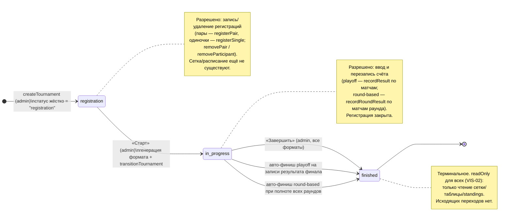
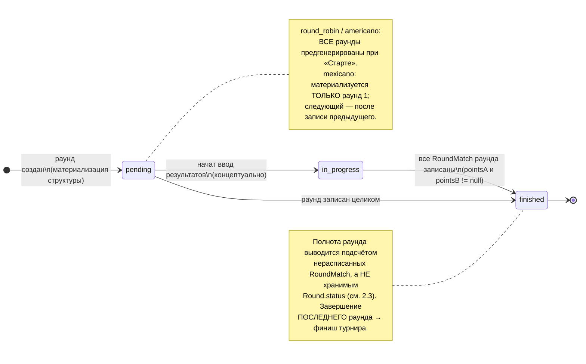

# 08 — Машины состояний

Этот документ описывает жизненные циклы доменных сущностей системы «Padel Tournaments»
как конечные автоматы: какие состояния существуют, какими действиями и какими акторами
выполняются переходы, что разрешено в каждом состоянии и какими инвариантами защищена
целостность. Машины состояний — это контракт между [сценариями использования](07-stsenarii-ispolzovaniya.md)
(кто и когда нажимает кнопку), [форматами и алгоритмами](05-formaty-i-algoritmy.md)
(что происходит при старте) и [подсчётом и standings](06-podschyot-i-standings.md)
(что считается результатом и победителем).

Проектное решение: **состояние хранится в БД и является единственным источником правды**.
Заявленное клиентом текущее состояние никогда не принимается на веру — каждый переход
перечитывает актуальный статус из базы внутри транзакции и отвергает рассинхронизацию.
Это закрывает класс угроз гонок и подделанного запроса (T-02-01) при единственном
администраторе и низкой нагрузке без введения блокировок или очередей.

В системе три явных жизненных цикла:

1. **Турнир** (`Tournament.status`) — основной автомат: `registration → in_progress → finished`.
2. **Раунд** (`Round.status`) — для round-based форматов (`round_robin`/`americano`/`mexicano`).
3. **Матч playoff** (`Match`) — продвижение по дереву single-elimination: заполнение слотов,
   запись результата, продвижение победителя, авто-финиш на финале.

---

## 1. Жизненный цикл турнира

### 1.1. Диаграмма состояний

### 1.2. Состояния

Статус хранится строкой (`Tournament.status`), потому что SQLite не имеет native enum
(см. [модель данных](04-model-dannyh.md)); допустимые значения заданы TS-union и zod-схемой
`tournamentStatuses = ["registration", "in_progress", "finished"]` в `src/lib/validation/tournament.ts`.
Этот же кортеж — единственный источник правды для машины переходов.

- **`registration`** — начальное состояние. Турнир создан администратором; статус **не
  принимается из формы**, а жёстко выставляется сервером в `createTournament` (клиент не может
  создать турнир сразу запущенным). Идёт набор участников.
- **`in_progress`** — турнир запущен: сетка (playoff) или расписание раундов (round-based)
  сгенерированы, идёт ввод результатов.
- **`finished`** — **терминальное** состояние. Исходящих переходов нет; турнир доступен только
  на чтение.

### 1.3. Правила переходов

Переходы реализованы единственной функцией `transitionTournament(prisma, id, from, to)` в
`src/lib/services/tournament-status.ts`. Все пути к смене статуса (старт каждого из четырёх
форматов, ручной и авто-финиш) проходят через неё — машина состояний не дублируется.

**Только вперёд.** Разрешены ровно два ребра, заданные таблицей `ALLOWED_TRANSITIONS`:

| from | разрешённые to |
|------|----------------|
| `registration` | `in_progress` |
| `in_progress` | `finished` |
| `finished` | — (пусто) |

Запрещены: пропуск (`registration → finished`), любые обратные рёбра, петли (`X → X`) и любые
значения вне `tournamentStatuses`. Чистый предикат `isAllowedTransition(from, to)` возвращает
`true` лишь для двух перечисленных рёбер и `false` для всякой другой упорядоченной пары,
включая совпадающие `from`/`to` и неизвестные статусы.

**Проверка заявленного `from` (защита от гонок, угроза T-02-01).** `transitionTournament`
перечитывает текущий статус из БД (`findUniqueOrThrow`) и, если он не равен заявленному `from`,
бросает ошибку рассинхронизации — не выполняя апдейт. Тем самым устаревший или подделанный
запрос (например, второй «Старт», проскочивший мимо проверки на стороне действия) не может
перевести турнир в неконсистентное состояние. Лишь после совпадения `from` и прохождения
`isAllowedTransition` выполняется единственный `update` статуса.

**Транзакционность.** При старте смена статуса вызывается **внутри той же транзакции**, что и
генерация сетки/расписания (`generateBracket`, `generateRoundRobin`, `generateAmericano`,
`generateMexicanoRound1`): turn в `in_progress` происходит шагом (6)/(7) после создания всех
матчей. Любой бросок откатывает всю транзакцию — не бывает запущенного турнира без сетки и
наоборот (см. раздел 5).

### 1.4. Переход `registration → in_progress` («Старт»)

- **Актор:** администратор (кнопка «Старт» на детальной странице турнира, действие
  `startTournamentAction`).
- **Предусловия (перечитываются в БД внутри транзакции генерации):** статус = `registration`;
  для `playoff` — число пар ровно `size` (4/8/16); для round-based — число участников
  удовлетворяет правилам формата. Иначе — типизированная ошибка (`BracketError`/`FormatError`),
  ничего не сохраняется.
- **Эффект:** диспетчер `startFormat` (`format-engine.ts`) по полю `format` запускает генерацию
  соответствующей структуры (см. [форматы и алгоритмы](05-formaty-i-algoritmy.md)) и в той же
  транзакции переводит турнир в `in_progress`.
- **Идемпотентность:** повторный «Старт» отвергается на двух уровнях — проверкой статуса
  (`not_open`) и БД-ограничениями уникальности (`@@unique([tournamentId, round, position])` у
  `Match`, `@@unique([tournamentId, roundNumber])` у `Round`), которые ловят конкурентный
  двойной старт уже на этапе create.

### 1.5. Переход `in_progress → finished` («Завершить» / авто-финиш)

В это состояние ведут **три пути**, и все они вызывают один и тот же
`transitionTournament(..., "in_progress", "finished")`:

1. **Ручное завершение (все форматы).** Администратор нажимает «Завершить»
   (`finishTournamentAction` → `finishTournament` в `admin.ts`). Поведение:
   - если турнир уже `finished` — **no-op** (идемпотентно, дубль POST не ломает состояние и не
     бросает ошибку);
   - если турнир в `registration` (никогда не запускался) — **постоянная** ошибка
     `AdminError("not_started")` с ясным сообщением, а не «повторите попытку»: завершить можно
     только запущенный турнир;
   - если `in_progress` — выполняется переход в `finished`.
2. **Авто-финиш playoff на записи результата финала.** Финальный матч имеет `nextMatchId = null`.
   При записи его результата (`recordResult`, шаг 9) система видит отсутствие родителя и
   финиширует турнир. Если результат финала перезаписывают у уже завершённого турнира — переход
   трактуется как no-op (статус перечитывается; `finished` → ничего не делаем). См. раздел 3.
3. **Авто-финиш round-based при полноте.** `recordRoundResult` после записи проверяет, не
   записаны ли все матчи всех раундов (для `round_robin`/`americano`) или последний раунд (для
   `mexicano`); при полноте вызывает `finishIfNotAlready`, который трактует уже-`finished` как
   no-op и иначе делает переход. См. раздел 2.

### 1.6. Что разрешено в каждом статусе

| Статус | Разрешённые действия | Запрещено |
|--------|----------------------|-----------|
| `registration` | Регистрация (`registerPair`/`registerSingle`) и удаление регистраций (`removePair`/`removeParticipant`, оба под guard `status==="registration"` — `AdminError("not_open")` иначе) | Ввод результатов (сетки/раундов ещё нет) |
| `in_progress` | Ввод и свободная перезапись счёта (`recordResult` / `recordRoundResult`) | Запись и удаление регистраций (registration-only guard) |
| `finished` | Только чтение: сетка, таблица круговика, ротация и standings (DERIVED, считаются на каждый запрос) | Любые мутации; на UI `readOnly = !isAdmin || status==="finished"` (VIS-02) скрывает все формы |

Привязка к UI и подсчёту: формы записи/старта/удаления показываются только администратору и
только в соответствующем статусе (см. [пользовательский интерфейс](09-polzovatelskiy-interfeys.md));
standings никогда не материализуются и пересчитываются из результатов, поэтому в `finished`
итог стабилен и доступен на чтение (см. [подсчёт и standings](06-podschyot-i-standings.md)).

---

## 2. Жизненный цикл раунда (round-based форматы)

Применяется к форматам `round_robin`, `americano`, `mexicano`. Сущность `Round` — контейнер
раунда (`roundNumber`, `status`, набор `RoundMatch`), `@@unique([tournamentId, roundNumber])`.

### 2.1. Диаграмма состояний

### 2.2. Кто и как двигает раунды

Поле `Round.status` спроектировано с тремя значениями (`pending` → `in_progress` → `finished`,
дефолт `pending`) как явный контейнер жизненного цикла раунда. Драйвер перехода зависит от
формата (см. [форматы и алгоритмы](05-formaty-i-algoritmy.md)):

- **`round_robin` и `americano`** — **все раунды предгенерированы** одной транзакцией при
  «Старте». `round_robin` строит расписание круговым методом (`circleMethodSchedule`),
  `americano` — круговым методом на игроках (`americanoSchedule`, гарантия «партнёр-once» за
  N−1 раундов). Раунды создаются сразу полным набором; администратор затем заполняет результаты
  матчей в любом порядке.
- **`mexicano`** — раунды **материализуются по одному**. При «Старте» создаётся только раунд 1
  (`generateMexicanoRound1`). Каждый следующий раунд формируется функцией
  `materializeNextMexicanoRound` **по текущему кумулятивному рейтингу** игроков, пересчитанному
  после записи результатов предыдущего раунда (quad-cut + cross-pairing «1+4 vs 2+3»). Это
  жёсткая зависимость: пары следующего раунда невозможно знать, пока не сыгран предыдущий.

### 2.3. Связь записи результата и продвижения раунда

Переход раунда наблюдается через запись результатов его матчей в `recordRoundResult`
(`round-result.ts`). Важная проектная деталь реализации:

> **Полнота раунда и турнира выводится подсчётом нерасписанных `RoundMatch`
> (`pointsA = null` OR `pointsB = null`), а не чтением/записью хранимого `Round.status`.**
> В текущей реализации `Round.status` остаётся значением по умолчанию `pending` и не
> мутируется сервисами; диаграмма 2.1 отражает спроектированный жизненный цикл контейнера,
> тогда как фактический триггер завершения — нулевой счётчик незаполненных матчей. Решение
> опирается на то, что результат каждого матча хранится в самих `RoundMatch.pointsA/pointsB`,
> а standings — DERIVED, поэтому отдельная материализация статуса раунда не нужна для
> корректности и не вводится (принцип «просто и без преждевременной оптимизации»).

Логика `recordRoundResult` (в одной транзакции):
1. Перечитывает `RoundMatch` + раунд + `format`/`scoringMode`/`totalRounds`/`status` турнира
   (БД-источник правды; заявленные клиентом формат и счёт не принимаются, T-09-17).
2. Отвергает матч playoff-турнира (`not_round_based`) — playoff идёт строго через `recordResult`.
3. Для `mexicano` — **gate `stale_pairings`:** если для бо́льшего `roundNumber` уже существует
   раунд, изменить результат уже сыгранного раунда **нельзя** (иначе пересчёт quad-cut/
   cross-pairing следующего раунда молча разошёлся бы с исправленным счётом). Ошибка делает
   несогласованность явной, а не латентной.
4. Выводит `{ pointsA, pointsB, winner }` сервером по `scoringMode` (`scorePointsMode` /
   `scoreSetsMode`) и сохраняет на `RoundMatch`; делает fan-out `PlayerMatchScore`
   (`deleteMany → create`, идемпотентная перезапись).
5. **Завершение / материализация по формату:**
   - `mexicano`, **не последний** раунд (`roundNumber < totalRounds`): материализует
     **следующий** раунд из накопленного рейтинга (`materializeNextMexicanoRound`). Хелпер
     владеет только gate «раунд полон + материализовать-once» и возвращает `null`, если раунд
     ещё не доигран или следующий уже создан;
   - `mexicano`, **последний** раунд (`roundNumber >= totalRounds`): следующий **не**
     материализуется (иначе появился бы лишний раунд `totalRounds+1`); при полной записи
     последнего раунда турнир финишируется;
   - `round_robin` / `americano`: авто-финиш, когда **каждый** `RoundMatch` **каждого** раунда
     записан.

### 2.4. Связь с завершением турнира

Завершение **последнего** раунда (mexicano) или **всех** раундов (round_robin/americano) ведёт
к авто-финишу турнира через `finishIfNotAlready` → `transitionTournament(..., "in_progress",
"finished")`. Хелпер трактует уже-`finished` как no-op, поэтому перезапись результата в уже
завершённом турнире не бросает ошибку рассинхронизации. Так жизненный цикл раунда смыкается с
жизненным циклом турнира (раздел 1).

---

## 3. Жизненный цикл матча playoff

Применяется к формату `playoff`. Сущность `Match` — узел предгенерированного дерева
single-elimination; все `size − 1` матчей создаются при «Старте», полностью связанные
указателем продвижения `nextMatchId` + `nextSlot` (см. [форматы](05-formaty-i-algoritmy.md)).

### 3.1. Диаграмма состояний

```mermaid
stateDiagram-v2
    direction LR
    [*] --> tbd : матч создан при «Старте»

    state "Пустой слот (TBD)" as tbd
    state "Слоты заполнены" as filled
    state "Результат записан" as scored
    state "Чемпион + турнир finished" as champion

    tbd --> filled : оба соперника определены\n(раунд 1 заполнен сразу;\nпоздние раунды — продвижением)
    filled --> scored : recordResult\nwinnerId выведен сервером (более сетов,\nпотом по геймам); SetScore пересозданы

    scored --> scored : свободная правка результата\n(delete+recreate SetScore, MATCH-04)
    scored --> filled : ничья → ResultError("draw")\nрезультат НЕ принят, без продвижения

    scored --> champion : финал (nextMatchId = null)\nавто-финиш турнира
    champion --> champion : перезапись результата финала\n(финиш трактуется как no-op)

    champion --> [*]
```

### 3.2. Состояния и переходы

- **Пустой слот (TBD).** Матчи раунда 1 заполняются парами уже при генерации (Fisher–Yates
  посев, `seed = 1..size`). Матчи поздних раундов создаются с `pairAId = pairBId = null` (TBD) и
  заполняются по мере продвижения победителей.
- **Слоты заполнены → результат записан.** Записать результат можно, только когда **оба** слота
  определены — иначе `ResultError("slots_unfilled")` (защита от ввода вне порядка, Pitfall 5,
  T-05-02). При записи `recordResult` (одна транзакция):
  - выводит победителя сервером (`matchWinnerFromSets`: больше выигранных сетов, тай-брейк по
    сумме геймов) — `winnerId` **не принимается от клиента** и по построению ∈ {`pairAId`,
    `pairBId`} (T-05-01);
  - пересоздаёт строки `SetScore` (`deleteMany → create` 1..n) и кэширует `setsWonA/setsWonB` +
    `winnerId` на матче;
  - **продвигает победителя** в заранее существующий родительский слот: `UPDATE` поля
    `pairAId`/`pairBId` родителя по `nextSlot` (родитель создан при генерации). Это переводит
    родительский матч из TBD в «заполнен».
- **Ничья → результат не принимается.** В playoff победитель обязателен: при ничьей
  (`matchWinnerFromSets === null`) бросается `ResultError("draw", "Ничья недопустима в playoff —
  введите решающий счёт")` — транзакция откатывается, ничего не сохраняется и **никто не
  продвигается**. Концептуально матч остаётся в состоянии «слоты заполнены, результата нет».
  (Контраст с round-based, где ничья допустима — см. [подсчёт и standings](06-podschyot-i-standings.md).)
- **Свободная правка результата.** Результат можно перезаписать (MATCH-04): новая запись делает
  `delete + recreate` всех `SetScore` и заново выводит победителя — матч «возвращается» в
  состояние записи с, возможно, новым победителем. Ре-продвижение распространяется **только на
  непосредственного родителя** (перезапись его слота); каскадная очистка нижестоящих узлов вне
  области (принято осознанно).
- **Финал → чемпион + авто-финиш.** Финальный матч имеет `nextMatchId = null`. При записи его
  результата продвигать некуда; вместо этого `recordResult` (шаг 9) финиширует турнир через
  `transitionTournament(..., "in_progress", "finished")`. Победитель финала — чемпион. При
  перезаписи результата уже завершённого турнира статус перечитывается и `finished` трактуется
  как no-op (без ошибки рассинхронизации).

---

## 4. Матчинг переходов и действий

Сводная таблица всех переходов трёх машин: какое действие, кем, с каким эффектом и в какое
состояние ведёт. Акторы и действия согласованы со [сценариями использования](07-stsenarii-ispolzovaniya.md).

| Машина | Состояние (from) | Действие | Актор | Эффект | Следующее состояние (to) |
|--------|------------------|----------|-------|--------|--------------------------|
| Турнир | (нет) | `createTournament` | admin | Статус жёстко = `registration` (не из формы) | `registration` |
| Турнир | `registration` | `registerPair` / `registerSingle` | игрок | Добавлена регистрация (capacity-close при заполнении) | `registration` |
| Турнир | `registration` | `removePair` / `removeParticipant` | admin | Удалена регистрация (guard `registration`, иначе `not_open`) | `registration` |
| Турнир | `registration` | «Старт» (`startTournamentAction` → `startFormat`) | admin | Генерация сетки/расписания + `transitionTournament` в одной транзакции | `in_progress` |
| Турнир | `registration` | повторный «Старт» (гонка) | admin | Отказ: проверка статуса + `@@unique` бэкстоп | `registration` (без изменений) |
| Турнир | `in_progress` | «Завершить» (`finishTournament`) | admin | `transitionTournament` в `finished` | `finished` |
| Турнир | `registration` | «Завершить» | admin | Отказ `AdminError("not_started")` (постоянная ошибка) | `registration` |
| Турнир | `finished` | «Завершить» (дубль) | admin | No-op (идемпотентно) | `finished` |
| Турнир | `in_progress` | запись результата финала / полнота раундов | admin | Авто-финиш через `transitionTournament` | `finished` |
| Раунд | (нет) | генерация при «Старте» | admin (через формат) | round_robin/americano — все раунды; mexicano — раунд 1 | `pending` |
| Раунд | `pending`/`in_progress` | `recordRoundResult` (не последний матч/раунд) | admin | Запись `RoundMatch` + fan-out `PlayerMatchScore`; mexicano материализует следующий раунд | `in_progress` (концептуально) |
| Раунд | `in_progress` | `recordRoundResult` (раунд/турнир добран) | admin | Полнота → авто-финиш турнира | `finished` (раунд) |
| Раунд | (mexicano, есть следующий) | правка результата прошлого раунда | admin | Отказ `RoundResultError("stale_pairings")` | без изменений |
| Матч playoff | (нет) | генерация при «Старте» | admin | Раунд 1 заполнен парами; поздние — TBD | TBD / заполнен |
| Матч playoff | заполнен | `recordResult` (есть родитель) | admin | Вывод `winnerId`, пересоздание `SetScore`, продвижение в `nextMatch[nextSlot]` | результат записан |
| Матч playoff | заполнен | `recordResult` при ничьей | admin | Отказ `ResultError("draw")`, откат, без продвижения | заполнен (без результата) |
| Матч playoff | заполнен (слот пуст) | `recordResult` до определения соперников | admin | Отказ `ResultError("slots_unfilled")` | TBD |
| Матч playoff | результат записан | повторный `recordResult` | admin | delete+recreate `SetScore`, ре-продвижение к непосредственному родителю | результат записан |
| Матч playoff | финал заполнен | `recordResult` | admin | Чемпион + авто-финиш турнира | чемпион / турнир `finished` |

Ввод результатов и старт доступны **только администратору** и только в статусе `in_progress`
(старт — в `registration`); запись/удаление регистраций — игрокам/администратору и только в
`registration`. Эти ограничения видимости форм описаны в
[пользовательском интерфейсе](09-polzovatelskiy-interfeys.md), а распределение по акторам — в
[сценариях](07-stsenarii-ispolzovaniya.md).

---

## 5. Инварианты целостности

Машины состояний опираются на набор инвариантов, гарантированных на уровне данных и транзакций.

### 5.1. Генерация структуры — идемпотентна и единожды

- **Playoff.** `generateBracket` перед созданием матчей перечитывает статус (`not_open`, если
  не `registration`), число пар (`wrong_count`, если ≠ `size`) и наличие матчей
  (`already_generated`, если уже есть хоть один). Конкурентный двойной «Старт», проскочивший
  программную проверку, отбивается БД-ограничением `@@unique([tournamentId, round, position])`
  на `Match` — второй create падает с P2002, который перехватывается и маппится в
  `BracketError("already_generated")`. Итог: сетка генерируется **ровно один раз**.
- **Round-based.** То же дисциплинарно: `generateRoundRobin`/`generateAmericano`/
  `generateMexicanoRound1` проверяют статус и наличие раундов, а `@@unique([tournamentId,
  roundNumber])` на `Round` — бэкстоп против конкурентной двойной генерации. Mexicano
  материализует следующий раунд тоже единожды: `materializeNextMexicanoRound` проверяет
  «следующий уже создан» и ловит P2002 (возвращает `null`).

### 5.2. Иммутабельность структуры дерева после старта

После генерации структура single-elimination **неизменна**: ни пересева, ни регенерации
(`already_generated`). Посев (`seed = 1..size`) и связи продвижения (`nextMatchId`/`nextSlot`)
фиксируются один раз. Меняются только результаты узлов (`winnerId`, `setsWonA/B`, `SetScore`) и
заполнение слотов продвижением — но не топология. Удаление регистраций после старта невозможно
(registration-only guard у `removePair`/`removeParticipant`), что согласовано с
иммутабельностью: набор участников зафиксирован посевом.

### 5.3. Транзакционность переходов

- **Старт = генерация + смена статуса в одной транзакции.** `transitionTournament` вызывается
  **внутри** транзакции генерации (`tx`). Любой бросок (неверный размер, гонка, ошибка create)
  откатывает всё: не бывает турнира `in_progress` без сетки/расписания и не бывает созданной
  сетки при оставшемся `registration`.
- **Запись результата — атомарна.** `recordResult` и `recordRoundResult` выполняют валидацию,
  персист счёта, fan-out / пересоздание `SetScore`, продвижение/материализацию и (при финале/
  полноте) финиш — в одной транзакции. На reject — полный откат: нет осиротевших `SetScore`,
  наполовину продвинутого родителя или частично материализованного следующего раунда.
- **`from` всегда сверяется с БД.** Любой переход статуса (старт, ручной/авто-финиш) перечитывает
  актуальный статус и отвергает несовпадение заявленного `from` (T-02-01). Авто-финиш и ручной
  финиш идемпотентны к уже-`finished` (no-op), поэтому перезапись результата завершённого
  турнира безопасна.
- **Единственная функция переходов.** Вся смена `Tournament.status` идёт через
  `transitionTournament`; машина не реализована повторно ни в одном сервисе — ручной финиш,
  авто-финиш playoff и авто-финиш round-based лишь разные пути к одному и тому же терминальному
  состоянию через один guard.

### 5.4. Производный характер результата и standings

Победитель матча/раунда выводится сервером из валидированного счёта и никогда не принимается от
клиента (T-05-01 / T-09-16); standings не материализуются, а пересчитываются на каждый запрос
из `SetScore`/`PlayerMatchScore`/`RoundMatch` (см. [подсчёт и standings](06-podschyot-i-standings.md)).
Поэтому состояние `finished` не требует «замораживания» отдельной агрегированной таблицы —
итог детерминированно выводится из сохранённых результатов и стабилен на чтение.
