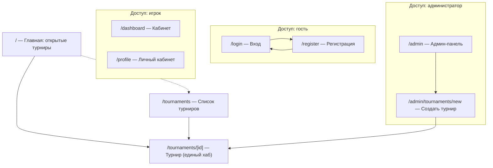
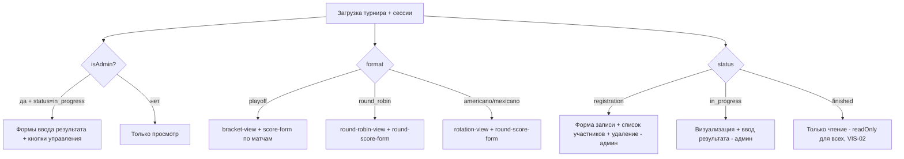
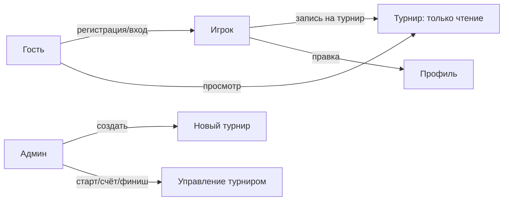

# 09 — Пользовательский интерфейс

Документ описывает проектирование пользовательского интерфейса: принципы, карту сайта, страницы,
навигацию, формы, компоненты визуализации и состояния интерфейса. Источник истины — `src/app/**`
и `src/components/**`. Все видимые строки приведены так, как они есть в коде (русский).

См. также: [сценарии использования](07-stsenarii-ispolzovaniya.md),
[серверные действия](11-servernye-deystviya-i-validatsiya.md), [форматы](05-formaty-i-algoritmy.md),
[машины состояний](08-mashiny-sostoyaniy.md).

## 1. Принципы проектирования UI

- **Только русский язык.** Вся подпись интерфейса локализована (SITE-01); строки зашиты в разметку.
- **Тёмная тема** по умолчанию, единая (SITE-02); задаётся корневым `layout.tsx` + Tailwind 4.
- **Адаптивная вёрстка**, mobile-first (SITE-03); корректность примерно от 375px.
- **Без UI-библиотек** — Tailwind 4 (utility-классы), обычный JSX. Кит компонентов не используется
  (диспропорция настройки к ~10 экранам формы).
- **Бэкенд-ориентированность.** Интерфейс минималистичен; основная сложность — в серверной логике.
  Формы — это `<form action={serverAction}>`; данные приходят из RSC напрямую из БД.
- **Прогрессивная отдача.** Чтение — Server Components (без клиентских загрузчиков); запись — Client
  Components с состоянием «idle → отправка → результат» (надписи вида «Сохранение…» / «Создаём аккаунт…»).

## 2. Карта сайта

Полный список маршрутов с группами и уровнями доступа:

| Маршрут | Группа | Доступ | Назначение |
|---------|--------|--------|------------|
| `/` | (корень) | гость+ | Главная: турниры, открытые для записи (HOME-01) |
| `/tournaments` | (public) | гость+ | Список всех турниров (вкл. прошедшие — VIS-02) |
| `/tournaments/[id]` | (public) | гость+ (формы — по роли/статусу) | Детальная страница турнира — **единый хаб** |
| `/login` | (auth) | гость | Вход |
| `/register` | (auth) | гость | Регистрация игрока |
| `/dashboard` | (app) | игрок+ | Кабинет (обзор) |
| `/profile` | (app) | игрок+ | Личный кабинет — правка профиля |
| `/admin` | (app) | admin | Админ-панель |
| `/admin/tournaments/new` | (app) | admin | Форма создания турнира |
| `/api/auth/[...all]` | api | — | Обработчик Better Auth |

**Route-groups** `(auth)` / `(app)` / `(public)` — это группировка Next.js App Router без влияния на URL:
она разделяет экраны по смыслу (вход/регистрация · приватный кабинет/админка · публичные турниры) и
позволяет применять разные layout’ы и логику доступа. Подробнее о слоях — в [03 — архитектура](03-arhitektura.md).

## 3. Каркас приложения: layout и шапка

- **`layout.tsx`** (корневой, server) — заголовок вкладки «Падел турниры», тёмная тема, общий каркас,
  подключение шапки `nav.tsx`.
- **`nav.tsx`** (server, HDR-01) — шапка с брендом **«Падел Клуб»** и навигацией, **зависящей от сессии/роли**:

| Пункт | Кому виден |
|-------|-----------|
| Турниры | всем |
| Прошедшие турниры | всем |
| Создать турнир | только администратору |
| Личный кабинет | аутентифицированному (игрок/админ) |
| Выйти (`logout-button`) | аутентифицированному |
| Войти · Регистрация | гостю |

Шапка читает сессию на сервере, поэтому пункты для админа/игрока не попадают в разметку для гостя.

## 4. Описание экранов

### 4.1. Главная `/` (HOME-01)

Заголовок **«Открытые турниры»**, подпись «Турниры, открытые для регистрации.». Список турниров в
статусе `registration` с указанием формата и заполненности (счётчики «… пар» / «… участников»).
Пустое состояние: «Сейчас нет открытых турниров.». Карточки ведут на `/tournaments/[id]`.

### 4.2. Список турниров `/tournaments`

Заголовок **«Турниры»**. Полный перечень турниров с бейджем статуса (см. §5). Включает прошедшие
(история, VIS-02). Пустое состояние: «Турниров пока нет.».

### 4.3. Детальная страница турнира `/tournaments/[id]` — единый хаб

Центральный экран. Один RSC собирает всё и **ветвится** по трём флагам:

Управляющие флаги (см. также [07](07-stsenarii-ispolzovaniya.md), [08](08-mashiny-sostoyaniy.md)):
- `isAdmin = role === "admin"`,
- `isPairsMode = participantMode === "pairs"`,
- `isPlayoff = format === "playoff"`,
- `readOnly = !isAdmin || status === "finished"` (VIS-02).

**Блоки страницы:**
1. **Шапка турнира** — название, статус-бейдж и характеристики: **Формат**, **Вид** (одиночный/парный),
   **Уровень**, **Цена** (если задана), **Режим подсчёта** («Сеты/геймы» либо «Очки»), **Размер**
   («… пар» / «… участников»), **Дата**, место.
2. **Список участников** — пары (никнеймы обоих, сторона корта «левая»/«правая»/«оба») или одиночки.
   В статусе `registration` администратору рядом — форма удаления регистрации.
3. **Запись** (только `registration`) — `participate-form` (пара по нику) либо одиночная запись.
4. **Управление турниром** (админ): «Старт турнира» (`registration`), «Завершить турнир» (`in_progress`).
5. **Визуализация по формату** — `bracket-view` / `round-robin-view` / `rotation-view` (см. §6).
6. **Ввод результата** (админ, `in_progress`) — `score-form` (playoff, по матчам) либо
   `round-score-form` (round-based, по раундам); вид ввода зависит от `scoringMode`.

### 4.4. Создание турнира `/admin/tournaments/new` (FORM-01)

Клиентская форма (`create-tournament-form`), заголовок «Создать турнир». Поля:
`name` (Название), `format` (Формат), `participantMode` (Вид), `level` (Уровень),
`size` (подпись меняется: **«Размер сетки»** для playoff vs **«Количество участников»** для остальных),
`price` (Цена, ₽), `scoringMode` («Сеты/геймы» / «Очки»), `totalRounds` (Число раундов — американо/мексикано),
`date` (Дата), `location` (Место). Кнопка «Создать турнир» → «Создание…». Валидация — format-зависимая
(см. [11](11-servernye-deystviya-i-validatsiya.md)). После успеха — переход на страницу турнира.

### 4.5. Регистрация `/register` и вход `/login` (FORM-02)

- **Регистрация** (`register-form`): `email` (Почта), `password` (Пароль), `name` (Имя (ФИО)),
  `nickname` (Никнейм), `phone` (Телефон), `birthDate` (Дата рождения), `skillLevel` (Уровень,
  плейсхолдер «Выберите уровень»). Кнопка «Зарегистрироваться» → «Создаём аккаунт…». Ошибки полей:
  «Никнейм уже занят», «Этот email уже зарегистрирован», общий fallback «Не удалось зарегистрироваться».
  Сторона корта **не** запрашивается при регистрации.
- **Вход** (`login-form`): `email`, `password`; ошибка «Неверная почта или пароль». Перелинковка
  «Войти» ↔ «Регистрация».

### 4.6. Личный кабинет `/profile` (FORM-03, USR-03)

Форма `profile-form`, заголовок «Личный кабинет». Поля: `name` (ФИО), `courtSide` (Сторона корта),
`phone` (Телефон), `skillLevel` (Уровень), `birthDate` (Дата рождения), `nickname` (Никнейм),
`email`. Кнопка «Сохранить» → «Сохраняем…», подтверждение «Сохранено.». Email и никнейм идут через
защищённые пути Better Auth (см. [10](10-autentifikatsiya-i-bezopasnost.md)).

### 4.7. Кабинет `/dashboard` и админ-панель `/admin`

`/dashboard` — простой обзор («Вы вошли в систему.»). `/admin` — точка входа администратора к управлению
(в т.ч. ссылка на создание турнира).

## 5. Компоненты-индикаторы и формы действий

- **`tournament-status-badge`** — бейдж статуса: «Регистрация открыта» / «Идёт» / «Завершён».
- **Формы-действия** (клиентские, по одной кнопке, у каждой — состояние процесса):
  `start-tournament-form` («Старт турнира» → «Генерация сетки…»),
  `finish-tournament-form` («Завершить турнир» → «Завершение…»),
  `remove-registration-form` («Удалить» → «Удаление…»),
  `participate-form` (поле «Ник партнёра», «Участвовать» → «Регистрация…»).

## 6. Компоненты визуализации (VIS-01)

Диспетчеризация на детальной странице по `format`:

| Компонент | Формат | Что показывает |
|-----------|--------|----------------|
| **`bracket-view`** | playoff | Дерево сетки колонками по раундам с подписями «Четвертьфинал» / «Полуфинал» / «Финал»; пары и счёт |
| **`round-robin-view`** | round_robin | Блок **«Матчи»** (или «Матчи ещё не сгенерированы») + **«Турнирная таблица»** (Место · Участник · Игр · Победы · Поражения · Очки · Разница) |
| **`rotation-view`** | americano / mexicano | «Текущие игры» / «Прошедшие игры» по раундам и кортам + **«Рейтинг игроков»** (Место · Игрок · Сыграно · Победы · Очки · Разница) |

Подсчёт значений таблиц/рейтинга — [06 — подсчёт и standings](06-podschyot-i-standings.md).

## 7. Ввод счёта (SCORE-02)

- **Playoff (`score-form`):** по матчам; стартовая строка сета предзаполняется существующим счётом,
  динамические строки сетов («+ Добавить сет», удаление строки), произвольные целые. Подпись «против»,
  кнопка «Сохранить счёт» → «Сохранение…».
- **Round-based (`round-score-form`):** ветка по `scoringMode`. Режим `points` — поля `points_a`/`points_b`
  (два целых). Режим `sets` — динамические строки сетов (как в playoff). Для мексикано после записи может
  появиться уведомление «следующий раунд уже сформирован».

Free-form: верхних пределов на число сетов/геймов/очков нет (см. [06](06-podschyot-i-standings.md)).

## 8. Состояния интерфейса

- **Пустые состояния** — у списков предусмотрены подписи («Турниров пока нет.», «Сейчас нет открытых
  турниров.», «Матчи ещё не сгенерированы», «Раунды ещё не сгенерированы», «Пока нет сыгранных игр»).
- **Режим только-чтения** — для гостя/игрока всегда, и для всех на завершённом турнире (`readOnly`, VIS-02):
  формы ввода и кнопки управления не отображаются.
- **Ошибки форм** — приходят из server actions как `fieldErrors` (привязка к полю) или общая ошибка,
  всегда безопасным русским текстом (см. [11](11-servernye-deystviya-i-validatsiya.md)).
- **Процесс отправки** — клиентские формы показывают промежуточную надпись и блокируют повторную отправку.

## 9. Навигационные потоки (типовые пути)

- **Гость:** Главная → карточка турнира → просмотр сетки/таблицы; либо → «Регистрация»/«Войти».
- **Игрок:** Вход → Главная/Список → турнир → «Участвовать» (ник партнёра или одиночно) → просмотр; правка в «Личном кабинете».
- **Администратор:** Вход → «Создать турнир» → страница турнира → (по мере записи участников) «Старт турнира»
  → ввод результатов → «Завершить турнир».
