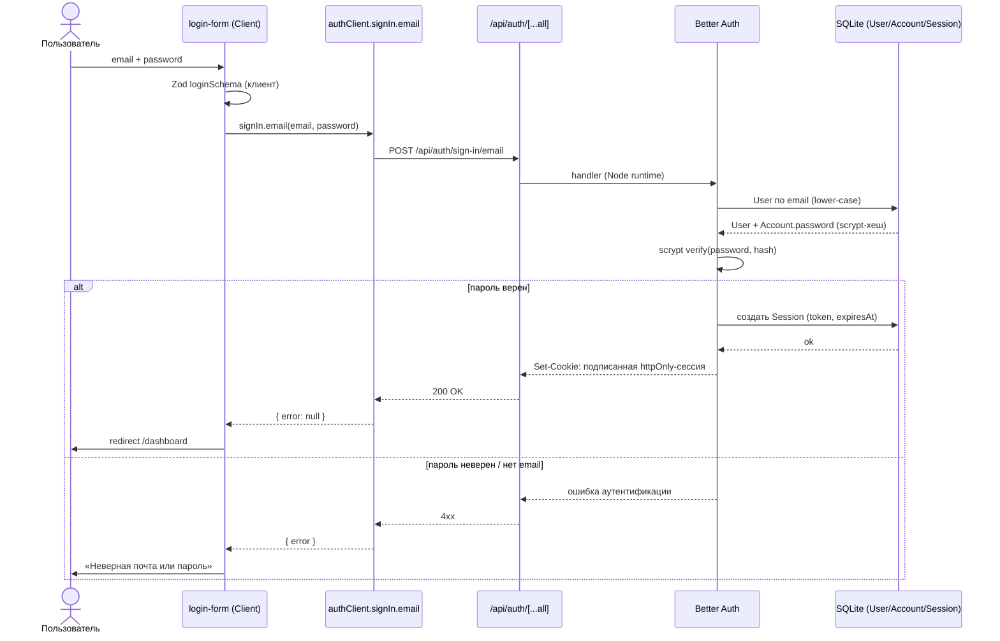

# 10 — Аутентификация и безопасность

Документ описывает подсистему аутентификации, авторизации и принятые меры безопасности приложения «Padel Tournaments». Раздел проектирует *что* и *как* защищено: выбор библиотеки, модель аутентификации, доменные поля при регистрации, роли и точки авторизации, безопасную смену email/ника, модель угроз и меры противодействия, управление сессиями. Реализация согласована со слоистой [архитектурой](03-arhitektura.md): авторизация выполняется на границе [серверных действий](11-servernye-deystviya-i-validatsiya.md) и в Server Components (RSC), а целостность переходов опирается на [машины состояний](08-mashiny-sostoyaniy.md).

Подсистема построена на единственной внешней библиотеке — **Better Auth** (`^1.6`). Самописный код аутентификации в проекте отсутствует: хеширование пароля, выпуск и подпись сессионных кук, схема таблиц авторизации, обработчик HTTP-эндпоинтов и роль-плагин предоставлены библиотекой. Это сознательное проектное решение, обоснованное ниже.

---

## 10.1. Выбор решения

### 10.1.1. Требования к подсистеме

Контекст диплома задаёт узкие, но жёсткие требования к аутентификации:

- **email + password** — единственный нужный способ входа (нет соцлогина, нет MFA, нет magic-link).
- **Роль администратора** — ровно одна организация-клуб; нужна модель «роль игрока по умолчанию + единственный администратор».
- **Node runtime, без Edge** — приложение работает как обычный Next.js-сервер; никаких ограничений Edge-окружения принимать на себя не нужно.
- **Prisma + SQLite** — сессии и учётные данные должны храниться в той же файловой БД, что и доменные данные, без отдельного стора.
- **Офлайн-демо** — защита диплома может проходить без интернета; решение не должно зависеть от внешнего сервиса (хостинговый провайдер аутентификации исключён).
- **Простота защиты на защите** — решение должно быть кратко и честно объяснимо в академическом тексте.

### 10.1.2. Принятое решение — Better Auth ^1.6

В качестве библиотеки аутентификации выбран **Better Auth** версии `^1.6` (на момент фиксации стека — `1.6.14`). Решение зафиксировано в ресёрче [AUTH.md](../.planning/research/AUTH.md) и перекрывает более раннюю рекомендацию «самописная cookie-сессия» из STACK.md: появилась поддерживаемая, Node-нативная библиотека, точно ложащаяся на стек.

Better Auth закрывает все перечисленные требования «из коробки»:

| Требование | Как закрывает Better Auth |
|------------|---------------------------|
| email + password | Опция `emailAndPassword.enabled` — встроенная регистрация и вход, хеширование пароля библиотекой (scrypt) |
| Роль администратора | Плагин `admin()` добавляет поле `role` в `User` и серверные проверки роли |
| Node runtime | Библиотека работает целиком в Node-окружении; никаких Edge/`crypto`-ограничений |
| Prisma + SQLite | Официальный Prisma-адаптер (`provider: "sqlite"`); сессии и учётные данные — в той же SQLite-БД |
| Офлайн | Самохостинг: всё в собственной БД, без внешних вызовов |
| Объяснимость | «Использован Better Auth — текущий стандарт аутентификации для Next.js, с Prisma+SQLite-адаптером и admin-плагином» — сильный и честный нарратив |

Дополнительные следствия выбора, важные для проекта:
- **Пароли в проекте не хешируются вручную** и `bcryptjs` из тракта аутентификации исключён — Better Auth хеширует пароль (scrypt) и подписывает сессию сам.
- Интеграция с Next.js минимальна: один конфиг [`src/lib/auth.ts`](../src/lib/auth.ts), один браузерный клиент [`src/lib/auth-client.ts`](../src/lib/auth-client.ts), один catch-all route-handler [`src/app/api/auth/[...all]/route.ts`](../src/app/api/auth/[...all]/route.ts) и плагин `nextCookies()` для записи кук из Server Actions.

### 10.1.3. Почему не Auth.js v5 и не Lucia

Два очевидных альтернативных кандидата отклонены по конкретным причинам:

- **Auth.js v5 (NextAuth)** — отклонён. На момент выбора v5 по-прежнему публикуется только под тегом `beta` (`5.0.0-beta.31`), тогда как `latest` — это ещё v4. Для credentials-провайдера v5 навязывает известный *footgun*: конфиг приходится **разделять** так, чтобы middleware исполнялось в Edge-runtime (где недоступны Node `crypto`/`bcrypt`), а фактический вход — в Node. Этот edge/node-раскол — чистые накладные расходы для демо с единственным администратором, без какой-либо выгоды. Симптоматично, что и сами мейнтейнеры NextAuth теперь направляют новые проекты на Better Auth.
- **Lucia** — отклонён. Lucia v3 (`3.2.2`) **заморожена и помечена как deprecated** (март 2025); официальная рекомендация автора — «реализуйте сессии сами». Это теперь учебный ресурс, а не поддерживаемая библиотека. Прежний вывод STACK.md «Lucia мертва → значит, пишем сами» был неполным: правильный преемник — именно Better Auth.

Хостинговые провайдеры (Clerk, Supabase Auth, Auth0/WorkOS) исключены как нарушающие требования офлайн-демо и/или уводящие со стека SQLite.

---

## 10.2. Модель аутентификации

### 10.2.1. Способ и хранение учётных данных

Включён единственный способ — **email + password** (`emailAndPassword: { enabled: true }` в [`src/lib/auth.ts`](../src/lib/auth.ts)). **Email-верификация выключена** (значение по умолчанию Better Auth не переопределяется в сторону включения): это сознательное решение для офлайн-демо — нет SMTP, нет интернета, регистрация даёт немедленный вход. Следствие: поле `User.emailVerified` всегда остаётся `false` и никогда не выставляется в `true` — этот факт далее используется при безопасной смене email (см. 10.5).

Ключевой факт модели данных: **пароль хранится не в `User`, а в таблице `Account`**, в колонке `Account.password`, в виде scrypt-хеша, выпускаемого Better Auth. У модели `User` колонки пароля **нет** вовсе (см. [модель данных](04-model-dannyh.md)). Это разделение — естественное следствие схемы Better Auth (учётная запись/«провайдер» отделены от профиля пользователя) и одновременно мера безопасности: профильные `select`-проекции сервисов физически не могут случайно вернуть пароль, так как его нет в `User`. В [`src/lib/services/profile.ts`](../src/lib/services/profile.ts) каждый чтение/запись профиля использует явный `safeProfileSelect` только безопасных полей.

### 10.2.2. Таблицы Better Auth

Схема аутентификации сгенерирована CLI Better Auth и состоит из четырёх таблиц (см. [модель данных](04-model-dannyh.md)):

| Таблица | Назначение | Существенные поля |
|---------|------------|-------------------|
| `User` | Профиль пользователя | `id`, `email` (`@@unique`), `emailVerified`, `name`, `role`, доменные поля (см. 10.3) |
| `Session` | Активные сессии | `id`, `token` (`@@unique`), `expiresAt`, `userId`, `ipAddress?`, `userAgent?` |
| `Account` | Учётные данные/провайдеры | `userId`, `providerId`, `accountId`, **`password`** (scrypt-хеш) |
| `Verification` | Токены верификации | `identifier`, `value`, `expiresAt` — присутствует по схеме, но не используется (верификация off) |

Доменные поля (`role`, `courtSide`, `nickname`, `phone`, `skillLevel`, `birthDate`, а также `banned`/`banReason`/`banExpires` от admin-плагина) добавлены поверх сгенерированной модели `User`.

### 10.2.3. Сценарий входа

Вход инициируется браузерным клиентом ([`src/lib/auth-client.ts`](../src/lib/auth-client.ts), метод `signIn.email`) из формы [`login-form.tsx`](../src/app/(auth)/login/login-form.tsx). Перед отправкой форма валидирует ввод схемой Zod (`loginSchema`). На любую ошибку входа клиент показывает единое нейтральное сообщение «Неверная почта или пароль» — без различения «нет такого email» и «неверный пароль» (анти-перечисление, см. 10.6).



Существенно: проверка пароля и выпуск сессии происходят **на сервере** (Node runtime) внутри Better Auth; браузер получает только подписанную httpOnly-куку и никогда не видит хеш. Идентичность пользователя в дальнейшем выводится **исключительно** из этой куки (см. 10.4), а не из клиентских данных.

---

## 10.3. Доменные поля при регистрации

### 10.3.1. additionalFields

Регистрация собирает не только email/password/name, но и доменные поля игрока. Они объявлены в `user.additionalFields` конфига [`src/lib/auth.ts`](../src/lib/auth.ts) и пробрасываются в типизированные параметры `signUp.email` через `inferAdditionalFields<typeof auth>()` в браузерном клиенте:

| Поле | Тип | Обязательность | Семантика и обоснование |
|------|-----|----------------|--------------------------|
| `nickname` | string | **required**, `input:true` | Уникальный человекочитаемый идентификатор. `required:true` → Better Auth валидирует наличие и добавляет поле в выведенный тип `signUp.email`. DB-`@@unique([nickname])` — источник истины уникальности; сравнение **регистрозависимое** (SQLite TEXT BINARY, без `COLLATE NOCASE`) — это и есть зафиксированный exact-match. |
| `skillLevel` | string | **required**, `input:true` | Уровень игрока, один из пяти латинских значений (`beginner`/`progressing`/`intermediate`/`advanced`/`pro`). Обязателен осознанно: «проскок» дефолта приводил к несовпадению уровня при регистрации в пару (REG-05). |
| `phone` | string | optional, `input:true` | Телефон, только для отображения. |
| `birthDate` | string | optional, `input:true` | Дата рождения. Объявлена как **`string`, а НЕ `date`** — это A1-fallback из ресёрча: форма шлёт ISO-строку, а Prisma/SQLite-адаптер надёжно укладывает её в колонку `DateTime? birthDate`, минуя риск coercion для типа `"date"`. |

**`courtSide` намеренно НЕ собирается при регистрации.** Поле объявлено только в схеме `User` с дефолтом `"either"` (`"left"`/`"right"`/`"either"`) и редактируется позже в профиле. Это сознательно упрощает форму регистрации — предпочитаемая сторона корта не критична для входа в систему.

### 10.3.2. Обработка дубликата ника

Уникальность ника обеспечивается на уровне БД (`@@unique([nickname])`), без TOCTOU-предпроверки в коде. На этапе регистрации ник — **единственное** уникальное поле, создаваемое одновременно с записью (email отдельно пред-проверяется Better Auth и даёт собственный код ошибки). Поэтому в форме [`register-form.tsx`](../src/app/(auth)/register/register-form.tsx) ветвление идёт по **стабильному `error.code`**, а не по английскому `error.message`:

- `USER_ALREADY_EXISTS_USE_ANOTHER_EMAIL` → «Этот email уже зарегистрирован»;
- `FAILED_TO_CREATE_USER` → «Никнейм уже занят» (это и есть атомарный отказ DB-`@@unique` на дубликате ника — единственное оставшееся уникальное create-time поле);
- иначе → нейтральное «Не удалось зарегистрироваться».

Это допущение A1, явно задокументированное в схеме: если когда-либо появится второе уникальное create-time поле, отображение `FAILED_TO_CREATE_USER → ник занят` перестанет быть однозначным, и потребуется разбор `P2002`/`meta.target` на сервере. После успешной регистрации Better Auth автоматически выполняет вход (верификация выключена), и пользователь перенаправляется в `/dashboard`.

---

## 10.4. Роли и авторизация

### 10.4.1. Модель ролей

Роли реализованы плагином `admin()` Better Auth с конфигурацией `defaultRole: "player"`, `adminRoles: ["admin"]` ([`src/lib/auth.ts`](../src/lib/auth.ts)). Плагин добавляет в `User` поле `role` (плюс служебные `banned`/`banReason`/`banExpires`). Любая новая регистрация получает роль `"player"`.

**Администратор — единственный, и это seed-аккаунт из переменных окружения.** Скрипт [`prisma/seed.ts`](../prisma/seed.ts) идемпотентно создаёт ровно одну учётную запись организации:

1. читает `ADMIN_EMAIL`/`ADMIN_PASSWORD` из окружения (креды никогда не коммитятся);
2. при наличии пользователя с таким email — операция no-op (повторный запуск безопасен);
3. иначе создаёт пользователя **через `auth.api.signUpEmail`** — чтобы пароль был корректно хеширован (scrypt) и строка `Account` соответствовала ожиданиям Better Auth;
4. **промоутит роль скриптом**: `prisma.user.update({ data: { role: "admin" } })`.

Создание администратора именно через Better Auth (а не прямой `prisma.create`) принципиально: только так пароль попадает в `Account.password` в правильном формате. Идемпотентность завязана на email; ограничение `@@unique([nickname])` для ника `"admin"` этим guard'ом не покрыто, что безопасно при зафиксированном потоке `migrate reset` + reseed (пустая таблица → нет коллизий).

### 10.4.2. Guards — единая граница авторизации

Все проверки доступа сосредоточены в одном модуле [`src/lib/auth-guards.ts`](../src/lib/auth-guards.ts). Он импортирует `next/headers`, что делает его server-only by construction — никакой клиентский путь импорта до него не дотягивается. Три функции:

- **`getOptionalSession()`** — читает сессию без выброса исключения. Для отображающих вызовов (например, навигация `nav.tsx`), которые выбирают ссылки по состоянию входа, а не ограничивают доступ.
- **`requireUser()`** — требует аутентифицированного пользователя. Бросает `"Unauthorized"`, если аноним или пользователь **забанен** (живая кука не должна обходить бан). Возвращает пользователя.
- **`requireAdmin()`** — требует роль `"admin"`. Бросает `"Forbidden"`, если аноним, забанен или `role !== "admin"`.

Идентичность во всех трёх выводится **только** из подписанной сессионной куки через `auth.api.getSession({ headers })` — никогда из клиентских props или полей формы. Бан учитывается функцией `isBanned`: пользователь забанен, если `banned` выставлен и срок (`banExpires`) либо отсутствует (перманентный), либо ещё не истёк.

### 10.4.3. Почему авторизация на границе действия/RSC, а НЕ в middleware

Авторизация выполняется **на первой строке каждого Server Action** и **внутри защищённых RSC**, но **не в middleware**. Это сознательное решение, и у него две причины:

1. **Edge/Node footgun.** Next.js middleware исполняется в Edge-runtime, где недоступны Node `crypto`/`bcrypt`-примитивы и полноценная работа с БД. Better Auth и проверка сессии целиком живут в Node-runtime; вынос авторизации в middleware вернул бы тот самый edge/node-раскол, из-за которого был отклонён Auth.js v5 (см. 10.1.3).
2. **Источник истины — данные, а не UI.** Server Action — это публичный HTTP-эндпоинт. Скрытая в UI кнопка («Старт», «Удалить») — лишь косметика; прямой POST в обход интерфейса должен быть отбит. Поэтому guard стоит **до** любого парсинга и работы с БД, а сервисы дополнительно перечитывают статус/режим/вместимость внутри своих транзакций (см. 10.6). Все write-actions проекта следуют паттерну `requireUser()/requireAdmin()` → `parse*Form` → service → `revalidatePath` (см. [серверные действия](11-servernye-deystviya-i-validatsiya.md)). В RSC та же `getSession`-проверка гейтит рендер страниц.

Существенная деталь: в admin-actions выброс `requireAdmin()` **намеренно не перехватывается** `try/catch` — отказ доступа должен пробрасываться, а не превращаться в дружелюбное сообщение наряду с доменными ошибками.

```mermaid
flowchart TD
    A[POST в Server Action] --> B{Тип действия}
    B -->|только для авторизованных| C[requireUser]
    B -->|только для админа| D[requireAdmin]
    B -->|публичное чтение в RSC| E[getOptionalSession]

    C --> F{есть сессия-кука?}
    F -->|нет| X1[throw Unauthorized]
    F -->|да| G{забанен?}
    G -->|да| X1
    G -->|нет| OK1[user → parse → service]

    D --> H{есть сессия-кука?}
    H -->|нет| X2[throw Forbidden]
    H -->|да| I{role == admin?}
    I -->|нет| X2
    I -->|да| J{забанен?}
    J -->|да| X2
    J -->|нет| OK2[admin → parse → service]

    E --> K[вернуть session | null<br/>выбор ссылок/рендера]
```

---

## 10.5. Смена email и ника (USR-03)

Правка профиля выполняется действием [`updateProfileAction`](../src/app/(app)/profile/actions.ts). Email и ник обрабатываются по двум разным, но одинаково безопасным трактам.

### 10.5.1. Email — только через Better Auth changeEmail

**Email никогда не меняется прямым `prisma.user.update`.** Им владеет Better Auth, и смена идёт исключительно через `auth.api.changeEmail`. Конфиг требует **обоих** флагов (`changeEmail: { enabled: true, updateEmailWithoutVerification: true }` в [`src/lib/auth.ts`](../src/lib/auth.ts)):

- без `enabled` смена email недоступна вовсе;
- без `updateEmailWithoutVerification` `changeEmail` бросает «Verification email isn't enabled» (Pitfall 2 ресёрча).

Этот тракт работает корректно **именно потому**, что верификация выключена и `emailVerified` всегда `false`: Better Auth немедленно обновляет email и сессионную куку без SMTP. Прямой `prisma.update` обошёл бы внутреннюю нормализацию и инварианты Better Auth (нижний регистр email, согласованность сессии) — поэтому он запрещён как класс.

Действие меняет email **только если он реально изменился**, и предварительно нормализует значение в нижний регистр и тримит. Это необходимо, так как Better Auth хранит email в нижнем регистре, а SQLite TEXT-сравнение бинарное/регистрозависимое: без нормализации дубликат в другом регистре проскочил бы пред-проверку, а `changeEmail` молча сделал бы no-op на занятом email. Пред-проверка занятости (`findUnique` по нормализованному email, сравнение `id`) даёт нейтральное «Этот email уже используется» (анти-перечисление, см. 10.6).

### 10.5.2. Ник — прямой update с проверкой уникальности через БД

Ник, в отличие от email, — доменное поле `User`, и пишется напрямую через сервис [`updateProfile`](../src/lib/services/profile.ts). Уникальность **не пред-проверяется** в коде (никакого TOCTOU): запись идёт сразу, а конфликт `@@unique([nickname])` всплывает как Prisma-ошибка `P2002`, которую действие отображает в RU-сообщение «Этот ник уже занят». Это согласовано с обработкой дубля при регистрации (10.3.2) — оба тракта опираются на DB-constraint как на источник истины, а не на гонко-уязвимую пред-проверку.

---

## 10.6. Модель угроз и меры

Модель угроз ограничена реальным контекстом: единственная доверенная организация-администратор, демо-нагрузка, SQLite single-writer. Меры спроектированы под этот контекст, а не под публичный сервис с высокой конкурентностью.

| Угроза | Мера противодействия |
|--------|----------------------|
| **Подмена роли / прямой POST в admin-эндпоинт.** Не-админ или аноним шлёт POST в `startTournamentAction`/`recordResultAction`/`removeRegistrationAction`/`finishTournamentAction` в обход UI. | `requireAdmin()` — **первая строка** каждого admin-action; роль читается из подписанной сессии (никогда из формы). Выброс `"Forbidden"` происходит до парсинга и работы с БД и **намеренно не перехватывается**. Скрытая в UI кнопка — лишь косметика. |
| **Гонка перехода статуса турнира** (T-02-01). Параллельные/повторные переходы `registration→in_progress→finished`, попытка «протолкнуть» нелегальное ребро. | `transitionTournament` ([`tournament-status.ts`](../src/lib/services/tournament-status.ts)) **перечитывает текущий статус из БД** и отвергает вызов, если заявленный `from` не совпадает с фактическим; `isAllowedTransition` разрешает только два прямых ребра. Клиентский `from` не доверяется. См. [машины состояний](08-mashiny-sostoyaniy.md). |
| **Утечка внутренних ошибок** (T-08-07). Сырой текст Prisma/исключений раскрывает структуру БД/логику. | Сервисы кидают **типизированные ошибки** с `code`-дискриминантом (`RegistrationError`, `AdminError`, `ResultError`, `RoundResultError`, `BracketError`, `FormatError`). Действия отображают наружу **только безопасный RU-текст** по `code`; любой иной выброс → нейтральный fallback («Не удалось …»). Сырой текст наружу не уходит. |
| **Нарушение целостности регистрации/вместимости** (REG-01..06). Двойная регистрация игрока, превышение размера турнира, пара с самим собой, несовпадение режима/уровня. | `registerPair`/`registerSingle` ([`registration.ts`](../src/lib/services/registration.ts)) выполняют перечитку статуса, режима, уровня, подсчёт вместимости, кросс-слотовую проверку дубля и вставку **в одной `prisma.$transaction`** (на reject — полный откат). DB-`@@unique` (`[tournamentId, player1Id]`, `[tournamentId, player2Id]`, `[tournamentId, userId]`) — defense-in-depth. `player1Id` всегда `= user.id`, не из формы. |
| **CSRF / кража сессии через JS.** | Сессия — **httpOnly**-кука, подписанная Better Auth; JS на странице не читает её. Плагин `nextCookies()` стоит **последним** и корректно ставит куки из Server Actions; запись идёт только через POST-эндпоинты Better Auth. |
| **Перечисление пользователей** (anti-enumeration). По ответам формы можно собрать список email/ников. | Вход возвращает единое «Неверная почта или пароль» без различения причин. Смена email пред-проверяется на нормализованном (lower-case) значении и даёт нейтральное сообщение. Регистрация партнёра в пару — **по точному нику** (`findUserIdByNickname`, exact-match), а не по списку/автодополнению пользователей: нет эндпоинта, отдающего перечень игроков. |
| **Раскрытие учётных/приватных полей в проекциях.** | Все сервис-`select` явные и содержат только безопасные поля (`safeProfileSelect`, `playerSelect`). Пароля в `User` нет вовсе (он в `Account`), поэтому проекция профиля физически не может его вернуть; email/телефон не попадают в публичный список участников. |
| **Обход бана живой кукой.** | `requireUser`/`requireAdmin` проверяют `isBanned` (учёт `banExpires`) — действующая сессия забаненного пользователя отвергается. |

### Принятое ограничение (accepted)

**TOCTOU вместимости в `registerPair`/`registerSingle`.** Подсчёт занятых мест и вставка выполнены в одной транзакции, что закрывает гонку в пределах одной транзакции, однако SQLite на уровне изоляции не даёт строгой сериализуемости диапазонного предиката «мест меньше size» между конкурирующими транзакциями. В теории два почти одновременных запроса могли бы оба пройти проверку вместимости. Это ограничение **принято осознанно**: реальной конкурентной нагрузки в дипломе нет, а SQLite в режиме single-writer фактически сериализует записи — отдельные блокировки/`SELECT … FOR UPDATE` были бы преждевременной оптимизацией вне scope. Жёсткие DB-`@@unique` при этом продолжают исключать дубликаты конкретного игрока даже при гонке.

---

## 10.7. Сессии

Сессия — это строка в таблице `Session` (`token` `@@unique`, `expiresAt`, привязка к `userId`, опционально `ipAddress`/`userAgent`), которой на стороне браузера соответствует **подписанная httpOnly-кука**, выпускаемая Better Auth при успешном входе/регистрации. Существенные свойства:

- **Хранение и подпись** — целиком на стороне Better Auth: библиотека подписывает куку и сверяет её с записью `Session` в SQLite. Приложение нигде не парсит и не подписывает куку вручную.
- **Запись кук из Server Actions** обеспечивает плагин `nextCookies()`, стоящий **последним** в списке плагинов конфига (это требование Better Auth для Next.js).
- **Срок жизни** — `Session.expiresAt`; по истечении срока (или при бане, см. 10.4.2) `getSession` не вернёт валидного пользователя, и guard отвергнет доступ. Конкретные значения TTL — дефолты Better Auth (приложение их не переопределяет).
- **Выход** — кнопка [`logout-button.tsx`](../src/components/logout-button.tsx) вызывает `authClient.signOut()`, после чего Better Auth инвалидирует сессию и очищает куку; затем выполняется `router.push("/")` + `router.refresh()`, чтобы навигация и RSC перечитали (теперь анонимное) состояние.
- **Идентичность из куки** — повторим как инвариант безопасности: во всех guard'ах (`getOptionalSession`/`requireUser`/`requireAdmin`) пользователь и его роль выводятся **только** из этой подписанной сессионной куки через `auth.api.getSession`, и никогда из клиентских props или полей формы.

---

## Связанные документы

- [03 — Архитектура](03-arhitektura.md) — слои, размещение guard'ов, потоки данных.
- [08 — Машины состояний](08-mashiny-sostoyaniy.md) — переходы статуса турнира, на которые опирается T-02-01.
- [11 — Серверные действия и валидация](11-servernye-deystviya-i-validatsiya.md) — паттерн `guard → parse → service`, модель типизированных ошибок.
- [04 — Модель данных](04-model-dannyh.md) — таблицы `User`/`Session`/`Account`/`Verification` и доменные поля.
