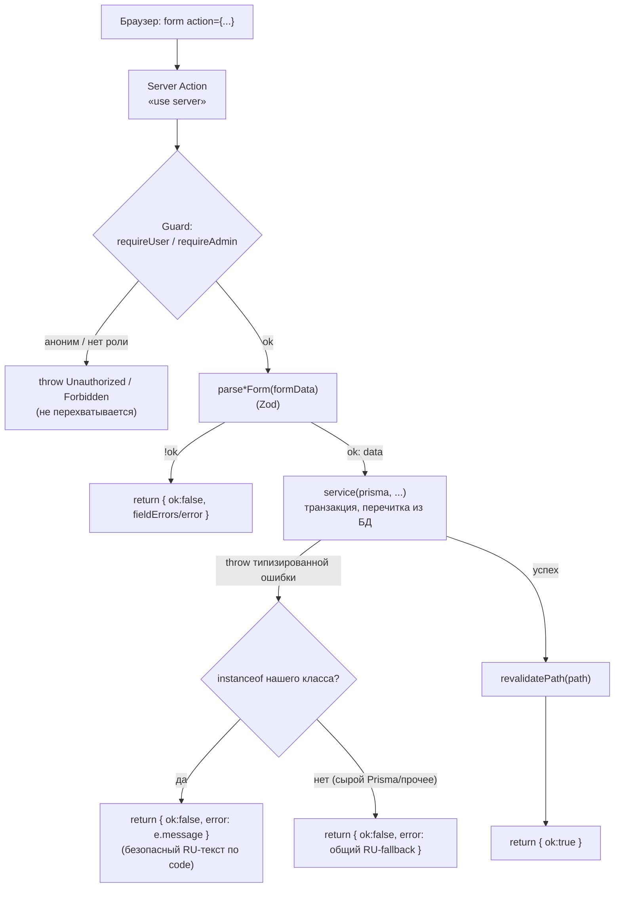

# 11 — Серверные действия и валидация

Этот документ описывает write-путь системы «Padel Tournaments»: как мутации данных
оформлены в виде Server Actions, как устроен слой валидации на Zod, какие
типизированные ошибки кидает слой сервисов и как наружу отдаётся только безопасный
русскоязычный текст. Read-путь (Server Components → service → Prisma) и общая
раскладка слоёв описаны в [архитектуре](03-arhitektura.md); правила вычисления
победителя и рейтингов — в [подсчёте и standings](06-podschyot-i-standings.md);
аутентификация и guard-функции — в [безопасности](10-autentifikatsiya-i-bezopasnost.md);
сквозные пользовательские потоки — в [сценариях](07-stsenarii-ispolzovaniya.md).

## 11.1 Концепция write-пути

В приложении нет отдельного REST/API-слоя. Все мутации выполняются через **Server
Actions** — асинхронные функции с директивой `"use server"`, которые вызываются
прямо из `<form action={...}>` клиентского компонента. Это согласуется с выбором
App Router (см. [архитектуру](03-arhitektura.md)): чтение — Server Components,
запись — Server Actions, без промежуточного fetch-слоя, REST-маршрутов и ручной
сериализации. Единственный route-handler в проекте — `api/auth/[...all]`, и он
принадлежит библиотеке Better Auth (см. ниже и [безопасность](10-autentifikatsiya-i-bezopasnost.md)).

### Единый конвейер каждого action

Каждый Server Action — **тонкий**: он не содержит бизнес-логики, а только
оркеструет фиксированную последовательность шагов. Бизнес-логика и работа с БД
вынесены в слой сервисов (`src/lib/services/*.ts`), которые принимают `prisma`
параметром. Конвейер:

1. **`"use server"`** — директива в начале файла. С точки зрения рантайма Server
   Action — это публичный HTTP-эндпоинт, поэтому первая же строка тела —
   граница безопасности.
2. **Guard** — `requireUser()` или `requireAdmin()` из `src/lib/auth-guards.ts`.
   Идентичность и роль выводятся из подписанной session-cookie, а не из формы.
   Аноним/не-админ, отправивший POST напрямую, отвергается ещё до парсинга и любой
   работы с БД. Бросок guard'а (`Unauthorized`/`Forbidden`) намеренно **не**
   перехватывается — UX-редирект делает guard страницы (см. [безопасность](10-autentifikatsiya-i-bezopasnost.md)).
3. **`parse*Form(formData)`** — Zod-парсер читает и валидирует `FormData`,
   возвращая дискриминированный результат `{ ok: true; data } | { ok: false; errors }`.
   При неудаче action сразу возвращает `{ ok: false, ... }` с per-field-ошибками.
4. **Вызов сервиса** — `service(prisma, ...)`. Идентификаторы доверенного
   происхождения (`user.id`, `tournamentId`, `matchId`) передаются из guard'а и из
   `.bind(...)`-привязок leaf-компонента, **никогда** не читаются из тела формы.
   Сервис повторно перечитывает статус/режим/ёмкость/уровень из БД внутри
   собственной транзакции — данные авторитетны независимо от того, что прислал UI.
5. **`revalidatePath(...)`** — сброс кэша затронутой страницы, чтобы изменение
   отрисовалось немедленно (новая пара, обновлённая сетка, чемпион).
6. **Возврат `{ ok, fieldErrors?/error? }`** — без `redirect`. Действие остаётся на
   той же странице, и результат (успех или ошибка) отрисовывается через `useActionState`.

> Единственное исключение из «без redirect» — `createTournamentAction`: после
> успешного создания он делает `redirect` на страницу нового турнира. `redirect`
> бросает `NEXT_REDIRECT` и поэтому вынесен **за** `try/catch`.

Обоснование. Тонкий action + толстый сервис даёт три свойства: (1) бизнес-правила
тестируются изолированно, без HTTP/Next-контекста (сервисы принимают `prisma` и
кидают чистые ошибки); (2) одна и та же логика записи переиспользуется
диспетчерами `startFormat`/`recordFormatResult` для четырёх форматов; (3) граница
безопасности всегда стоит первой строкой, а валидация — второй, до любого
обращения к БД.

## 11.2 Каталог Server Actions

| Action | Файл | Guard | Валидатор | Сервис(ы) | Эффект | Ревалидирует |
|--------|------|-------|-----------|-----------|--------|--------------|
| `createTournamentAction` | `(app)/admin/tournaments/actions.ts` | `requireAdmin` | `parseTournamentForm` | `createTournament` | Создаёт турнир, статус жёстко `"registration"` | `/tournaments` + `redirect` на `/tournaments/{id}` |
| `participateAction` | `(public)/tournaments/[id]/actions.ts` | `requireUser` | `parseRegisterPairForm` | `findUserIdByNickname` → `registerPair` | Регистрация пары (ник партнёра → `player2Id`) | `/tournaments/{id}` |
| `participateSingleAction` | `(public)/tournaments/[id]/actions.ts` | `requireUser` | (schema пустая) | `registerSingle` | Одиночная регистрация (`userId = user.id`) | `/tournaments/{id}` |
| `startTournamentAction` | `(public)/tournaments/[id]/actions.ts` | `requireAdmin` | — | `startFormat` (диспетчер → `generateBracket` / `generateRoundRobin` / `generateAmericano` / `generateMexicanoRound1`) | Генерация сетки/расписания; статус `registration → in_progress` | `/tournaments/{id}` |
| `removeRegistrationAction` | `(public)/tournaments/[id]/actions.ts` | `requireAdmin` | — | `removePair` / `removeParticipant` (диспетч. по `kind`) | Удаление регистрации (только до старта) | `/tournaments/{id}` |
| `finishTournamentAction` | `(public)/tournaments/[id]/actions.ts` | `requireAdmin` | — | `finishTournament` | Ручной финиш `in_progress → finished` (идемпотентно) | `/tournaments/{id}` |
| `recordResultAction` | `(public)/tournaments/[id]/actions.ts` | `requireAdmin` | `parseRecordResultForm` / `parseRoundResultForm` (внутри `recordFormatResult`) | `recordFormatResult` (диспетчер → `recordResult` / `recordRoundResult`) | Запись/правка счёта; продвижение/материализация/авто-финиш | `/tournaments/{id}` |
| `updateProfileAction` | `(app)/profile/actions.ts` | `requireUser` | `parseProfileForm` | `updateProfile` (домен) + `auth.api.changeEmail` (email) | Правка профиля своего пользователя | `/profile` |
| `adminPing` | `(app)/admin/actions.ts` | `requireAdmin` | — | — | Служебный proof-action (демонстрация границы безопасности) | — |
| `api/auth/[...all]` | `api/auth/[...all]/route.ts` | (внутри Better Auth) | — | Better Auth handler | Регистрация/вход/сессии/смена email | — |

Несколько замечаний по диспетчеризации (детали алгоритмов — в
[форматы и алгоритмы](05-formaty-i-algoritmy.md) и [подсчёте](06-podschyot-i-standings.md)):

- **`startFormat`** и **`recordFormatResult`** (`format-engine.ts`) — диспетчеры:
  они перечитывают `format` из БД и направляют вызов в нужный сервис. Клиент не
  может «подменить» формат и записать результат не по тому пути.
- **`recordResultAction`** сохраняет в сигнатуре аргумент `_setsPerMatch` для
  совместимости с UI, но **не доверяет** ему — реальная конфигурация перечитывается
  из БД (после free-form rewrite счёт вообще не ограничен сверху, см. ниже).
- **`participateAction`** строит `player1Id` исключительно из `user.id`; из формы
  приходит только `player2Nickname`, который резолвится в `player2Id` сервером
  через `findUserIdByNickname`.
- `tournamentId`, `kind`, `id`, `matchId` привязаны через `.bind(null, ...)` из
  leaf-компонента и не читаются из тела запроса — подделанная форма не может
  перенаправить удаление/запись на чужой объект.

## 11.3 Слой валидации (Zod)

Файлы `src/lib/validation/*.ts` содержат Zod-схемы и функции `parse*Form(formData)`.
Ключевой принцип: **один источник правды для клиентской формы и для серверной
границы**. Один и тот же `parse*Form` вызывается и в клиентском компоненте (для
мгновенной UX-валидации), и в Server Action (как настоящая граница безопасности),
поэтому правила не могут разойтись: невозможна ситуация, когда форма что-то
пропускает, а сервер ждёт другое. Поскольку SQLite не имеет нативных enum-типов,
все «перечисления» хранятся как `String` и валидируются Zod-union/`z.enum`.

Все парсеры возвращают единую дискриминированную форму
`{ ok: true; data } | { ok: false; errors }`, где `errors` — частичная карта
`поле → русское сообщение` (первое сообщение на поле).

### `tournament.ts` — создание турнира

Самая сложная схема (`createTournamentSchema`), потому что правила
**формат-зависимы**. Базовые поля: `name` (непустое), `format` (`z.enum`
`tournamentFormats`), `participantMode` (`participantModes`), `level` (`skillLevels`),
`size` (coerce → int, positive), необязательные `price`, `totalRounds`, `date`
(union `"" | дата`), `location`. Поле `status` в схеме **отсутствует** — оно
жёстко выставляется в `"registration"` сервером.

Перечисления вынесены в экспортируемые tuple-константы (`tournamentFormats`,
`participantModes`, `scoringModes`, `PLAYOFF_SIZES = [4,8,16]`, `SIZE_CAP = 24`) —
ими же типизируются RU-лейблы в UI и переиспользуют тесты/машина статусов.

Кросс-полевые правила вынесены в `.superRefine` (одиночные правила вроде «4/8/16»
нельзя выразить базовым типом, т.к. они зависят от значения `format`):

| Правило | Условие | Сообщение (поле) |
|---------|---------|------------------|
| Размер playoff | `format=playoff` и `size ∉ {4,8,16}` | «Размер должен быть 4, 8 или 16» (`size`) |
| Размер round_robin | `size < 3` / `size > 24` | «Минимум 3 участника» / «Максимум 24» (`size`) |
| Размер americano | `size < 4` / `size > 24` | «Минимум 4 игрока» / «Максимум 24» (`size`) |
| Размер mexicano | `size < 8` / `size > 24` | «Минимум 8 игроков» / «Максимум 24» (`size`) |
| Режим участия | `americano`/`mexicano` и `mode ≠ singles` | «Американо/Мексикано — только одиночная регистрация» (`participantMode`) |
| Режим подсчёта | `americano`/`mexicano` и `scoringMode = sets` | «Для американо/мексикано используйте режим очков» (`scoringMode`) |
| Число раундов | `mexicano` и `totalRounds == null` | «Укажите число раундов» (`totalRounds`) |

`SIZE_CAP = 24` — мягкий потолок: число матчей кругового растёт как N(N−1)/2, и 24
оставляет генерацию управляемой. Требование `totalRounds` для mexicano —
функциональная необходимость: мексикано материализует раунды по одному и
авто-финиширует, когда `roundNumber ≥ totalRounds`; при `null` турнир никогда бы не
завершился.

### `registration.ts` — регистрация

Две схемы. `registerPairSchema` принимает **только** `player2Nickname` (trim,
непустой) — личность регистрирующего берётся из сессии, ник партнёра резолвится в
`userId` на сервере. `registerSingleSchema` — намеренно **пустая** схема
(`z.object({})`): одиночная форма не несёт ни одного клиентского поля, `userId`
выводится из guard'а. Пустая схема + дискриминированный парсер сохранены ради
единообразия с парной формой, чтобы пути не разошлись. Функции
`parseRegisterPairForm` / `parseRegisterSingleForm`.

### `result.ts` / `round-result.ts` — счёт матча (free-form)

Обе схемы реализуют **динамический скан без верхнего лимита**. После free-form
rewrite поля `setsPerMatch`/`gamesPerSet`/`targetPoints` больше не читаются.

- **`parseRecordResultForm`** (playoff) сканирует пары `set{n}_a` / `set{n}_b`,
  начиная с `n = 1`, пока строка существует. Правила: полностью пустая строка —
  пропускается (хвостовой/неиспользованный сет: матч может закончиться в 2 из 3
  сетов); частично заполненная (одна сторона пустая) — ошибка «Заполните оба счёта
  в сете {n}»; каждое значение coerce → целое ≥ 0; ноль валидных сетов — ошибка
  «Введите счёт хотя бы одного сета».
- **`parseRoundResultForm`** (round-based) ветвится по `scoringMode`. В режиме
  `points` — два целых поля `points_a` / `points_b` (≥ 0, оба обязательны). В
  режиме `sets` — тот же динамический скан, что у playoff.

Принципиально: парсеры **только** приводят форму и целочисленно коэрсят вход.
**Валидность** результата (кто победил, ничья, число выигранных сетов) — забота
сервисов `recordResult` / `setWinner` / `scorePointsMode` / `scoreSetsMode` на
сервере, она не дублируется в парсере. Это и есть граница: форма не может «решить»,
что счёт валиден.

### `profile.ts` — профиль

`profileSchema` принимает доменные поля: `name` (непустое), `courtSide`
(`z.enum(courtSides)` — `left`/`right`/`either`, в UI лейблы «Левая/Правая/Любая»),
необязательный `phone`, `skillLevel`, `birthDate` (union `"" | дата`), а также
`nickname` (trim, 3–30, `^[A-Za-z0-9_-]+$`) и `email`. Поле `role` **отсутствует**
намеренно — роль не редактируется клиентом никогда. `email` присутствует только
для парсинга/валидации: action отделяет его и направляет через
`auth.api.changeEmail` (email и session-cookie принадлежат Better Auth — прямого
`prisma`-update по email нет). Изменение `nickname` идёт прямым `prisma`-update, и
конфликт `@@unique` ловится как `P2002` → «Этот ник уже занят» (без
pre-check-гонки). Функция `parseProfileForm`.

### `auth.ts` — регистрация и вход

`registerSchema`: `email` (валидный), `password` (≥ 8), `name` (непустой),
`nickname` (trim, 3–30, `^[A-Za-z0-9_-]+$`), необязательный `phone`, `birthDate`
(union `"" | дата`) и **обязательный** `skillLevel` (`z.enum(skillLevels)` —
`beginner`/`progressing`/`intermediate`/`advanced`/`pro`). `skillLevel` обязателен
сознательно: «тихий» дефолт `beginner` ломал бы проверку равенства уровней при
парной регистрации. `loginSchema`: `email` + `password` (непустой). Эти схемы
используются клиентскими формами входа/регистрации, которые вызывают
`authClient` (Better Auth), а не Server Action.

## 11.4 Модель ошибок

Слой сервисов кидает **типизированные** ошибки с полем-дискриминантом `code` и
русским `message`. Принцип (T-08-07): наружу из action отдаётся только безопасный
RU-текст, выбранный по `code`; **сырой текст Prisma или внутренней ошибки никогда
не доходит до клиента**. Каждый action перехватывает ошибки через `instanceof`
своего класса (или по `e.name` для структурно одинаковых `FormatError`) и
возвращает `e.message`; всё прочее (исключения Prisma, неизвестные ошибки)
сворачивается в общий fallback вида «Не удалось … Попробуйте ещё раз.».

| Класс | Значения `code` | Где кидается | RU-сообщения наружу |
|-------|-----------------|--------------|---------------------|
| `ResultError` (`result.ts`) | `invalid_set`, `slots_unfilled`, `no_winner`, `empty`, `draw` | `setWinner`, `recordResult` (playoff) | «Недопустимый счёт сета …»; «Нельзя ввести результат: соперники ещё не определены»; «Не указано ни одного сета»; **«Ничья недопустима в playoff — введите решающий счёт»** (`draw`); «Внутренняя ошибка: победитель не из пары матча» (`no_winner`) |
| `RoundResultError` (`round-result.ts`) | `invalid_points`, `invalid_set`, `match_not_found`, `not_round_based`, `stale_pairings` | `scorePointsMode`, `scoreSetsMode`, `recordRoundResult` | «Недопустимый счёт …» / «Ожидался счёт в очках» / «Ожидался счёт по сетам»; «Матч раунда не найден»; «Этот матч не относится к round-based формату»; «Нельзя изменить результат раунда: следующий раунд уже сформирован» (`stale_pairings`) |
| `RegistrationError` (`registration.ts`) | `self_partner`, `already_registered`, `tournament_full`, `not_open`, `partner_not_found`, `level_mismatch`, `wrong_mode` | `findUserIdByNickname`, `registerPair`, `registerSingle` | «Нельзя зарегистрироваться в паре с самим собой»; «Один из игроков уже участвует в этом турнире»; «Турнир заполнен»; «Регистрация на турнир закрыта»; «Игрок с таким ником не найден»; «Уровень игрока не совпадает с уровнем турнира»; «На этот турнир регистрация только одиночная» |
| `AdminError` (`admin.ts`) | `not_open`, `not_started` | `removePair`, `removeParticipant`, `finishTournament` | «Удаление возможно только до старта турнира» / «Регистрация не найдена» (`not_open`); «Турнир ещё не запущен — сначала запустите его» (`not_started`) |
| `BracketError` (`bracket.ts`) | `not_open`, `bad_size`, `wrong_count`, `already_generated` | `generateBracket` (playoff) | «Нельзя сгенерировать сетку: турнир в статусе "…"»; «Недопустимый размер турнира: … (ожидается 4, 8 или 16)»; «Нужно ровно N пар для старта (зарегистрировано …)»; «Сетка уже сгенерирована …» |
| `FormatError` (`round-robin.ts`, `americano.ts`, `mexicano.ts`) | `not_open`, `wrong_format`, `already_generated`, `no_units` (+ `round_incomplete` в `mexicano.ts`) | `generateRoundRobin` / `generateAmericano` / `generateMexicanoRound1` / `materializeNextMexicanoRound` | «Нельзя сгенерировать расписание: турнир в статусе "…"»; «Формат турнира не …»; «Расписание уже сгенерировано — повторная генерация запрещена»; «Недостаточно … для старта (нужно минимум …)» |
| (без отдельного класса) `tournament-status.ts` | — (plain `Error`, английский текст) | `transitionTournament` | Не показывается дословно: action сворачивает в общий RU-fallback. Кроме случая финиша из `registration` — `finishTournament` перехватывает его раньше и кидает типизированный `AdminError("not_started")` с понятным RU-текстом |

Три класса `FormatError` (round-robin/americano/mexicano) объявлены локально и
независимо, но структурно одинаковы и имеют одно имя `"FormatError"`. Поэтому
`startTournamentAction` матчит их по `e.name === "FormatError"`, а не по
`instanceof`, и дословно отдаёт любое из трёх RU-сообщений, при этом сырой
Prisma/внутренний текст не пробрасывается.

### `fieldErrors` против общей ошибки

Различаются два вида отрицательного ответа action, в зависимости от природы сбоя:

- **`fieldErrors` (карта `поле → сообщение`)** — результат провала Zod-парсинга:
  ошибка привязана к конкретному полю формы. Так возвращают
  `createTournamentAction` (`errors` по полям `name`/`format`/`size`/…) и
  `updateProfileAction` (`errors` по `nickname`/`email`/…), а также точечные
  доменные конфликты, естественно ложащиеся на поле (`nickname` → «Этот ник уже
  занят», `email` → «Этот email уже используется»/«Не удалось сменить email»).
- **Общая `error: string`** — результат отказа сервиса (бизнес-правило/состояние),
  не привязанного к одному полю формы: `participateAction`, `startTournamentAction`,
  `recordResultAction`, `removeRegistrationAction`, `finishTournamentAction` отдают
  единое сообщение по `code` либо общий retry-fallback.

## 11.5 Транзакционность

Целостность мутаций обеспечивается оборачиванием в `prisma.$transaction(async (tx) => …)`:
все чтения-guard'ы и записи внутри выполняются на одном `tx`, и **любой бросок
полностью откатывает транзакцию** — не остаётся ни осиротевших строк, ни
наполовину продвинутого состояния. В транзакцию обёрнуты:

- **`registerPair`** / **`registerSingle`** — перечитка статуса/режима/уровня +
  capacity-lock (счётчик пар/игроков против `size`) + проверка дублей + вставка.
  Все гейты и вставка атомарны: гонка «два последних места» не переполнит турнир.
- **`generateBracket`** (playoff) — перечитка статуса/размера/числа пар + создание
  всех `size − 1` матчей с проводкой `nextMatchId`/`nextSlot` + посев Fisher–Yates
  + флип статуса. Либо вся сетка создана и турнир `in_progress`, либо ничего.
- **`generateRoundRobin` / `generateAmericano` / `generateMexicanoRound1`** —
  перечитка статуса/формата + загрузка участников + создание раундов и матчей +
  `transitionTournament(registration → in_progress)`, всё в одной транзакции.
- **`recordResult`** (playoff) — перечитка матча, вычисление победителя,
  delete+recreate всех `SetScore`, обновление кэша `setsWonA/B` + `winnerId`,
  продвижение победителя в родительский слот, финиш на финале — атомарно.
- **`recordRoundResult`** (round-based) — обновление счёта `RoundMatch`, fan-out
  `PlayerMatchScore` (`deleteMany` → `create` на каждого игрока), затем по формату:
  для mexicano — материализация следующего раунда (`materializeNextMexicanoRound`
  вызывается **внутри той же транзакции**, своей не открывает) или финиш на
  последнем раунде; для round_robin/americano — авто-финиш, когда записаны все
  матчи всех раундов.
- **Переходы статуса** — `transitionTournament` сам по себе не открывает
  транзакцию (он — единичный `update` после перечитки), но при вызове из
  генераторов/`recordRoundResult` исполняется **внутри** их транзакции, так что
  смена статуса откатится вместе с остальными изменениями. `finishTournament`
  (ручной финиш) — единичный `update` через ту же машину, отдельная транзакция не
  нужна.

## 11.6 Идемпотентность и защита

Помимо транзакций, корректность защищена `@@unique`-ограничениями в схеме
(см. [модель данных](04-model-dannyh.md)), играющими роль backstop'ов на случай
гонок/повторных POST:

- **Генерация — единожды.** `@@unique([tournamentId, round, position])` на `Match`
  и `@@unique([tournamentId, roundNumber])` на `Round` физически не дают второму
  «Старту» (двойной клик/гонка) создать вторую сетку или дублирующий раунд, даже
  если проверка «расписание уже существует» прошла бы конкурентно. Сервисы дополнительно
  проверяют наличие матчей/раундов и кидают `already_generated`.
- **Материализация mexicano — единожды.** `materializeNextMexicanoRound` имеет
  явный gate «следующий раунд уже существует → ничего не делать», а `P2002` по
  `@@unique([tournamentId, roundNumber])` страхует гонку конкурентной
  материализации. Правка счёта прошлого раунда после появления следующего
  отвергается типизированной `stale_pairings`.
- **Дубль регистрации.** Пары: `@@unique([tournamentId, player1Id])` и
  `@@unique([tournamentId, player2Id])` ловят повторную запись игрока в любом из
  слотов; одиночки: `@@unique([tournamentId, userId])` на `TournamentPlayer`.
  Само-партнёрство (`player1Id === player2Id`) `@@unique` поймать не может, поэтому
  оно отдельно проверяется в сервисе (`self_partner`).
- **Идемпотентный финиш.** `finishTournament` — no-op, если турнир уже
  `finished`: повторный POST не кидает ошибку и не портит состояние.
  Аналогично, `finishIfNotAlready` в round-based-пути не повторяет переход на уже
  закрытом турнире.
- **Проверка `from` при переходе.** `transitionTournament` перечитывает текущий
  статус из БД и отвергает вызов, чей заявленный `from` не совпадает (защита от
  гонки и от подделанного клиентом состояния). Разрешены только два прямых ребра:
  `registration → in_progress → finished`; «finished» — терминальное состояние
  (детали — в [машинах состояний](08-mashiny-sostoyaniy.md)).
- **Delete+recreate счёта.** Перезапись результата матча всегда удаляет старые
  строки (`SetScore` / `PlayerMatchScore`) и создаёт заново, так что свободная
  правка не оставляет устаревших строк; `@@unique([matchId, setNumber])` и
  `@@unique([roundMatchId, userId])` гарантируют отсутствие дублей внутри матча.

Совокупно: UI-кнопки (скрытие/disabled) — косметика; авторитетны guard на границе
action и перечитка-с-проверками внутри транзакции сервиса, а `@@unique` —
последний рубеж на уровне БД.
